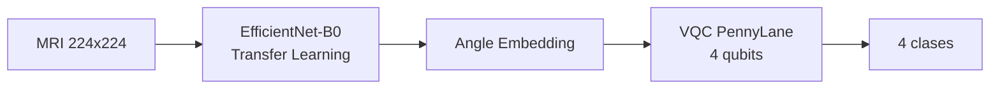

# Evaluación HQCNN en escasez de datos

> Evaluación de la Eficiencia de una Arquitectura Híbrida CNN-VQC para el Diagnóstico de Tumores Cerebrales en Imágenes de Resonancia Magnética en escenarios de Escasez de Datos

| | |
| :--- | :--- |
| **Autor** | Frank Edward Daza Gonzalez |
| **Programa** | Maestría en Inteligencia Artificial y Ciencia de Datos |
| **Institución** | Universidad Autónoma de Occidente, Santiago de Cali |
| **Año** | 2026 |

## Resumen

El auge de las Redes Neuronales Convolucionales (CNN) ha revolucionado el diagnóstico médico. Sin embargo, arquitecturas recientes se centran en maximizar la precisión utilizando grandes volúmenes de datos, ignorando la escasez de información en entornos clínicos reales (*Low-Data regimes*). Este proyecto investiga la viabilidad de una arquitectura híbrida cuántico-clásica para resolver la «paradoja de los datos».

A diferencia de trabajos recientes que entrenan modelos híbridos desde cero buscando explicabilidad, esta propuesta integra Transfer Learning (usando EfficientNet) con un Clasificador Cuántico Variacional (VQC) para mejorar la eficiencia de datos. La metodología contrastará el modelo híbrido frente a arquitecturas del estado del arte (EfficientNet-B0, ResNet-50), evaluando específicamente la capacidad de generalización al entrenar con solo el 10%, 25% y 50% del conjunto de datos.

> **Hipótesis central:** el componente cuántico permite obtener métricas competitivas con fracciones reducidas de datos, superando a los modelos clásicos propensos al sobreajuste (*overfitting*) en estos escenarios.

## Contenido

- [Introducción](#introducción)
- [Planteamiento del problema](#planteamiento-del-problema)
- [Objetivos](#objetivos)
- [Diseño metodológico](#diseño-metodológico)
- [Stack técnico](#stack-técnico)
- [Equipo](#equipo)
- [Documentación](#documentación)

## Introducción

El diagnóstico por imagen es una piedra angular de la medicina moderna. La Imagen por Resonancia Magnética (MRI, *Magnetic Resonance Imaging*) es la modalidad de referencia para tumores cerebrales por su alto contraste en tejidos blandos; el Aprendizaje Profundo (DL, *Deep Learning*) ha elevado la precisión de los sistemas de diagnóstico asistido por computador (CAD, *Computer-Aided Diagnosis*) a niveles comparables con expertos humanos. Sin embargo, las arquitecturas de vanguardia (SOTA, *State of the Art*) exigen volúmenes masivos de datos para evitar el sobreajuste, mientras que los conjuntos médicos etiquetados son intrínsecamente escasos: la «paradoja de los datos».

El Aprendizaje Automático Cuántico (QML, *Quantum Machine Learning*) ofrece una vía alternativa en la era NISQ (*Noisy Intermediate-Scale Quantum*): combinar redes clásicas pre-entrenadas (Transfer Learning) con circuitos cuánticos variacionales (VQC, *Variational Quantum Classifier*) como clasificador final. La hipótesis es que la expresividad de los circuitos en espacios de Hilbert de alta dimensión favorece la generalización con menos ejemplos de entrenamiento.

Este proyecto diseña y evalúa una arquitectura híbrida VQC-CNN para clasificación multiclase de tumores cerebrales. No se persigue solo la reducción de parámetros, sino demostrar si el componente cuántico aporta ventaja real en **eficiencia de datos**, contrastando frente a EfficientNet bajo escasez de datos y validando el potencial del QML en entornos médicos reales.

## Planteamiento del problema

La clasificación automatizada de imágenes médicas mediante CNNs ha alcanzado hitos significativos, pero el paradigma de «más profundo es mejor» conlleva riesgo de sobreajuste cuando los conjuntos son pequeños. Arquitecturas como ResNet-50 acumulan decenas de millones de parámetros; EfficientNet optimiza la relación precisión-parámetros, pero la barrera persiste en regímenes de pocos datos (*Few-Shot* o *Low-Data regimes*). Técnicas clásicas como el aumento de datos (*data augmentation*) mitigan parcialmente el problema, sin resolver la ineficiencia estructural del aprendizaje clásico con datos limitados.

Los Circuitos Cuánticos Variacionales (VQC) podrían ofrecer mayor expresividad por parámetro que redes clásicas, pero en la literatura falta evidencia rigurosa que compare arquitecturas híbridas con modelos clásicos eficientes —EfficientNet-B0 con Transfer Learning— bajo escasez severa de datos. La mayoría de estudios contrastan contra redes básicas, inflando la percepción de ventaja cuántica.

> **Pregunta de investigación:** ¿Puede una arquitectura híbrida cuántico-clásica, basada en Transfer Learning, demostrar una capacidad de generalización superior a la de arquitecturas clásicas del estado del arte (como EfficientNet-B0 y ResNet-50) en escenarios de entrenamiento con escasez de datos, manteniendo métricas competitivas?

## Objetivos

### Objetivo general

Evaluar la eficiencia de una arquitectura híbrida cuántico-clásica para la clasificación multiclase de tumores cerebrales por medio de MRI, comparando su desempeño frente a arquitecturas clásicas en escenarios de escasez de datos.

### Objetivos específicos

1. Desarrollar una arquitectura híbrida que integre una red neuronal clásica pre-entrenada basada en EfficientNet-B0 (extractor de características) con un circuito cuántico variacional (VQC) utilizando técnicas de *Angle Embedding* y *Strongly Entangling Layers*.
2. Entrenar los modelos de referencia clásicos EfficientNet-B0 y ResNet-50, estableciendo líneas base robustas mediante Transfer Learning y entrenamiento con el conjunto completo de datos.
3. Evaluar comparativamente la exactitud del modelo híbrido y los modelos clásicos en escenarios de escasez de datos (10%, 25% y 50% del conjunto de datos), utilizando validación cruzada estratificada y análisis estadístico.

## Diseño metodológico

Enfoque experimental comparativo en tres fases, alineadas con los objetivos específicos:

| Fase | Enfoque | Actividades principales |
| :--- | :--- | :--- |
| **1 — Arquitectura** | HQCNN (Objetivo 1) | EfficientNet-B0 congelado; VQC en PennyLane (4 qubits, *Strongly Entangling Layers* con L ∈ {2, 4, 6}); integración vía `TorchLayer` |
| **2 — Líneas base** | Benchmark clásico (Objetivo 2) | Curaduría del conjunto de datos; preprocesamiento (224×224, normalización, *data augmentation*); entrenamiento EfficientNet-B0 y ResNet-50 al 100% |
| **3 — Escasez** | Generalización (Objetivo 3) | Subconjuntos al 10%, 25% y 50%; validación cruzada estratificada (k = 5); ANOVA y brecha de generalización G = \|Acctrain − Accval\| |

### Conjunto de datos y experimentación

| Aspecto | Detalle |
| :--- | :--- |
| **Fuente** | *Brain Tumor MRI Dataset* público (7023 imágenes) |
| **Clases** | Glioma, meningioma, pituitario, no tumor |
| **Escenarios de escasez** | 10%, 25% y 50% del conjunto de datos (líneas base al 100%) |
| **Métricas** | Exactitud, F1-Score, sensibilidad y especificidad por clase, tiempo de entrenamiento, latencia de inferencia |
| **Validación** | Validación cruzada estratificada (*Stratified k-fold*, k = 5) |
| **Análisis estadístico** | ANOVA; brecha de generalización G = \|Acctrain − Accval\| |

## Stack técnico

| Componente | Versión | Rol |
| :--- | :--- | :--- |
| Python | 3.12 | Intérprete (gestor UV) |
| PyTorch | 2.9.1 | Entrenamiento híbrido *end-to-end* |
| torchvision | 0.24.1 | EfficientNet-B0, ResNet-50 |
| PennyLane + Lightning | 0.45.1 | VQC, `TorchLayer`, simulación |
| scikit-learn | 1.9.0 | k-fold estratificado, métricas |
| statsmodels | 0.14.6 | ANOVA, Tukey HSD |
| wandb | 0.28.x | Monitoreo de experimentos |

**Entorno de ejecución:** Google Colab (CUDA) o local con UV (`uv sync`, `uv run python …`). Simulador cuántico por defecto: `default.qubit` con `interface="torch"` y `diff_method="parameter-shift"`.

## Equipo

| Rol | Nombre |
| :--- | :--- |
| **Estudiante** | Frank Edward Daza Gonzalez |
| **Director** | Julián Hurtado López, PhD |
| **Codirectora** | Alba Marcela Herrera Trujillo |

## Documentación

- Anteproyecto y referencias: [`docs/proyecto_de_grado/`](docs/proyecto_de_grado/)
- Guía de agentes y stack congelado: [`AGENTS.md`](AGENTS.md)
