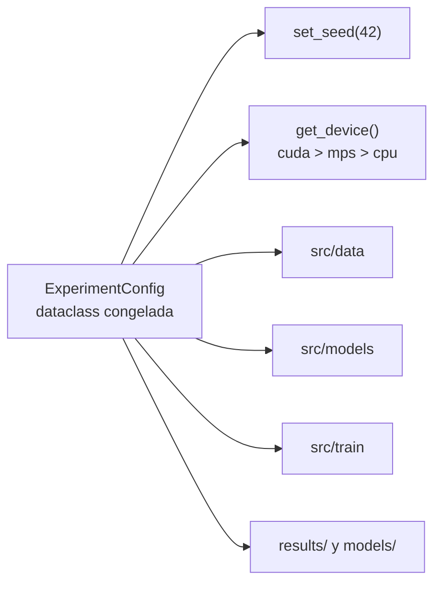

## Description

<!-- SECTION:DESCRIPTION:BEGIN -->
**Qué.** Levantar la base reproducible del proyecto: `ExperimentConfig` como única fuente de hiperparámetros, un solo `set_seed(42)`, selección de dispositivo `cuda > mps > cpu`, el layout de carpetas (`src/`, `models/`, `results/`, `results/figures/`) y `uv.lock` congelado con su bloque equivalente de pins para Google Colab.

**Por qué.** El diseño metodológico compara 3 modelos × 4 fracciones de datos × 5 folds. Si el entorno o la semilla varían entre corridas, cualquier diferencia observada entre modelos puede deberse a variación no controlada y no al efecto que se quiere medir. El notebook `notebooks/notebooks/01_Baseline_and_Data_Prep.ipynb` **no** es la fuente de verdad: usa `pip`, rutas absolutas de Google Drive y estado global; esta tarea establece el reemplazo importable desde CLI y desde Colab.

**Entregable.** `src/config.py`, `src/utils/seed.py`, `src/utils/device.py`, `uv.lock`, `.python-version` y la sección de pins para Colab en el README.

**Flujo de la configuración única.**



**Stack congelado (agosto 2026).** Python 3.12, PyTorch 2.9.1, torchvision 0.24.1, PennyLane + Lightning 0.45.1, NumPy `>=2.0,<2.3`, scikit-learn 1.9.0, SciPy 1.16.x, statsmodels 0.14.6, pandas 2.3, matplotlib 3.10, seaborn 0.13, wandb 0.28.x.

**Claves BibTeX.** `bergholm2018pennylane`.
<!-- SECTION:DESCRIPTION:END -->

## Acceptance Criteria
<!-- AC:BEGIN -->
- [ ] #1 uv sync --frozen reproduce el entorno desde uv.lock sin conflictos de versiones y el README documenta los pins equivalentes para Colab
- [ ] #2 ExperimentConfig es la única fuente de hiperparámetros: ningún módulo de src/ define valores por defecto duplicados
- [ ] #3 set_seed está implementado una sola vez y fija random, numpy, torch y torch.cuda; dos ejecuciones con la misma semilla y el mismo dispositivo producen métricas idénticas
- [ ] #4 La selección de dispositivo respeta el orden cuda > mps > cpu y el dispositivo elegido queda registrado en el log de la corrida
- [ ] #5 No existe ninguna ruta absoluta local ni de Google Drive en src/: todas las rutas se derivan de ExperimentConfig con pathlib
- [ ] #6 Las carpetas src/, models/, results/ y results/figures/ existen y su propósito está descrito en el README
<!-- AC:END -->

## Definition of Done
<!-- DOD:BEGIN -->
- [ ] #1 Tipado de Python 3.12 (list[int], X | None) en toda función pública
- [ ] #2 Docstrings NumPy en español latinoamericano
- [ ] #3 Ejecución verificada con uv run; sin pip fuera de la excepción documentada de Colab
- [ ] #4 Sin secretos ni rutas absolutas en el código versionado
<!-- DOD:END -->

## Implementation Plan

<!-- SECTION:PLAN:BEGIN -->
1. Fijar intérprete y entorno con UV (gestor canónico del proyecto):

```bash
uv python pin 3.12
uv sync
uv lock
```

2. Crear `src/config.py` con la dataclass congelada que centraliza hiperparámetros y rutas. Congelada (`frozen=True`) para que ningún módulo la mute a mitad de una corrida:

```python
from dataclasses import dataclass
from pathlib import Path

@dataclass(frozen=True, slots=True)
class ExperimentConfig:
    """Única fuente de verdad de hiperparámetros y rutas del experimento.

    Attributes
    ----------
    modelo : str
        Identificador que consume la fábrica de modelos.
    n_qubits : int
        Número de qubits del VQC; coincide con el número de clases.
    n_capas : int
        Profundidad ``L`` de las StronglyEntanglingLayers.
    data_fraction : float
        Fracción del entrenamiento usada en el escenario de escasez.
    """

    modelo: str = "hqcnn"
    n_clases: int = 4
    n_qubits: int = 4
    n_capas: int = 4
    data_fraction: float = 1.0
    n_folds: int = 5
    epocas: int = 15
    batch_size: int = 32
    lr: float = 1e-3
    semilla: int = 42
    raiz_datos: Path = Path("data/brain_tumor_mri")
    raiz_resultados: Path = Path("results")
    raiz_modelos: Path = Path("models")
```

3. Crear `src/utils/seed.py` con la **única** implementación de siembra del proyecto:

```python
def set_seed(semilla: int = 42) -> None:
    """Fija todas las fuentes de aleatoriedad de una corrida."""
    random.seed(semilla)
    np.random.seed(semilla)
    torch.manual_seed(semilla)
    if torch.cuda.is_available():
        torch.cuda.manual_seed_all(semilla)
    torch.use_deterministic_algorithms(True, warn_only=True)
```

4. Crear `src/utils/device.py` con la prelación de dispositivo exigida por `AGENTS.md`:

```python
def get_device() -> torch.device:
    """Devuelve el mejor dispositivo disponible: cuda > mps > cpu."""
    if torch.cuda.is_available():
        return torch.device("cuda")
    if torch.backends.mps.is_available():
        return torch.device("mps")
    return torch.device("cpu")
```

5. Documentar en el README el bloque de `pip install` equivalente para Colab, con **las mismas versiones** de `pyproject.toml` (única excepción permitida a UV).
6. Verificar reproducibilidad: ejecutar dos veces un script mínimo con la misma semilla (`uv run python -m src.smoke`) y comparar la pérdida de la primera época bit a bit.
7. Registrar en la bitácora (cuando exista, task-2) un párrafo breve con la versión del stack y el dispositivo detectado.
<!-- SECTION:PLAN:END -->

## Implementation Notes

<!-- SECTION:NOTES:BEGIN -->
**Trampas conocidas.**

- `torch.use_deterministic_algorithms(True)` lanza excepción con algunos kernels de cuDNN. Usar `warn_only=True` y **registrar** la advertencia en el log de la corrida en lugar de silenciarla; si se silencia, se pierde la evidencia de no determinismo.
- En macOS con `mps` varias operaciones caen a CPU y no hay equivalente completo de `torch.cuda.manual_seed_all`. La reproducibilidad bit a bit solo se garantiza **dentro del mismo dispositivo**: por eso el dispositivo debe quedar guardado en cada fila de resultados (contrato de task-4).
- PennyLane 0.45 exige `numpy < 2.3`. No actualizar NumPy "a latest": rompe la importación de PennyLane.
- No mezclar PyTorch 2.12+ con PennyLane 0.45: el combo validado es 2.9.1 y versiones más nuevas pueden romper `TorchLayer` y la regla de cambio de parámetros.
- `DataLoader` con `num_workers > 0` **no** es determinista solo por `set_seed`: requiere además `worker_init_fn` y un `generator` explícito. Esto se resuelve en task-5, pero la firma de `set_seed` debe permitirlo.
- No usar `pip`, `conda` ni `python -m venv` en local. Único gestor: UV.

**Decisión a documentar.** Semilla global 42 fijada por convención del anteproyecto; queda como parámetro de `ExperimentConfig` para poder auditar la sensibilidad a la semilla si el análisis estadístico lo exige.
<!-- SECTION:NOTES:END -->
