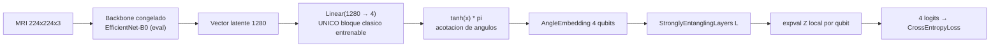

## Description

<!-- SECTION:DESCRIPTION:BEGIN -->
**Actividad del anteproyecto:** A3 — Integración del modelo híbrido HQCNN.

**Qué.** Un `nn.Module` de extremo a extremo que va del tensor de imagen a 4 logits: backbone congelado (task-7) → capa densa de reducción → acotación de ángulos → `qml.qnn.TorchLayer` sobre el QNode de task-9 → `CrossEntropyLoss`.

**Por qué.** Es el punto donde el diseño deja de ser dos piezas y pasa a ser un modelo entrenable de extremo a extremo con un solo grafo de diferenciación. `TorchLayer` hace que el circuito variacional se comporte como cualquier capa de PyTorch, lo que permite que el `Trainer` de task-8 lo trate exactamente igual que a una línea base clásica (LSP) y que el gradiente fluya del logit hasta los pesos cuánticos por la regla de cambio de parámetros (`bergholm2018pennylane`, `mitarai2018quantum`). La transferencia clásico-cuántica con extractor congelado es el patrón establecido por `mari2020transfer`.

**Entregable.** `src/models/hqcnn.py` con la clase `HQCNN`, la verificación numérica del gradiente y el conteo de parámetros por bloque.

**Arquitectura de extremo a extremo.**



**Detalle crítico de la integración.** La acotación entre la capa densa y el `AngleEmbedding` no es cosmética: sin ella, los ángulos se envuelven módulo 2π y dos características muy distintas se codifican en el mismo estado, destruyendo información **sin ningún error visible**. `tanh` escalado a [-π, π] resuelve el problema y la elección debe quedar justificada.

**Segundo detalle crítico.** El valor esperado de Z vive en [-1, 1], así que los logits tienen escala pequeña y el softmax queda plano: la confianza máxima alcanzable está acotada por construcción. Es una propiedad del diseño, no un error; si se decide añadir un factor de escala aprendible, debe aplicarse **igual en todas las corridas** y quedar registrado.

**Claves BibTeX.** `bergholm2018pennylane`, `mitarai2018quantum`, `mari2020transfer`.
<!-- SECTION:DESCRIPTION:END -->

## Acceptance Criteria
<!-- AC:BEGIN -->
- [ ] #1 El modelo es un único nn.Module que va del tensor de imagen a 4 logits, sin pasos manuales intermedios
- [ ] #2 El QNode se integra con qml.qnn.TorchLayer declarando interface=torch, diff_method=parameter-shift y default.qubit
- [ ] #3 La salida de la capa densa se acota antes del AngleEmbedding y la elección está justificada por la periodicidad de los ángulos
- [ ] #4 El gradiente que llega a los pesos cuánticos se verifica numéricamente contra diferencias finitas con tolerancia declarada
- [ ] #5 El módulo mantiene el backbone en eval() incluso cuando el Trainer llama train(), y una prueba lo verifica
- [ ] #6 state_dict() guarda y recarga pesos clásicos y cuánticos reproduciendo la misma salida para una entrada fija
- [ ] #7 El modelo es sustituible por una línea base clásica en el mismo Trainer sin ramas condicionales (LSP)
- [ ] #8 Se documenta la escala acotada de los logits derivada del valor esperado en [-1, 1] y su efecto sobre la confianza del softmax
- [ ] #9 Hallazgo registrado en hallazgos/h1_arquitectura.tex con \label{hallazgo:task-10}, esquema de la arquitectura y conteo de parámetros por bloque
<!-- AC:END -->

## Definition of Done
<!-- DOD:BEGIN -->
- [ ] #1 Tipado de Python 3.12 y docstrings NumPy en español latinoamericano
- [ ] #2 Sin torch.save del módulo completo: persistencia únicamente con state_dict()
- [ ] #3 El orden de clases del Dataset coincide con el mapeo qubit a clase de task-9 y hay una prueba que lo verifica
- [ ] #4 Ninguna decisión de arquitectura queda sin justificación trazable en la bitácora
<!-- DOD:END -->

## Implementation Plan

<!-- SECTION:PLAN:BEGIN -->
1. Implementar el módulo híbrido, resolviendo en él (y no en el `Trainer`) el problema de las estadísticas móviles del backbone:

```python
class HQCNN(nn.Module):
    """Red neuronal híbrida cuántico-clásica para clasificación de MRI cerebral.

    Notes
    -----
    Sobrescribe ``train`` para que el backbone congelado permanezca en modo
    evaluación: de lo contrario las capas de normalización por lotes seguirían
    actualizando sus estadísticas móviles y el "extractor congelado" cambiaría
    de comportamiento entre épocas.
    """

    def __init__(self, cfg: ExperimentConfig) -> None:
        super().__init__()
        self.backbone, dim_latente = build_backbone("efficientnet_b0")
        self.reduccion = nn.Linear(dim_latente, cfg.n_qubits)
        forma_pesos = {
            "pesos": qml.StronglyEntanglingLayers.shape(
                n_layers=cfg.n_capas, n_wires=cfg.n_qubits
            )
        }
        self.vqc = qml.qnn.TorchLayer(circuito_vqc, forma_pesos)

    def train(self, modo: bool = True) -> "HQCNN":
        """Cambia de modo manteniendo el backbone congelado en evaluación."""
        super().train(modo)
        self.backbone.eval()
        return self

    def forward(self, x: torch.Tensor) -> torch.Tensor:
        """Propaga de la imagen a los 4 logits."""
        with torch.no_grad():
            latente = self.backbone(x)
        angulos = torch.tanh(self.reduccion(latente)) * torch.pi
        return self.vqc(angulos)
```

2. Verificar **numéricamente** que el gradiente llega a los pesos cuánticos, comparando la retropropagación con diferencias finitas sobre un parámetro:

```python
def verificar_gradiente(modelo: HQCNN, x: torch.Tensor, y: torch.Tensor, eps: float = 1e-4) -> tuple[float, float]:
    """Compara el gradiente analítico con diferencias finitas centradas.

    Returns
    -------
    tuple[float, float]
        Gradiente analítico y gradiente numérico del primer peso del VQC.
    """
    criterio = nn.CrossEntropyLoss()
    parametro = modelo.vqc.pesos
    modelo.zero_grad()
    criterio(modelo(x), y).backward()
    analitico = float(parametro.grad.flatten()[0])

    with torch.no_grad():
        plano = parametro.flatten()
        original = float(plano[0])
        plano[0] = original + eps
        mas = float(criterio(modelo(x), y))
        plano[0] = original - eps
        menos = float(criterio(modelo(x), y))
        plano[0] = original
    return analitico, (mas - menos) / (2 * eps)
```

3. Escribir la prueba de que el backbone permanece en `eval()` después de llamar `modelo.train()`, y de que sus parámetros no reciben gradiente.
4. Escribir la prueba de ida y vuelta de `state_dict()`: guardar, reinstanciar, cargar y verificar que la salida para una entrada fija es idéntica.
5. Contar los parámetros por bloque (backbone congelado, capa densa, pesos del VQC) y dejar la tabla lista para la bitácora: es el argumento cuantitativo de la eficiencia de parámetros del modelo híbrido.
6. Verificar la sustituibilidad con el `Trainer` de task-8: entrenar una época del HQCNN y una de la línea base con el mismo código de bucle.
7. Registrar el hallazgo en `hallazgos/h1_arquitectura.tex`: esquema de la arquitectura, tabla de parámetros por bloque, resultado de la verificación numérica del gradiente y justificación de la acotación de ángulos.
<!-- SECTION:PLAN:END -->

## Implementation Notes

<!-- SECTION:NOTES:BEGIN -->
**Trampas conocidas.**

- Las claves del diccionario de formas de `TorchLayer` deben coincidir **exactamente** con los nombres de los argumentos del QNode (aquí `pesos`), y el primer argumento del QNode debe ser el de entradas. Si no coinciden, el error aparece lejos del origen y es difícil de leer.
- `TorchLayer` procesa lotes iterando internamente cuando el dispositivo no admite difusión de lotes. Con `parameter-shift` el costo crece con el tamaño del lote: **esta** es la fuente del cuello de botella que task-11 debe medir antes de lanzar 60 corridas.
- La verificación numérica del gradiente en `float32` es inestable: hacerla en CPU y, si es posible, en `float64`, o declarar una tolerancia laxa. Una prueba que falla de forma intermitente es peor que no tenerla.
- `torch.no_grad()` alrededor del backbone ahorra memoria, pero hay que comprobar que el gradiente **sí** fluye hacia `reduccion` y `vqc`. La prueba numérica del punto 2 es precisamente esa comprobación.
- No aplicar `softmax` antes de `CrossEntropyLoss`. Los valores esperados son logits de escala pequeña y eso achata la distribución; aplicar softmax dos veces la achata aún más y el modelo parece no aprender.
- No usar `torch.save(modelo)`: `TorchLayer` no serializa de forma portable. Solo `state_dict()`.
- Si se añade un factor de escala aprendible sobre los logits, es un cambio de arquitectura: debe aplicarse a **todas** las corridas o la comparación entre celdas del diseño factorial deja de ser válida.
- El orden de las clases del `Dataset` (alfabético por nombre de carpeta) debe coincidir con `MAPEO_QUBIT_CLASE` de task-9. Si no coincide, todo entrena bien y las métricas por clase quedan permutadas.

**Frontera de responsabilidades.** Este módulo resuelve el modo `eval()` del backbone porque es un detalle de **su** arquitectura. El `Trainer` no debe saber nada de ello: así se preserva DIP y no reaparece la rama condicional por tipo de modelo.
<!-- SECTION:NOTES:END -->
