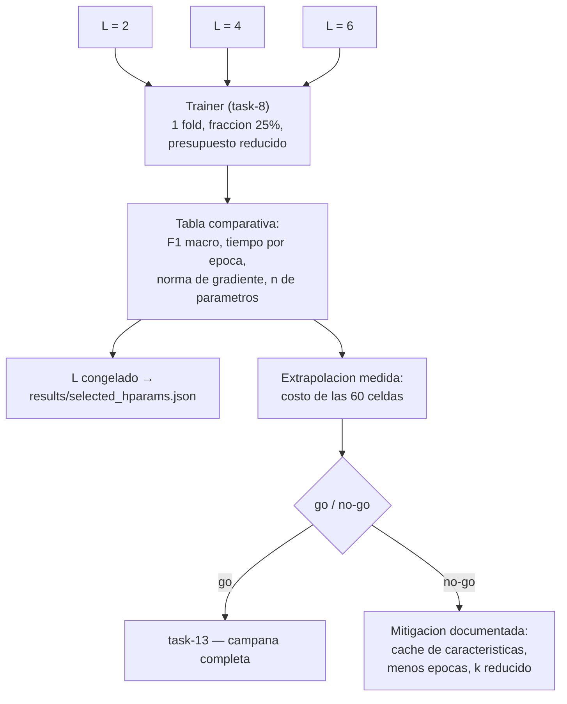

## Description

<!-- SECTION:DESCRIPTION:BEGIN -->
**Actividad del anteproyecto:** resto de A2 — selección de la profundidad del ansatz. Además, **compuerta de viabilidad** para toda la Fase 2.

**Qué.** Un protocolo económico para elegir `L ∈ {2, 4, 6}` y, en la misma corrida, **medir** el costo real de la campaña de task-13. Cierra con `results/selected_hparams.json` y una decisión explícita de *go/no-go*.

**Por qué.** Esta tarea cierra dos riesgos a la vez, y los cierra juntos porque comparten la misma medición.

1. **Riesgo de entrenabilidad.** `L` gobierna el equilibrio entre expresividad y entrenabilidad: más capas representan más funciones, pero achatan los gradientes hacia la meseta árida (`holmes2022connecting`, `McClean2018B`). No hay un valor "correcto" a priori; hay que medirlo en este dataset y con esta codificación.
2. **Riesgo de cómputo.** Con `parameter-shift` cada parámetro cuesta 2 evaluaciones de circuito. Con `L = 6` son `6 × 4 × 3 = 72` parámetros, es decir **144 evaluaciones por muestra y por paso**, multiplicadas por el tamaño del lote, por las épocas, y luego por las 60 celdas del diseño factorial. Descubrir a mitad de la campaña que no cabe en el tiempo disponible cuesta semanas; medirlo antes cuesta horas.

**Protocolo económico y declarado.** Un solo fold, la fracción del 25 %, presupuesto de épocas reducido y explícito. No es un experimento de A8 y **no debe reportarse como si tuviera significancia estadística**: es una decisión de diseño instrumentada.

**Entregable.** `results/ablacion_L.csv`, `results/selected_hparams.json` con `L` congelado y el registro del presupuesto medido con su decisión.

**Flujo de la ablación y la compuerta.**

**Decisión D2 en juego.** El diseño factorial balanceado incluye al HQCNN también al 100 % de los datos (3 modelos × 4 fracciones × 5 folds = 60 corridas), lo que es necesario para la ANOVA de dos vías de task-15. Esa decisión queda **sujeta al presupuesto medido aquí**: si el costo la hace inviable, la alternativa y su impacto sobre el análisis estadístico deben documentarse antes de continuar.

**Claves BibTeX.** `holmes2022connecting`, `McClean2018B`, `caro2022generalization`.
<!-- SECTION:DESCRIPTION:END -->

## Acceptance Criteria
<!-- AC:BEGIN -->
- [x] #1 Existe una tabla comparativa para L en 2, 4 y 6 con F1 macro de validación, tiempo por época, norma media del gradiente y número de parámetros cuánticos
- [x] #2 El protocolo de la ablación es económico y está declarado por escrito (un fold, una fracción, presupuesto de épocas reducido) y no se presenta como un resultado de A8
- [x] #3 Se reportan las curvas de pérdida por profundidad, de modo que no se confunda una arquitectura peor con una que no convergió en el presupuesto reducido
- [x] #4 El criterio de selección de L se escribe antes de observar los resultados y se aplica tal cual
- [x] #5 L queda congelado en results/selected_hparams.json antes de iniciar task-13, con criterio, fecha y commit
- [x] #6 Se reporta el costo medido por corrida y la extrapolación a las 60 celdas del diseño factorial en horas de cómputo, indicando el dispositivo
- [x] #7 Existe una decisión explícita go/no-go sobre la viabilidad de la campaña y, si es no-go, las mitigaciones evaluadas y la adoptada quedan documentadas con su impacto metodológico
- [x] #8 La decisión D2 de entrenar el HQCNN también al 100 por ciento se confirma o se ajusta con base en el presupuesto medido
- [x] #9 Hallazgo registrado en hallazgos/h1_arquitectura.tex con \label{hallazgo:task-11}, tabla comparativa y decisión
<!-- AC:END -->

## Definition of Done
<!-- DOD:BEGIN -->
- [x] #1 La ablación reutiliza el Trainer de task-8 sin escribir un bucle de entrenamiento nuevo
- [x] #2 Si se adopta el precálculo de características como mitigación, su incompatibilidad con el aumento de datos queda declarada y reflejada en el método
- [x] #3 El simulador cuántico usado es el mismo que usará la campaña, para que los tiempos sean extrapolables
- [x] #4 Tipado de Python 3.12 y docstrings NumPy en español latinoamericano
<!-- DOD:END -->

## Implementation Plan

<!-- SECTION:PLAN:BEGIN -->
1. Constantes de protocolo pre-declaradas: fold=0, fraccion=0.25, epocas=5, semilla=42, simulador default.qubit, umbral go/no-go 72 h.
2. Implementar src/experiments/ablacion_L.py con HQCNN(cfg) directo (sin build_model), Trainer(..., fold=0), estimacion ponderada por fraccion y criterio de seleccion fijado antes de correr.
3. Ejecutar L in {2,4,6}; persistir results/ablacion_L.csv, historiales JSON, figura de curvas y results/selected_hparams.json.
4. Documentar hallazgo en hallazgos/h1_arquitectura.tex con label hallazgo:task-11.
<!-- SECTION:PLAN:END -->

## Implementation Notes

<!-- SECTION:NOTES:BEGIN -->
Re-ejecutada ablacion con historiales L en nombre (hqcnn_0p25_f0_s42_L{n}.json). L=6 congelada (F1 0.817). No-go CPU: HQCNN solo 129.8h, conservadora 389.4h. Go condicionado sonda Colab/CUDA; mitigacion_adoptada null. Trainer con tqdm+log por epoca. commit 5153d2c-dirty en selected_hparams.json.
<!-- SECTION:NOTES:END -->

## Final Summary

<!-- SECTION:FINAL_SUMMARY:BEGIN -->
Implementado src/experiments/ablacion_L.py reutilizando Trainer. Ablacion L={2,4,6} en fold 0, 25%, 5 epocas: L=6 seleccionada (F1 macro 0.817). Compuerta no-go (387 h extrapoladas vs 72 h); mitigacion reducir_epocas_campana; D2 ajustada. Verificado con corrida real, 11 tests y hallazgo hallazgo:task-11 en bitacora.
<!-- SECTION:FINAL_SUMMARY:END -->
