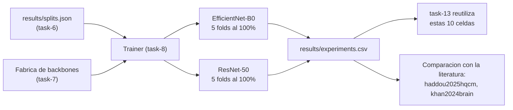

## Description

<!-- SECTION:DESCRIPTION:BEGIN -->
**Actividad del anteproyecto:** A6 — Entrenamiento de las líneas base clásicas.

**Qué.** Entrenar EfficientNet-B0 y ResNet-50 con cabeza clásica usando el `Trainer` de task-8 y **las mismas particiones** de `results/splits.json`, con el 100 % de los datos de entrenamiento de cada fold. Establece el límite superior de exactitud contra el cual se interpretará todo lo demás.

**Por qué.** Sin una línea base creíble, cualquier número del HQCNN es incomparable. Y "creíble" tiene un requisito preciso: **mismas particiones, mismo bucle, mismo presupuesto de épocas**. Si la línea base se entrenara con otro código o otros folds, la comparación mediría la diferencia entre dos implementaciones y no entre dos arquitecturas. Estas 10 corridas (2 modelos × 5 folds) son además las celdas al 100 % que la campaña de task-13 **reutiliza**, no repite.

**Entregable.** 10 corridas en `results/experiments.csv`, pesos en `models/`, historial por época en `results/history/` y la tabla de media ± desviación estándar por métrica.

**Posición en el diseño experimental.**



**Contraste con la literatura.** Los resultados deben compararse con los reportados en trabajos híbridos sobre el mismo dataset (`haddou2025hqcm`, `khan2024brain`) y con las arquitecturas originales (`tan2019efficientnet`, `he2016deep`). Si la línea base queda muy por debajo de lo publicado, hay un problema de implementación que debe resolverse **antes** de la campaña, no interpretarse como un hallazgo.

**Claves BibTeX.** `tan2019efficientnet`, `he2016deep`, `haddou2025hqcm`, `khan2024brain`.
<!-- SECTION:DESCRIPTION:END -->

## Acceptance Criteria
<!-- AC:BEGIN -->
- [ ] #1 EfficientNet-B0 y ResNet-50 se entrenan con el Trainer de task-8 y las particiones de results/splits.json, sin código de entrenamiento propio
- [ ] #2 Se completan las 10 corridas (2 arquitecturas x 5 folds) al 100 por ciento del entrenamiento y quedan escritas en results/experiments.csv
- [ ] #3 Se reporta media y desviación estándar por métrica sobre los 5 folds para cada arquitectura
- [ ] #4 Los índices efectivamente cargados se verifican contra results/splits.json para garantizar que el HQCNN verá los mismos folds
- [ ] #5 Los resultados se contrastan con la literatura sobre el mismo dataset y se explica por qué los números no son directamente comparables cuando corresponda
- [ ] #6 Las 10 celdas quedan reutilizables por task-13 con la clave (modelo, fracción 1.00, fold) correctamente registrada
- [ ] #7 El tiempo de inferencia se mide con el mismo protocolo que usará el HQCNN, para que la comparación de costo sea válida
- [ ] #8 Hallazgo registrado en hallazgos/h2_experimentacion.tex con \label{hallazgo:task-12}, tabla de resultados y comparación con la literatura
<!-- AC:END -->

## Definition of Done
<!-- DOD:BEGIN -->
- [ ] #1 Pesos persistidos con state_dict() en models/ e historial por época en results/history/
- [ ] #2 Semilla, dispositivo y versión de pesos registrados en cada fila del CSV
- [ ] #3 La limitación del extractor congelado queda declarada para que la tabla no se lea como el máximo alcanzable por la arquitectura
- [ ] #4 Sin rutas absolutas ni dependencias de Google Drive en el script de experimentos
<!-- DOD:END -->

## Implementation Plan

<!-- SECTION:PLAN:BEGIN -->
1. Construir las líneas base con la fábrica, sin escribir modelos ad hoc: backbone congelado de task-7 más cabeza `Linear(dim → 4)`.
2. Ejecutar las 10 celdas con el `Trainer`, iterando explícitamente sobre el diseño:

```python
for nombre in ("efficientnet_b0", "resnet50"):
    for fold in range(cfg_base.n_folds):
        cfg = replace(cfg_base, modelo=nombre, fold=fold, data_fraction=1.0)
        set_seed(cfg.semilla)
        modelo = build_model(nombre, cfg)
        registro, historial = Trainer(modelo, cfg, get_device()).ajustar(
            *construir_loaders(cfg, particiones)
        )
        escribir_registro(registro)
        escribir_historial(historial, cfg)
```

3. Consolidar media y desviación estándar por métrica sobre los 5 folds, para cada arquitectura: exactitud, F1 ponderado, F1 macro, sensibilidad y especificidad por clase, y tiempos.
4. Verificar la coherencia con la literatura: si la exactitud queda muy por debajo de lo reportado para estas arquitecturas en este dataset, diagnosticar antes de avanzar (normalización, congelamiento, orden de clases, tasa de aprendizaje).
5. Verificar que los folds son los mismos que usará el HQCNN: comparar los índices efectivamente cargados contra `results/splits.json`.
6. Confirmar que las 10 celdas quedan disponibles para reutilización por task-13, con la clave `(modelo, 1.00, fold)` correctamente escrita.
7. Registrar el hallazgo en `hallazgos/h2_experimentacion.tex`: tabla de resultados con media ± desviación estándar, comparación con la literatura y observaciones sobre estabilidad entre folds.

Ejecución sugerida (ver el skill `ejecutar-experimento`):

```bash
uv run python -m src.experiments.baselines
```
<!-- SECTION:PLAN:END -->

## Implementation Notes

<!-- SECTION:NOTES:BEGIN -->
**Trampas conocidas.**

- La comparación con la literatura tiene una asimetría que hay que declarar: la mayoría de los trabajos publicados sobre este dataset entrena **todo** el backbone o usa el *split* original `Training`/`Testing`, no validación cruzada con extractor congelado. Reportar una exactitud algo menor no es un fallo, pero **sí** hay que explicar por qué los números no son directamente comparables.
- Una desviación estándar muy alta entre folds es señal de que algo depende del muestreo más de lo esperado (tasa de aprendizaje, presupuesto de épocas, o un fold con distribución atípica). Investigar antes de la campaña: con 60 celdas el problema se multiplica.
- Con backbone congelado, la línea base tiene muy pocos parámetros entrenables y puede quedar por debajo de su potencial. Es la condición del experimento (misma restricción para todos), no un error, y debe quedar escrito para que nadie lea la tabla como el máximo alcanzable por EfficientNet-B0.
- No reentrenar las 10 celdas en task-13: la reanudabilidad del `Trainer` debe reconocerlas por su clave. Duplicarlas rompería el balance del diseño factorial y metería dos observaciones de la misma celda en la ANOVA.
- ResNet-50 con `IMAGENET1K_V2` no es intercambiable con `V1` a efectos de comparación bibliográfica; registrar la versión usada.
- El tiempo de inferencia de las líneas base es la referencia contra la cual se leerá el costo del HQCNN. Medirlo con el mismo protocolo (calentamiento y sincronización) o la comparación de costo será engañosa.
<!-- SECTION:NOTES:END -->
