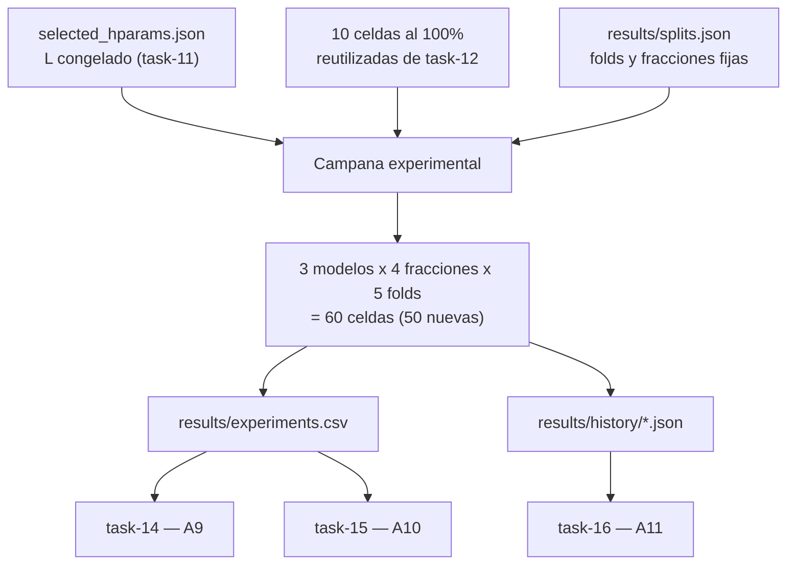

## Description

<!-- SECTION:DESCRIPTION:BEGIN -->
**Actividad del anteproyecto:** A8 — Campaña experimental con validación cruzada en escenarios de escasez.

**Qué.** Ejecutar el diseño factorial completo `{hqcnn, efficientnet_b0, resnet50} × {10 %, 25 %, 50 %, 100 %} × 5 folds` = **60 celdas**, de las cuales 10 se **reutilizan** de task-12, así que son 50 corridas nuevas.

**Por qué.** Es el experimento que responde la pregunta de investigación. El diseño es factorial y **balanceado** (decisión D2: el HQCNN también se entrena al 100 %) porque el análisis de task-15 necesita estimar el término de interacción `modelo × fracción`; un diseño incompleto dejaría la hipótesis central sin prueba estadística. La comparación es **pareada**: todas las celdas comparten los folds y las submuestras de `results/splits.json`, de modo que la diferencia entre modelos no arrastra ruido de partición.

**Entregable.** `results/experiments.csv` con 60 filas, `results/history/` con el historial por época de cada celda, pesos en `models/` y un informe de estado de ejecución.

**Diseño de la campaña.**

**Orden de ejecución recomendado.** De menor a mayor costo: primero las fracciones pequeñas, y las celdas del HQCNN al 100 % **al final**. Son las más caras de todo el proyecto y así, si el presupuesto se agota, lo que falta es la celda más costosa y no la mitad del diseño.

**Claves BibTeX.** `caro2022generalization`, `gupta2025systematic`. Excepción justificada: `li2021cvstability` (estabilidad de la validación cruzada en imagen médica).
<!-- SECTION:DESCRIPTION:END -->

## Acceptance Criteria
<!-- AC:BEGIN -->
- [ ] #1 Se completan las 60 celdas del diseño factorial (3 modelos x 4 fracciones x 5 folds) reutilizando las 10 celdas al 100 por ciento de task-12 sin repetirlas
- [x] #2 El HQCNN usa exclusivamente la profundidad L congelada en results/selected_hparams.json
- [x] #3 Todas las celdas comparten results/splits.json, de modo que la comparación entre modelos es pareada por fold y fracción
- [ ] #4 El CSV consolidado tiene exactamente una fila por celda, sin duplicados, verificado programáticamente antes de pasar al análisis
- [ ] #5 Existe historial por época para todas las celdas, suficiente para reconstruir las curvas de A11 sin reentrenar
- [x] #6 La campaña es reanudable y se documenta el estado de ejecución: celdas completadas, pendientes y fallidas con su motivo
- [x] #7 Ninguna celda fallida desaparece del registro: se anota explícitamente con la causa
- [x] #8 Se compara el costo real total de cómputo con la estimación de task-11 y se explica la desviación
- [x] #9 Hallazgo registrado en hallazgos/h2_experimentacion.tex con \label{hallazgo:task-13} con el resumen del diseño y el estado de ejecución
<!-- AC:END -->

## Definition of Done
<!-- DOD:BEGIN -->
- [x] #1 Ningún hiperparámetro cambia a mitad de campaña; si un cambio resulta imprescindible, se documenta y se repiten todas las celdas comparables
- [ ] #2 Las pruebas informales quedan fuera del CSV oficial
- [x] #3 Pesos e historiales persistidos con la convención de nombres del contrato de task-4
- [x] #4 Semilla, dispositivo y commit registrados en cada fila
<!-- DOD:END -->

## Implementation Plan

<!-- SECTION:PLAN:BEGIN -->
1. Verificar precondiciones: n_capas_congelada(), cargar_splits(validar_hash=True), 10 celdas baseline al 100% en experiments.csv, advertir si presupuesto.decision=no-go.
2. Implementar src/experiments/campana.py: bucle factorial {efficientnet_b0, resnet50, hqcnn} x {0.10, 0.25, 0.50, 1.00} x 5 folds; reanudabilidad via Trainer.corrida_completada(); dispositivos: baselines get_device(), HQCNN get_device_hqcnn(); orden: hqcnn ultimo en fraccion 1.00.
3. Estado en results/campana_estado.json (celdas completadas/omitidas/pendientes/fallidas con motivo); celdas fallidas NO van a experiments.csv.
4. verificar_integridad() y comparar_costo() vs estimacion task-11.
5. Tests en tests/test_campana.py; sonda local 1 epoca/1 celda; campana completa en Colab por bloques --fraccion.
6. Hallazgo hallazgo:task-13 en h2_experimentacion.tex.
<!-- SECTION:PLAN:END -->

## Implementation Notes

<!-- SECTION:NOTES:BEGIN -->
**Trampas conocidas.**

- **El riesgo dominante es la tentación de "arreglar" algo a mitad de campaña.** Cualquier cambio de hiperparámetro, de semilla, de preprocesamiento o de `L` invalida las celdas ya ejecutadas. Si un cambio resulta imprescindible, hay que repetir **todo** el bloque comparable, no solo añadir la celda nueva; mezclar celdas de dos configuraciones produce una tabla que parece completa y no lo es.
- Un fallo silencioso (memoria agotada, sesión cortada) deja el CSV con menos de 60 filas y desbalancea la ANOVA de dos vías. La verificación de integridad del punto 5 no es opcional: es la condición para pasar a task-14.
- No promediar folds al escribir el CSV. La unidad de observación es la corrida; promediar aquí destruye la información que task-15 necesita para estimar la varianza dentro de cada celda.
- Las celdas del HQCNN al 100 % son las más costosas del proyecto por el costo de `parameter-shift`. Dejarlas al final es una decisión de gestión de riesgo, no una preferencia estética.
- Si la campaña se paraleliza, dos procesos escribiendo el mismo CSV lo corrompen: un archivo por corrida y consolidación en task-14.
- Reentrenar por accidente las 10 celdas de task-12 metería dos observaciones de la misma celda en el análisis. La reanudabilidad debe comparar la clave completa `(modelo, fracción, fold)`.
- Las corridas al 10 % son rápidas y tentadoras para "probar cosas". Todo lo que se pruebe fuera del protocolo debe quedar fuera del CSV oficial, en un archivo aparte, o el registro experimental pierde credibilidad.

**Nota sobre la validación cruzada.** Los 5 folds comparten datos de entrenamiento entre sí; la varianza entre folds mide estabilidad de la partición, no error de muestreo independiente. Esta limitación, declarada desde task-6, es la que condiciona la lectura de los valores p en task-15.

Implementado src/experiments/campana.py con precondiciones, bucle factorial, campana_estado.json, verificar_integridad y comparar_costo. Bug corregido en generar_celdas_design (filtro modelo). 10 tests passed. Sonda local: 3 celdas al 10% fold 0 (1 epoca); 10 baselines al 100% intactas. Hallazgo hallazgo:task-13 en h2_experimentacion.tex.
<!-- SECTION:NOTES:END -->
