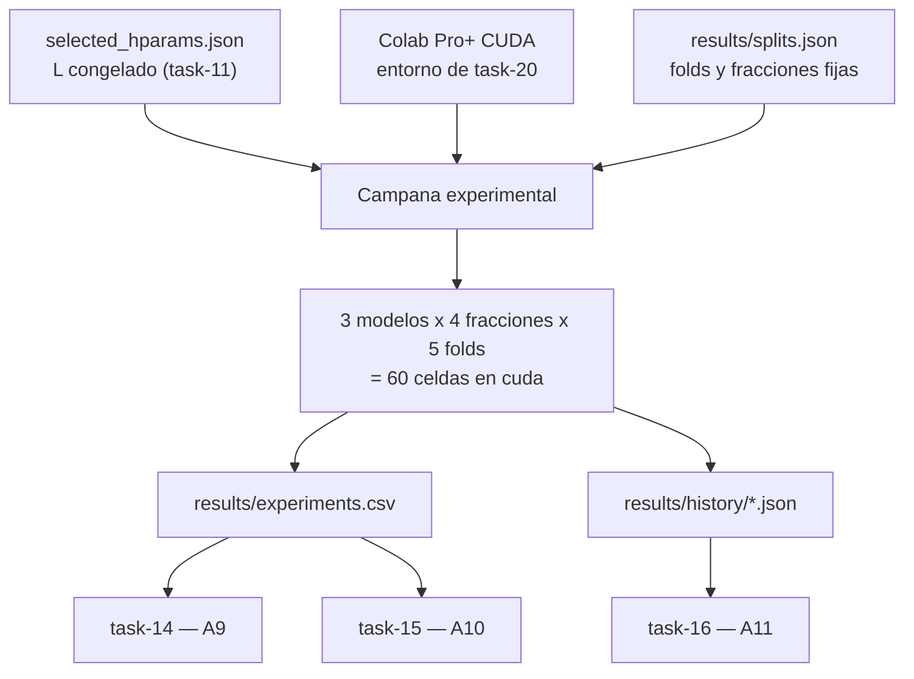

## Description

<!-- SECTION:DESCRIPTION:BEGIN -->
**Actividad del anteproyecto:** A8 — Campaña experimental con validación cruzada en escenarios de escasez.

**Qué.** Ejecutar el diseño factorial completo `{hqcnn, efficientnet_b0, resnet50} × {10 %, 25 %, 50 %, 100 %} × 5 folds` = **60 celdas**, íntegramente en **Google Colab Pro+ con GPU CUDA** (entorno entregado por TASK-20).

**Por qué.** Es el experimento que responde la pregunta de investigación. El diseño es factorial y **balanceado** (decisión D2: el HQCNN también se entrena al 100 %) porque el análisis de task-15 necesita estimar el término de interacción `modelo × fracción`; un diseño incompleto dejaría la hipótesis central sin prueba estadística. La comparación es **pareada**: todas las celdas comparten los folds y las submuestras de `results/splits.json`, de modo que la diferencia entre modelos no arrastra ruido de partición.

**Por qué las 60 celdas se ejecutan en CUDA y no se reutilizan las 10 de task-12 (decisión D3).** La versión previa de esta tarea reutilizaba las 10 celdas al 100 % de task-12. Esas corridas se hicieron en `mps` (15 épocas, EfficientNet-B0 ~640 s/fold, ResNet-50 ~1000 s/fold) y el resto de la campaña corre en `cuda`. A9 (task-14) exige reportar **tiempo de entrenamiento y latencia de inferencia**; con hardware mezclado esas dos métricas quedarían confundidas con el dispositivo justo en la fracción del 100 %, que es donde se contrasta el HQCNN contra las líneas base. Reejecutarlas en CUDA cuesta ~1.5–3 h de GPU frente a las ~130 h del bloque HQCNN: es barato comparado con publicar una tabla de costos no interpretable. Las corridas MPS **no se borran**: task-20 las archiva en `results/historico_mps.csv` y `results/history_mps/` como evidencia histórica.

**Entregable.** `results/experiments.csv` con 60 filas, todas con `dispositivo=cuda`; `results/history/` con el historial por época de cada celda; pesos en `models/`; y el estado de ejecución en `results/campana_estado.json`.

**Diseño de la campaña.**

**Orden de ejecución.** Primero las dos líneas base al 100 %, que rehacen en GPU las celdas archivadas de task-12 y revalidan el pipeline contra números ya conocidos en MPS. Luego las fracciones de menor a mayor costo, y las celdas del HQCNN al 100 % **al final**: son las más caras de todo el proyecto y así, si el presupuesto de cómputo se agota, lo que falta es la celda más costosa y no la mitad del diseño.

**Claves BibTeX.** `caro2022generalization`, `gupta2025systematic`. Excepción justificada: `li2021cvstability` (estabilidad de la validación cruzada en imagen médica).
<!-- SECTION:DESCRIPTION:END -->

## Acceptance Criteria
<!-- AC:BEGIN -->
- [ ] #1 Se completan las 60 celdas del diseño factorial (3 modelos x 4 fracciones x 5 folds) ejecutadas integramente en Colab Pro+ con GPU CUDA, sin reutilizar las corridas MPS de task-12
- [x] #2 El HQCNN usa exclusivamente la profundidad L congelada en results/selected_hparams.json
- [x] #3 Todas las celdas comparten results/splits.json, de modo que la comparación entre modelos es pareada por fold y fracción
- [ ] #4 El CSV consolidado tiene exactamente una fila por celda, sin duplicados, verificado programáticamente antes de pasar al análisis
- [ ] #5 Existe historial por época para todas las celdas, suficiente para reconstruir las curvas de A11 sin reentrenar
- [x] #6 La campaña es reanudable y se documenta el estado de ejecución: celdas completadas, pendientes y fallidas con su motivo
- [x] #7 Ninguna celda fallida desaparece del registro: se anota explícitamente con la causa
- [x] #8 Se compara el costo real total de cómputo con la estimación de task-11 y se explica la desviación
- [x] #9 Hallazgo registrado en hallazgos/h2_experimentacion.tex con \label{hallazgo:task-13} con el resumen del diseño y el estado de ejecución
- [ ] #10 experiments.csv contiene únicamente celdas ejecutadas en CUDA: las corridas MPS de task-12 y la sonda local quedan archivadas fuera del CSV oficial y referenciadas en la bitácora
<!-- AC:END -->

## Definition of Done
<!-- DOD:BEGIN -->
- [x] #1 Ningún hiperparámetro cambia a mitad de campaña; si un cambio resulta imprescindible, se documenta y se repiten todas las celdas comparables
- [ ] #2 Las pruebas informales quedan fuera del CSV oficial
- [x] #3 Pesos e historiales persistidos con la convención de nombres del contrato de task-4
- [x] #4 Semilla, dispositivo y commit registrados en cada fila
- [ ] #5 Las 60 filas del CSV registran dispositivo=cuda: ninguna celda del análisis proviene de mps ni de cpu
<!-- DOD:END -->

## Implementation Plan

<!-- SECTION:PLAN:BEGIN -->
1. Precondición: TASK-20 entrega el entorno Colab Pro+ con CUDA verificado, splits.json y selected_hparams.json restaurados, corridas MPS y sonda archivadas, y campana_estado.json con esas celdas de vuelta en pendiente.
2. Bloque de revalidación (líneas base al 100 % en GPU): `--fraccion 1.00 --modelo efficientnet_b0` y luego `--fraccion 1.00 --modelo resnet50`. Rehace en CUDA las 10 celdas archivadas de task-12 y permite contrastar la exactitud contra los valores MPS conocidos antes de comprometer horas en el HQCNN.
3. Bloques de escasez, de menor a mayor costo: `--fraccion 0.10`, luego `0.25`, luego `0.50`. Cada bloque cubre los tres modelos; `orden_modelos` ya coloca el HQCNN al final dentro de la fracción del 100 %.
4. Bloque de cierre: `--fraccion 1.00` completa el HQCNN al 100 %, la celda más cara del proyecto.
5. Después de cada bloque: actualizar la tabla de estado de `hallazgo:task-13` en h2_experimentacion.tex (completadas, pendientes, fallidas con motivo) y el costo acumulado. Es registro incremental; no se espera al final de la campaña.
6. Cierre: `--verificar` (60 celdas únicas, sin duplicados, historial completo) y `comparar_costo` frente a las 389.41 h estimadas en task-11 y a la re-extrapolación en CUDA de task-20.
7. Ningún hiperparámetro cambia entre bloques: L=6, 15 épocas, semilla 42, batch 32, lr 1e-3. Si algo resultara imprescindible cambiar, se repite el bloque comparable completo.
<!-- SECTION:PLAN:END -->

## Implementation Notes

<!-- SECTION:NOTES:BEGIN -->
**Trampas conocidas.**

- **El riesgo dominante es la tentación de "arreglar" algo a mitad de campaña.** Cualquier cambio de hiperparámetro, de semilla, de preprocesamiento o de `L` invalida las celdas ya ejecutadas. Si un cambio resulta imprescindible, hay que repetir **todo** el bloque comparable, no solo añadir la celda nueva; mezclar celdas de dos configuraciones produce una tabla que parece completa y no lo es.
- Un fallo silencioso (memoria agotada, sesión cortada) deja el CSV con menos de 60 filas y desbalancea la ANOVA de dos vías. La verificación de integridad del punto 5 no es opcional: es la condición para pasar a task-14.
- No promediar folds al escribir el CSV. La unidad de observación es la corrida; promediar aquí destruye la información que task-15 necesita para estimar la varianza dentro de cada celda.
- Las celdas del HQCNN al 100 % son las más costosas del proyecto por el costo de `parameter-shift`. Dejarlas al final es una decisión de gestión de riesgo, no una preferencia estética.
- Si la campaña se paraleliza, dos procesos escribiendo el mismo CSV lo corrompen: un archivo por corrida y consolidación en task-14.
- Reentrenar por accidente las 10 celdas de task-12 metería dos observaciones de la misma celda en el análisis. La reanudabilidad debe comparar la clave completa `(modelo, fracción, fold)`.
- Las corridas al 10 % son rápidas y tentadoras para "probar cosas". Todo lo que se pruebe fuera del protocolo debe quedar fuera del CSV oficial, en un archivo aparte, o el registro experimental pierde credibilidad.

**Nota sobre la validación cruzada.** Los 5 folds comparten datos de entrenamiento entre sí; la varianza entre folds mide estabilidad de la partición, no error de muestreo independiente. Esta limitación, declarada desde task-6, es la que condiciona la lectura de los valores p en task-15.

Implementado src/experiments/campana.py con precondiciones, bucle factorial, campana_estado.json, verificar_integridad y comparar_costo. Bug corregido en generar_celdas_design (filtro modelo). 10 tests passed. Sonda local: 3 celdas al 10% fold 0 (1 epoca); 10 baselines al 100% intactas. Hallazgo hallazgo:task-13 en h2_experimentacion.tex.

**Cambio de runtime (decisión D3).** La campaña deja de ejecutarse en el equipo local y pasa íntegramente a Colab Pro+ con GPU CUDA, entorno entregado por TASK-20. Con ello desaparece la reutilización de las 10 celdas al 100 % de task-12: esas corridas están en `mps` y mezclarlas con celdas en `cuda` confundiría el hardware con el efecto del modelo en las métricas de costo que exige A9 (tiempo de entrenamiento y latencia de inferencia). Se reejecutan en CUDA por ~1.5–3 h de GPU, frente a las ~130 h del bloque HQCNN.

Las corridas MPS y las 3 filas de la sonda local de 1 época no se borran: TASK-20 las archiva en `results/historico_mps.csv`, `results/history_mps/` y `results/pruebas_informales.csv`, y quedan referenciadas en la bitácora. Dejarlas en `experiments.csv` habría hecho que `Trainer.corrida_completada()` las omitiera por reanudabilidad, mezclando corridas de 1 época con corridas de 15 en la ANOVA de task-15.
<!-- SECTION:NOTES:END -->
