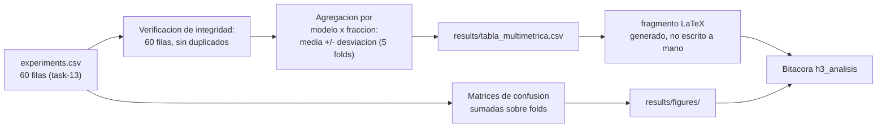

## Description

<!-- SECTION:DESCRIPTION:BEGIN -->
**Actividad del anteproyecto:** A9 — Evaluación multimétrica y de costo computacional.

**Qué.** Consolidar `results/experiments.csv` en la tabla final por modelo y fracción con **todas** las métricas que exige A9: exactitud, F1 ponderado y macro, sensibilidad y especificidad por clase, tiempo de entrenamiento y tiempo de inferencia; más las matrices de confusión agregadas.

**Por qué.** La exactitud sola es insuficiente en un problema clínico de 4 clases desbalanceadas: un modelo puede acertar el 90 % global y fallar sistemáticamente en la clase menos representada, lo que en un contexto diagnóstico es inaceptable (`esteva2019guide`). Reportar sensibilidad y especificidad por clase es lo que permite leer el comportamiento clínicamente relevante, y reportar el costo es lo que permite juzgar si el modelo híbrido paga su sobrecosto (`lusnig2024leveraging`).

**Entregable.** `results/tabla_multimetrica.csv`, fragmento LaTeX `results/figures/tabla_multimetrica.tex` incluido en la bitácora con `\input`, y matrices de confusión en `results/figures/`.

**Consolidación.**



**Nota estadística sobre las matrices de confusión.** En validación cruzada de k particiones cada imagen aparece en validación **exactamente una vez**, así que sumar las 5 matrices de un mismo modelo y fracción da una predicción por imagen del conjunto completo. Esa suma es legítima y es la forma correcta de presentar la matriz agregada.

**Claves BibTeX.** `esteva2019guide`, `lusnig2024leveraging`.
<!-- SECTION:DESCRIPTION:END -->

## Acceptance Criteria
<!-- AC:BEGIN -->
- [ ] #1 Tabla por modelo y fracción con exactitud, F1 ponderado, F1 macro, sensibilidad y especificidad por clase y tiempos, todas como media y desviación estándar sobre los 5 folds
- [ ] #2 Se reportan F1 ponderado y macro juntos, con la interpretación de su diferencia en el contexto del desbalance de clases
- [ ] #3 Matrices de confusión agregadas por modelo y fracción, con el orden de clases fijado explícitamente y coherente con el mapeo de task-9
- [ ] #4 La tabla se genera desde el CSV mediante script reproducible: ningún valor se escribe a mano
- [ ] #5 La tabla se exporta como fragmento LaTeX y se incluye en la bitácora con \input
- [ ] #6 Se verifica la integridad del CSV (60 filas, sin duplicados, sin nulos) antes de cualquier agregación
- [ ] #7 Se reporta el sobrecosto computacional del modelo híbrido frente a las líneas base, segmentado por dispositivo si la campaña usó más de uno
- [ ] #8 Hallazgo registrado en hallazgos/h3_analisis.tex con \label{hallazgo:task-14}
<!-- AC:END -->

## Definition of Done
<!-- DOD:BEGIN -->
- [ ] #1 La tabla se regenera con un solo comando y produce el mismo resultado
- [ ] #2 El CSV original nunca se sobrescribe con valores redondeados
- [ ] #3 Se distingue explícitamente la media de F1 por fold del F1 calculado sobre la unión de folds
- [ ] #4 Tipado de Python 3.12 y docstrings NumPy en español latinoamericano
<!-- DOD:END -->

## Implementation Plan

<!-- SECTION:PLAN:BEGIN -->
1. Verificar la integridad del CSV antes de agregar nada: 60 filas, sin duplicados en `(modelo, data_fraction, fold)`, sin nulos en las columnas de métricas. Si falta una celda, volver a task-13 en lugar de agregar un diseño incompleto.
2. Agregar por celda del diseño con media y desviación estándar sobre los 5 folds:

```python
METRICAS = [
    "accuracy_val",
    "f1_val_weighted",
    "f1_val_macro",
    "train_time_s",
    "inference_ms_per_batch",
    "brecha_g",
]

resumen = (
    df.groupby(["modelo", "data_fraction"])[METRICAS]
    .agg(["mean", "std"])
    .round(4)
)
```

3. Consolidar sensibilidad y especificidad por clase, que viven en columnas `sens_*` y `spec_*`, manteniendo el orden de clases fijado en task-9.
4. Construir las matrices de confusión agregadas sumando las de los 5 folds de cada celda, con `labels=` explícito para fijar el orden.
5. Exportar el fragmento LaTeX **generado**, nunca escrito a mano:

```python
(resumen
 .to_latex(
     "results/figures/tabla_multimetrica.tex",
     caption="Resultados multimétricos por modelo y fracción de datos.",
     label="tab:multimetrica",
     float_format="%.4f",
 ))
```

6. Redactar la lectura de la tabla: qué dice el F1 macro frente al ponderado, en qué clase se concentra el error y cuál es el sobrecosto de cómputo del modelo híbrido frente a las líneas base.
7. Registrar el hallazgo en `hallazgos/h3_analisis.tex` con `\input` del fragmento generado y las matrices de confusión.

Ejecución (ver el skill `analizar-resultados`):

```bash
uv run python -m src.analysis.consolidar
```
<!-- SECTION:PLAN:END -->

## Implementation Notes

<!-- SECTION:NOTES:BEGIN -->
**Trampas conocidas.**

- **No confundir dos cantidades distintas:** la media de los F1 calculados por fold **no** es el F1 calculado sobre la unión de las predicciones de todos los folds. A9 pide métricas por corrida, así que lo que se reporta es media ± desviación estándar de los F1 por fold; si en algún punto se reporta el F1 agregado, hay que decir explícitamente que es otra cantidad.
- El F1 ponderado puede subir mientras el macro baja: eso significa que el modelo mejora en las clases mayoritarias y empeora en las minoritarias. Es exactamente el patrón que interesa detectar en escasez, así que ambos números deben aparecer juntos y comentarse.
- Fijar `labels=` en `confusion_matrix`. Sin ello, el orden de clases puede variar entre celdas si alguna clase no aparece en las predicciones de un fold, y las matrices dejarían de ser sumables.
- Al 10 % la sensibilidad de una clase minoritaria se calcula sobre pocas imágenes y su varianza entre folds es enorme. Reportar la desviación estándar y evitar conclusiones sobre diferencias que caen dentro del ruido.
- Redondear solo en la presentación. Nunca sobrescribir el CSV con valores redondeados: el análisis de task-15 necesita la precisión completa.
- Ningún valor de la tabla debe escribirse a mano. Una tabla LaTeX editada manualmente se desincroniza del CSV en la primera corrección y nadie lo nota hasta la defensa.
- El tiempo de inferencia solo es comparable si todas las celdas se midieron en el mismo dispositivo. Si la campaña mezcló CPU, MPS y CUDA, hay que segmentar la comparación por dispositivo o la conclusión de costo será inválida.

**Entorno de ejecución (TASK-20).** Esta tarea se ejecuta en **CPU**: local con `uv run` o runtime de Colab sin GPU. Consolidar un CSV y generar tablas no requiere acelerador, y gastar unidades de cómputo de Colab Pro+ aquí resta presupuesto al bloque HQCNN de task-13.

Con la campaña homogénea en CUDA (decisión D3), las columnas `train_time_s` e `inference_ms_per_batch` de las 60 filas son comparables entre sí. Las corridas MPS archivadas en `results/historico_mps.csv` **no** entran en la consolidación: aparecerían como una segunda observación de celdas ya presentes y con hardware distinto.
<!-- SECTION:NOTES:END -->
