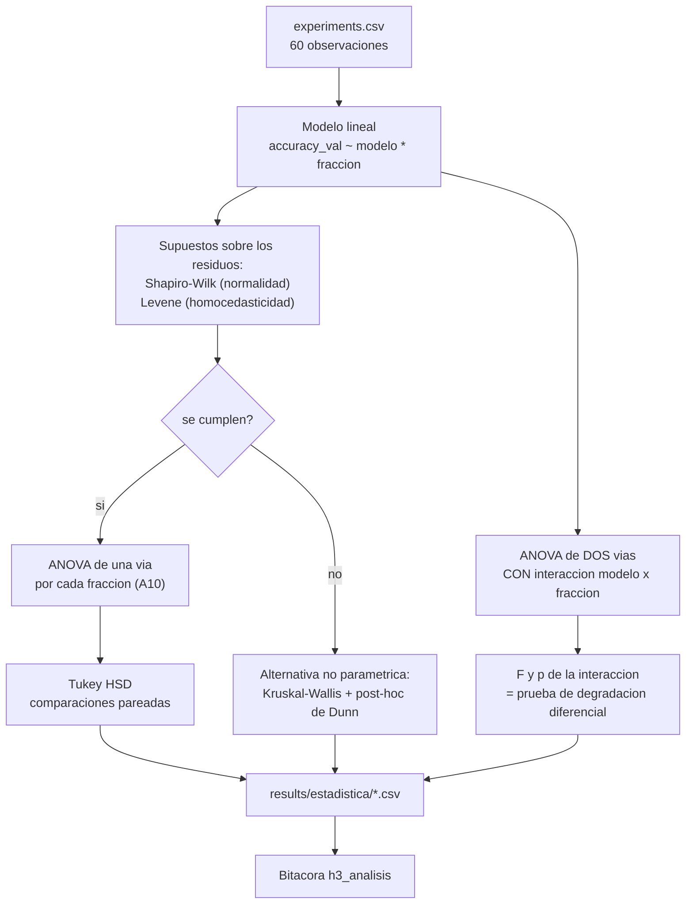

## Description

<!-- SECTION:DESCRIPTION:BEGIN -->
**Actividad del anteproyecto:** A10 — Análisis estadístico inferencial.

**Qué.** Verificación de supuestos (Shapiro-Wilk, Levene), ANOVA de una vía sobre `modelo` **por cada fracción**, Tukey HSD para las comparaciones pareadas y —esto es la corrección clave respecto al plan original— **ANOVA de dos vías con término de interacción `modelo × fracción`**.

**Por qué la interacción es imprescindible.** La hipótesis del proyecto no es "el HQCNN es mejor", sino "el HQCNN **se degrada menos** que las líneas base cuando los datos escasean". Eso es, por definición, un **efecto de interacción**: el efecto del modelo depende del nivel de la fracción de datos. Una ANOVA de una vía sobre `modelo` a una fracción fija solo dice si los modelos difieren en ese punto; no puede decir si las pendientes de degradación difieren. Sin el término de interacción, la pregunta de investigación queda sin prueba estadística, por muchas ANOVA de una vía que se acumulen.

**Entregable.** `results/estadistica/` con supuestos, ANOVA de una vía por fracción, Tukey HSD, ANOVA de dos vías con interacción y tamaños de efecto; todo reproducido en la bitácora.

**Ruta de decisión del análisis.**



**Limitación que debe declararse, no esconderse.** Los 5 folds **comparten** datos de entrenamiento entre sí, así que las 5 observaciones de cada celda **no son independientes**. La ANOVA supone independencia; al no cumplirse, los valores p son optimistas y deben leerse como indicativos y no como prueba definitiva. La alternativa metodológicamente más rigurosa sería un modelo mixto con el fold como efecto aleatorio; el anteproyecto pide ANOVA, de modo que se cumple lo pedido **y** se señala el modelo mixto como trabajo futuro.

**Claves BibTeX.** `caro2022generalization`. Excepción justificada por tema ausente en el `.bib`: `kim2015posthoc` (comparaciones múltiples y post-hoc).
<!-- SECTION:DESCRIPTION:END -->

## Acceptance Criteria
<!-- AC:BEGIN -->
- [ ] #1 Se verifican y reportan los supuestos sobre los residuos del modelo: Shapiro-Wilk para normalidad y Levene para homocedasticidad, con estadísticos y valores p
- [ ] #2 Se ejecuta la ANOVA de una vía sobre modelo para cada fracción de datos, como pide A10
- [ ] #3 Se ejecuta Tukey HSD para las comparaciones pareadas entre modelos, reportando diferencias de medias, intervalos de confianza y p ajustado
- [ ] #4 Se ejecuta la ANOVA de dos vías con término de interacción modelo por fracción y se reportan explícitamente F y p de la interacción como prueba de la degradación diferencial
- [ ] #5 Se declara la limitación de no independencia de las observaciones y se explica que los valores p son optimistas por folds que comparten datos de entrenamiento
- [ ] #6 Si los supuestos no se cumplen se aplica y reporta la alternativa no paramétrica (Kruskal-Wallis con post-hoc de Dunn) en lugar de ignorar el incumplimiento
- [ ] #7 Se reporta el tamaño del efecto además del valor p, de modo que un p no significativo no se lea como ausencia de efecto
- [ ] #8 Se declara el número de pruebas realizadas y la corrección aplicada por comparaciones múltiples
- [ ] #9 El análisis se repite para el F1 macro además de la exactitud, por el desbalance de clases
- [ ] #10 Todas las tablas quedan en results/estadistica/ y se reproducen en la bitácora en hallazgos/h3_analisis.tex con \label{hallazgo:task-15}
<!-- AC:END -->

## Definition of Done
<!-- DOD:BEGIN -->
- [ ] #1 Ninguna afirmación de ventaja o supremacía cuántica: las conclusiones se limitan a la configuración experimental evaluada
- [ ] #2 El tipo de sumas de cuadrados usado queda declarado, junto con el estado de balance del diseño
- [ ] #3 El modelo mixto con el fold como efecto aleatorio queda señalado como trabajo futuro
- [ ] #4 Análisis reproducible con un solo comando desde el CSV consolidado
<!-- DOD:END -->

## Implementation Plan

<!-- SECTION:PLAN:BEGIN -->
1. Ajustar el modelo lineal con interacción y verificar los supuestos **sobre los residuos**, no sobre la variable cruda:

```python
import statsmodels.api as sm
from scipy import stats
from statsmodels.formula.api import ols

modelo = ols(
    "accuracy_val ~ C(modelo) + C(data_fraction) + C(modelo):C(data_fraction)",
    data=df,
).fit()

w, p_shapiro = stats.shapiro(modelo.resid)
grupos = [g["accuracy_val"].to_numpy() for _, g in df.groupby(["modelo", "data_fraction"])]
lev, p_levene = stats.levene(*grupos)
```

2. Ejecutar la **ANOVA de dos vías con interacción**, que es la prueba de la hipótesis central:

```python
tabla_dos_vias = sm.stats.anova_lm(modelo, typ=2)
```

Reportar explícitamente `F` y `p` de la fila de interacción `C(modelo):C(data_fraction)`, no solo los efectos principales.

3. Ejecutar la ANOVA de una vía sobre `modelo` **para cada fracción**, como pide literalmente A10:

```python
for fraccion, grupo in df.groupby("data_fraction"):
    parcial = ols("accuracy_val ~ C(modelo)", data=grupo).fit()
    tabla = sm.stats.anova_lm(parcial, typ=2)
```

4. Ejecutar Tukey HSD por fracción, reportando diferencias de medias, intervalos de confianza y p ajustado:

```python
from statsmodels.stats.multicomp import pairwise_tukeyhsd

resultado = pairwise_tukeyhsd(
    endog=grupo["accuracy_val"],
    groups=grupo["modelo"],
    alpha=0.05,
)
```

5. Calcular el **tamaño del efecto** (eta cuadrado parcial) para cada término: con n = 5 por celda, un valor p no significativo no equivale a ausencia de efecto, y el tamaño del efecto es lo que permite distinguir ambas cosas.

```python
def eta_cuadrado_parcial(tabla: pd.DataFrame) -> pd.Series:
    """Calcula eta cuadrado parcial por término del modelo."""
    residual = tabla.loc["Residual", "sum_sq"]
    return tabla["sum_sq"] / (tabla["sum_sq"] + residual)
```

6. Si Shapiro-Wilk o Levene rechazan, ejecutar y reportar la alternativa no paramétrica (Kruskal-Wallis con post-hoc de Dunn) en lugar de continuar como si los supuestos se cumplieran.
7. Corregir por comparaciones múltiples si se ejecutan varias ANOVA (una por fracción y por métrica) y declarar el método de corrección.
8. Repetir el análisis para la métrica secundaria clave (F1 macro), porque en clases desbalanceadas puede contar una historia distinta a la exactitud.
9. Registrar el hallazgo en `hallazgos/h3_analisis.tex`: tabla de supuestos, tabla de dos vías con la interacción resaltada, ANOVA por fracción, Tukey HSD, tamaños de efecto y la declaración de la limitación de independencia.

Ejecución (ver el skill `analizar-resultados`):

```bash
uv run python -m src.analysis.estadistica
```
<!-- SECTION:PLAN:END -->

## Implementation Notes

<!-- SECTION:NOTES:BEGIN -->
**Trampas conocidas.**

- Shapiro-Wilk se aplica a los **residuos del modelo**, no a la variable de respuesta cruda. Aplicarlo a la variable cruda mezcla la variación entre grupos con la del error y casi siempre rechaza.
- Con 5 observaciones por celda, las pruebas de supuestos tienen **poca potencia**: no rechazar normalidad no demuestra normalidad. Hay que decirlo, en lugar de presentar el no rechazo como validación.
- El tipo de sumas de cuadrados importa cuando el diseño está desbalanceado. Con las 60 celdas completas (5 por celda) los tipos I, II y III coinciden para los efectos principales; si alguna celda quedó incompleta en task-13, el tipo elegido cambia los resultados y debe declararse explícitamente.
- Tukey HSD supone homocedasticidad e **independencia**. Con folds que comparten datos de entrenamiento, su nivel de confianza nominal del 95 % es optimista. Reportarlo con esa advertencia.
- Ejecutar una ANOVA por fracción y por métrica multiplica las pruebas y con ellas la tasa de falsos positivos. Declarar cuántas pruebas se hicieron y qué corrección se aplicó.
- **Nunca concluir "ventaja cuántica" ni "supremacía cuántica"** a partir de un p < 0.05 obtenido en un simulador de 4 qubits. El resultado, si existe, es sobre eficiencia de datos en esta configuración concreta: extractor congelado, 4 qubits, `parameter-shift`, este dataset. Cualquier afirmación más amplia no está sostenida por el diseño.
- Un efecto de interacción significativo tampoco identifica **qué** modelo se degrada menos: hay que inspeccionar las medias marginales o las comparaciones simples dentro de cada fracción para decir la dirección del efecto.
- Reportar solo el valor p sin el tamaño del efecto ni los intervalos de confianza es insuficiente para un trabajo publicable, e invita a sobreinterpretar diferencias que están dentro del ruido.

**Frontera de la afirmación.** La conclusión defendible tiene esta forma: en este dataset, con este extractor congelado y esta configuración de 4 qubits simulados, la interacción entre modelo y fracción de datos fue (o no fue) estadísticamente detectable, con este tamaño de efecto y bajo estas limitaciones de independencia.

**Entorno de ejecución (TASK-20).** Esta tarea se ejecuta en **CPU**: local con `uv run` o runtime de Colab sin GPU. ANOVA, Tukey HSD y pruebas de supuestos no requieren acelerador; el presupuesto de Colab Pro+ se reserva para la campaña de task-13.

El análisis parte exclusivamente de las 60 filas en CUDA. Ni las corridas MPS archivadas ni la sonda local de 1 época entran al modelo: mezclar presupuestos de época o dispositivos introduciría una fuente de variación no controlada que la ANOVA atribuiría al modelo.
<!-- SECTION:NOTES:END -->
