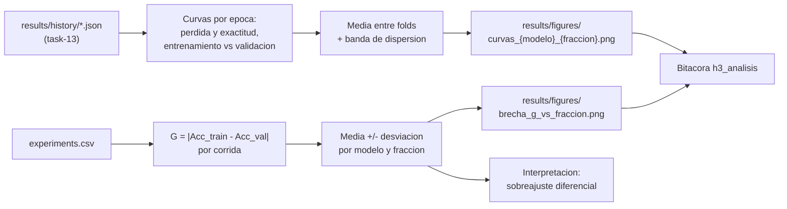

## Description

<!-- SECTION:DESCRIPTION:BEGIN -->
**Actividad del anteproyecto:** A11 — Curvas de aprendizaje y análisis de la brecha de generalización.

**Qué.** Curvas de pérdida y exactitud por época (entrenamiento y validación) reconstruidas desde `results/history/`, y la brecha de generalización `G = |Acc_train − Acc_val|` calculada por corrida y agregada por modelo y fracción.

**Por qué.** `G` es la expresión cuantitativa de la hipótesis central. Si el modelo híbrido realmente generaliza mejor con pocos datos, su `G` debería **crecer menos** que la de las líneas base a medida que la fracción de entrenamiento disminuye. Las curvas por época son lo que permite distinguir las tres explicaciones posibles de una exactitud baja: sobreajuste, subajuste u optimización insuficiente. El marco teórico de generalización a partir de pocos datos de entrenamiento (`caro2022generalization`) y la relación entre dimensión efectiva y capacidad de generalización (`abbas2021power`) son la base para interpretar lo observado.

**Entregable.** Figuras en `results/figures/` (curvas por modelo y fracción, y evolución de `G` frente a la fracción) más la interpretación registrada en la bitácora.

**Construcción del análisis.**



**Advertencia de interpretación que la tarea debe respetar.** Una `G` baja acompañada de exactitud baja **no** es una buena noticia: es subajuste. Y una `G` baja en el modelo híbrido puede deberse a su cuello de botella de 4 dimensiones (menos capacidad, por tanto menos margen para sobreajustar) y no a una virtud del componente cuántico. Esa explicación alternativa debe discutirse explícitamente, no omitirse.

**Claves BibTeX.** `caro2022generalization`, `abbas2021power`, `holmes2022connecting`.
<!-- SECTION:DESCRIPTION:END -->

## Acceptance Criteria
<!-- AC:BEGIN -->
- [ ] #1 Curvas de pérdida y exactitud por época para entrenamiento y validación, por cada combinación de modelo y fracción, construidas desde el historial persistido y sin reentrenar
- [ ] #2 La brecha G = |Acc_train - Acc_val| se calcula por corrida y se agrega como media y desviación estándar por modelo y fracción
- [ ] #3 Existe una figura de G frente a la fracción de datos con una serie por modelo y barras de error: la lectura visual directa de la hipótesis de degradación diferencial
- [ ] #4 Las curvas incluyen la dispersión entre folds mediante banda o sombreado, no solo la media
- [ ] #5 La interpretación distingue sobreajuste, subajuste y optimización insuficiente, y descarta explícitamente leer una G baja con exactitud baja como buena generalización
- [ ] #6 Se documenta si la exactitud de entrenamiento se midió con o sin aumento de datos, por su efecto sobre la interpretación de G
- [ ] #7 Se discute la explicación alternativa de que el cuello de botella de 4 dimensiones del modelo híbrido reduzca su margen de sobreajuste
- [ ] #8 Se advierte que las curvas de pérdida del híbrido y de las líneas base no son directamente comparables por la escala de los logits
- [ ] #9 Todas las figuras quedan en results/figures/ con formato y escalas consistentes y se incluyen en la bitácora con \includegraphics
- [ ] #10 Hallazgo registrado en hallazgos/h3_analisis.tex con \label{hallazgo:task-16} conectando la lectura empírica con el marco teórico de generalización con pocos datos
<!-- AC:END -->

## Definition of Done
<!-- DOD:BEGIN -->
- [ ] #1 Se verifica que existe historial por época para todas las celdas antes de graficar
- [ ] #2 El presupuesto de épocas se reporta junto con G para que la métrica sea comparable
- [ ] #3 Figuras regenerables con un solo comando desde los artefactos de results/
- [ ] #4 Tipado de Python 3.12 y docstrings NumPy en español latinoamericano
<!-- DOD:END -->

## Implementation Plan

<!-- SECTION:PLAN:BEGIN -->
1. Cargar los historiales por época y verificar que existe uno por cada celda del diseño; si falta alguno, volver a task-13 en lugar de graficar un subconjunto silencioso.
2. Construir las curvas promediando entre folds y mostrando la dispersión, no solo la media:

```python
def curva_promedio(historiales: list[pd.DataFrame], columna: str) -> pd.DataFrame:
    """Promedia una métrica por época entre folds y devuelve media y desviación.

    Returns
    -------
    pd.DataFrame
        Índice por época con las columnas ``media`` y ``desviacion``.
    """
    apiladas = pd.concat([h[["epoca", columna]] for h in historiales])
    agrupadas = apiladas.groupby("epoca")[columna]
    return pd.DataFrame({"media": agrupadas.mean(), "desviacion": agrupadas.std()})
```

3. Graficar con banda de dispersión (`fill_between` entre media ± desviación) para cada combinación de modelo y fracción, con ejes y escalas consistentes entre figuras.
4. Calcular la brecha por corrida y agregarla por celda:

```python
df["brecha_g"] = (df["accuracy_train"] - df["accuracy_val"]).abs()
brecha = df.groupby(["modelo", "data_fraction"])["brecha_g"].agg(["mean", "std"])
```

5. Producir la figura clave del capítulo de resultados: `G` en el eje vertical, fracción de datos en el horizontal, una serie por modelo, con barras de error. Es la lectura visual directa de la hipótesis de degradación diferencial.
6. Redactar la interpretación distinguiendo los tres regímenes: sobreajuste (`G` alta con exactitud de entrenamiento alta), subajuste (ambas exactitudes bajas) y optimización insuficiente (la curva de validación aún desciende al agotarse el presupuesto de épocas).
7. Discutir la explicación alternativa: el cuello de botella de 4 dimensiones del modelo híbrido reduce su capacidad y por tanto su margen de sobreajuste, lo que puede producir una `G` baja sin que intervenga ninguna ventaja cuántica.
8. Registrar el hallazgo en `hallazgos/h3_analisis.tex` con `\includegraphics` de las figuras y la interpretación conectada al marco teórico.

Ejecución (ver el skill `analizar-resultados`):

```bash
uv run python -m src.analysis.curvas
```
<!-- SECTION:PLAN:END -->

## Implementation Notes

<!-- SECTION:NOTES:BEGIN -->
**Trampas conocidas.**

- **La trampa más importante:** la exactitud de entrenamiento medida **durante** la pasada de entrenamiento se calcula sobre imágenes aumentadas, mientras que la de validación se calcula sobre imágenes sin aumentar. Esa asimetría **subestima** `G`. Para que `G` sea interpretable, la exactitud de entrenamiento debe medirse en una pasada aparte sin aumento; si se decide no hacerlo por costo, hay que declararlo, porque cambia el significado de la métrica. Esta decisión conecta directamente con el contrato de task-4 y el bucle de task-8.
- `G` medida en la última época depende del presupuesto de épocas: con más épocas, todos los modelos sobreajustan más. Reportar siempre el presupuesto junto con `G`, o el número no es comparable con ningún otro trabajo.
- Las curvas de **pérdida** del modelo híbrido y de las líneas base **no** son directamente comparables: los logits del híbrido provienen de valores esperados en [-1, 1] y su entropía cruzada parte de un rango distinto. Las curvas de **exactitud** sí son comparables. Superponer pérdidas sin advertirlo produce una figura engañosa.
- Promediar curvas entre folds oculta comportamientos divergentes: si un fold no converge y cuatro sí, la media parece razonable. La banda de dispersión es lo que hace visible ese caso.
- Una `G` baja con exactitud baja es subajuste, no generalización. Es el error de lectura más frecuente de esta métrica y debe quedar explícitamente descartado en el texto.
- Al 10 % la exactitud de entrenamiento puede llegar a 1.0 con muy pocas imágenes, saturando `G`. Con saturación, las comparaciones entre modelos pierden sensibilidad: mencionarlo si ocurre.
- Mantener escalas idénticas entre figuras del mismo tipo. Ejes autoescalados hacen que dos modelos parezcan distintos por el encuadre y no por los datos.

**Entorno de ejecución (TASK-20).** Esta tarea se ejecuta en **CPU**: local con `uv run` o runtime de Colab sin GPU. Las curvas se reconstruyen desde `results/history/` sin reentrenar, así que no requiere acelerador.

Los historiales de las corridas MPS quedan archivados en `results/history_mps/` y no se grafican: las curvas del capítulo provienen únicamente de las 60 celdas ejecutadas en CUDA con el mismo presupuesto de 15 épocas.
<!-- SECTION:NOTES:END -->
