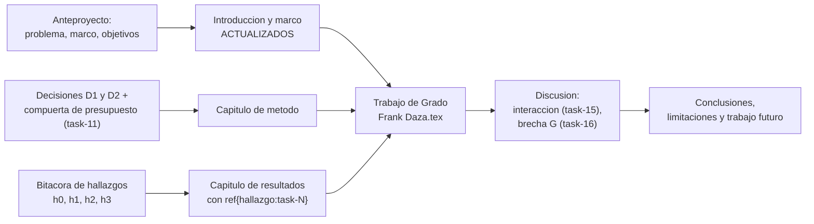

## Description

<!-- SECTION:DESCRIPTION:BEGIN -->
**Actividad del anteproyecto:** A12 — Redacción del documento final de trabajo de grado.

**Qué.** Sintetizar la bitácora de hallazgos en `docs/trabajo_de_grado/Trabajo de Grado - Frank Daza.tex`: introducción, marco teórico (heredado del anteproyecto y **actualizado**), método (con las decisiones D1 y D2 justificadas), resultados (trazados con `\ref{hallazgo:task-N}`), discusión, conclusiones y limitaciones.

**Por qué.** Si las tareas anteriores se ejecutaron con disciplina, esta no es una tarea de arqueología sino de **síntesis**: la evidencia ya está escrita, fechada y ligada a artefactos concretos en `results/`. El documento final se construye seleccionando y articulando hallazgos, no reconstruyendo desde CSV lo que se pensó meses antes.

**Entregable.** Documento compilable en `docs/trabajo_de_grado/`, con capítulos en `capitulos/` y bibliografía contra el `Referencias.bib` compartido.

**Flujo de síntesis.**



**Mapeo de capítulos a su fuente de evidencia.**

| Capítulo | Fuente |
| :--- | :--- |
| Introducción | Anteproyecto: problema, justificación, objetivos |
| Marco teórico | Anteproyecto, **actualizado** con lo aprendido en task-9 y task-11 |
| Método | task-3 a task-8, más las decisiones D1 y D2 |
| Resultados | task-12 a task-16, vía los hallazgos de la bitácora |
| Discusión | Interacción de task-15, brecha de task-16, contraste con `haddou2025hqcm` y `khan2024brain` |
| Conclusiones y trabajo futuro | Modelo mixto, hardware real, más qubits, aumento del espacio latente |

**Precisión metodológica que este documento debe dejar clara.** La decisión **D1** cambia el orden de las operaciones respecto a la redacción literal de A8: los folds se definen sobre el conjunto completo y la fracción de escasez se aplica solo al entrenamiento. La intención de A8 se cumple, pero el cambio debe explicarse, no ocultarse.

**Claves BibTeX.** Todas las utilizadas en las tareas previas, sin duplicar entradas.
<!-- SECTION:DESCRIPTION:END -->

## Acceptance Criteria
<!-- AC:BEGIN -->
- [ ] #1 Cada capítulo de resultados deriva de la bitácora con referencias explícitas al hallazgo correspondiente: ningún número aparece sin trazabilidad a un artefacto en results/
- [ ] #2 El capítulo de método justifica la decisión D1 frente a la redacción literal de A8, explicando por qué cambia el orden de las operaciones
- [ ] #3 El capítulo de método declara la decisión D2 y el resultado de la compuerta de presupuesto de task-11
- [ ] #4 Las limitaciones se declaran en un apartado propio: no independencia de folds, simulación en lugar de hardware, cuello de botella de 4 dimensiones, extractor congelado y potencia estadística
- [ ] #5 No se afirma ventaja ni supremacía cuántica en ningún punto: las conclusiones se limitan a la configuración evaluada
- [ ] #6 El marco teórico se actualiza con lo aprendido durante la ejecución y no se copia sin cambios del anteproyecto
- [ ] #7 Tablas y figuras se incluyen desde results/ con \input y \includegraphics, sin transcribir valores a mano
- [ ] #8 Bibliografía con natbib contra el Referencias.bib compartido, sin entradas duplicadas y sin DOIs inventados
- [ ] #9 Los objetivos específicos OE1, OE2 y OE3 quedan respondidos explícitamente, cada uno con la evidencia que lo sustenta
- [ ] #10 El documento compila con la cadena completa sin errores y sin referencias sin resolver
<!-- AC:END -->

## Definition of Done
<!-- DOD:BEGIN -->
- [ ] #1 Español latinoamericano académico en todo el documento
- [ ] #2 Un resultado contrario a la hipótesis se reporta con la misma claridad que uno favorable
- [ ] #3 Las citas nuevas se agregan con el skill agregar-cita sobre el .bib compartido
- [ ] #4 PDF final revisado a la vista: índice, tablas, figuras y citas resueltas
<!-- DOD:END -->

## Implementation Plan

<!-- SECTION:PLAN:BEGIN -->
1. Recorrer la bitácora completa y construir el índice de hallazgos disponibles: `task-N`, artefacto, decisión asociada. Ese índice es el esqueleto del capítulo de resultados.
2. Redactar el capítulo de método a partir de las tareas de Fase 0 y Fase 1, incluyendo explícitamente:
   - la auditoría del dataset y sus exclusiones (task-3);
   - el pipeline y la justificación anatómica del aumento (task-5);
   - **D1** con su justificación frente a la redacción literal de A8 (task-6);
   - el criterio de época y los hiperparámetros comunes (task-8);
   - cada decisión de diseño del circuito con su cita (task-9, task-10);
   - **D2** y el resultado de la compuerta de presupuesto (task-11).
3. Redactar el capítulo de resultados incluyendo tablas y figuras **desde** `results/`, nunca copiadas a mano:

```latex
\section{Resultados multimétricos}
\label{sec:resultados-multimetricos}
Los resultados consolidados (véase el hallazgo~\ref{hallazgo:task-14})
se presentan en la Tabla~\ref{tab:multimetrica}.
\input{../../results/figures/tabla_multimetrica.tex}

\section{Brecha de generalización}
La evolución de la brecha $G$ frente a la fracción de datos
(hallazgo~\ref{hallazgo:task-16}) se muestra en la
Figura~\ref{fig:brecha}.
\begin{figure}[htbp]
  \centering
  \includegraphics[width=0.85\textwidth]{../../results/figures/brecha_g_vs_fraccion.png}
  \caption{Brecha de generalización por modelo y fracción de datos.}
  \label{fig:brecha}
\end{figure}
```

4. Redactar la discusión articulando tres piezas: el resultado de la interacción `modelo × fracción` (task-15), la lectura de la brecha (task-16) y el contraste con la literatura híbrida sobre el mismo dataset.
5. Redactar el apartado de limitaciones de forma explícita y completa: no independencia de los folds, simulación en lugar de hardware cuántico, cuello de botella de 4 dimensiones, extractor congelado, potencia estadística con n = 5 por celda y las exclusiones del dataset.
6. Responder de forma explícita cada objetivo específico (OE1, OE2, OE3) con la evidencia que lo sustenta y su referencia al hallazgo correspondiente.
7. Añadir las citas nuevas que haga falta con el skill `agregar-cita`, sobre el `Referencias.bib` **compartido**.
8. Compilar la cadena completa y verificar que no queda ninguna referencia sin resolver:

```bash
cd docs/trabajo_de_grado
pdflatex "Trabajo de Grado - Frank Daza.tex"
bibtex "Trabajo de Grado - Frank Daza"
pdflatex "Trabajo de Grado - Frank Daza.tex"
pdflatex "Trabajo de Grado - Frank Daza.tex"
grep -c "??" "Trabajo de Grado - Frank Daza.log" || true
```
<!-- SECTION:PLAN:END -->

## Implementation Notes

<!-- SECTION:NOTES:BEGIN -->
**Trampas conocidas.**

- **Copiar el marco teórico del anteproyecto sin actualizarlo** es el error más probable. Entre el anteproyecto y el cierre se aprenden cosas que pertenecen al marco y al método: la profundidad `L` elegida y por qué, el costo real de `parameter-shift`, las limitaciones concretas del dataset, el efecto de la acotación de ángulos. Un marco que no refleja lo aprendido delata que el documento se escribió sin leer la propia evidencia.
- Ningún número debe escribirse a mano en el documento. Tablas con `\input` y figuras con `\includegraphics` desde `results/`: en cuanto se corrige un análisis, el documento se actualiza al recompilar. Un número transcrito se desincroniza en la primera corrección y nadie lo nota hasta la defensa.
- No crear un `.bib` local. La bibliografía es la compartida en `docs/proyecto_de_grado/Referencias.bib`, y las entradas nuevas entran validadas con el skill `agregar-cita`. **No inventar DOIs** bajo ninguna circunstancia.
- Si un resultado contradice la hipótesis, se reporta igual. Un resultado negativo bien ejecutado, con diseño factorial balanceado y control de particiones, es un aporte legítimo; uno maquillado es indefendible ante un jurado que sepa leer una tabla.
- Evitar el lenguaje de "ventaja cuántica", "supremacía" o "superioridad". Lo que el diseño permite afirmar es acotado: eficiencia de datos en esta configuración, con este extractor, con 4 qubits simulados y este dataset.
- Las rutas relativas desde `capitulos/` hacia `results/` cambian según desde dónde se compile. Fijar el directorio de compilación en el README y usar `\graphicspath` si hace falta, en lugar de parchear rutas capítulo por capítulo.
- La cadena de compilación con `natbib` necesita `pdflatex` → `bibtex` → `pdflatex` → `pdflatex` cuando hay referencias cruzadas a tablas y figuras. Una pasada de menos deja `[?]` y `??` en el PDF final.
<!-- SECTION:NOTES:END -->
