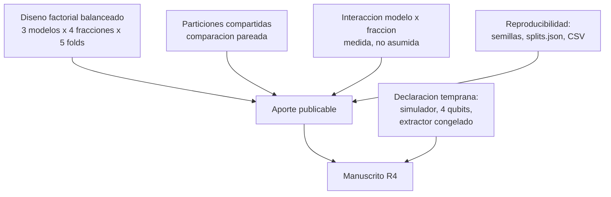

## Description

<!-- SECTION:DESCRIPTION:BEGIN -->
**Resultado esperado del anteproyecto:** R4 — Artículo científico derivado de la investigación.

**Qué.** Manuscrito derivado de los hallazgos consolidados, reproducible desde los CSV de `results/`, enfocado en la **eficiencia de datos** del modelo híbrido y no en la exactitud absoluta.

**Por qué.** El aporte publicable de este trabajo no es "el HQCNN gana": es el **diseño experimental controlado** que permite responder si la degradación al reducir datos difiere entre arquitecturas. Buena parte de la literatura de QML médico reporta mejoras sin controlar particiones, semillas ni presupuesto de cómputo, lo que hace sus comparaciones difíciles de interpretar (`gupta2025systematic`, `shahriyar2025advancements`). El diferencial de este trabajo es el control experimental: diseño factorial balanceado, particiones compartidas, término de interacción medido y reproducibilidad completa. Eso es lo que sobrevive a la revisión por pares.

**Entregable.** Manuscrito con estructura de artículo, figuras y tablas generadas por script, y paquete de reproducción (código, semillas, `splits.json`, CSV).

**Anclaje del aporte.**

**Honestidad como estrategia editorial.** Declarar en el **resumen** que se trabaja con un simulador de 4 qubits, y no enterrarlo en las limitaciones, reduce el riesgo de rechazo por sobreafirmación y mejora la credibilidad del resto del manuscrito.

**Claves BibTeX.** `gupta2025systematic`, `shahriyar2025advancements`, `Preskill2018`, `haddou2025hqcm`.
<!-- SECTION:DESCRIPTION:END -->

## Acceptance Criteria
<!-- AC:BEGIN -->
- [ ] #1 El manuscrito es reproducible desde los CSV de results/: cada figura y tabla se genera con script y ninguna se rehace a mano
- [ ] #2 Estructura completa de artículo con el aporte enmarcado en eficiencia de datos y no en exactitud absoluta
- [ ] #3 Se reporta el término de interacción modelo por fracción con su tamaño de efecto y sus limitaciones de independencia
- [ ] #4 Se contrasta con la revisión sistemática de QML en salud digital y con los trabajos híbridos sobre el mismo dataset, explicando por qué los números no son directamente comparables
- [ ] #5 El uso de simulación y el número de qubits se declaran en el resumen y no solo en las limitaciones
- [ ] #6 Ninguna afirmación de ventaja o supremacía cuántica en el manuscrito
- [ ] #7 Se identifica la revista o congreso objetivo y el manuscrito respeta su formato y límite de extensión
- [ ] #8 Existe paquete de reproducción con código, uv.lock, splits.json, CSV e instrucciones de ejecución
<!-- AC:END -->

## Definition of Done
<!-- DOD:BEGIN -->
- [ ] #1 Todas las citas provienen del Referencias.bib compartido y cada DOI está verificado contra Crossref
- [ ] #2 Un resultado nulo o contrario a la hipótesis se reporta con el diseño y las limitaciones declaradas
- [ ] #3 La revista objetivo es de acceso abierto indexado y no depredadora
- [ ] #4 Los recortes por extensión no sacrifican el capítulo de método
<!-- DOD:END -->

## Implementation Plan

<!-- SECTION:PLAN:BEGIN -->
1. Elegir la revista o el congreso objetivo **antes** de escribir, y ajustar extensión, formato y estilo bibliográfico a sus normas. Preferir acceso abierto indexado y verificar que no se trate de una editorial depredadora.
2. Redactar el manuscrito con la estructura estándar: resumen, introducción, trabajos relacionados, método, resultados, discusión, limitaciones y conclusiones.
3. Enmarcar la contribución en términos de eficiencia de datos: la pregunta es cómo se degrada el desempeño al reducir el conjunto de entrenamiento y si esa degradación difiere entre arquitecturas.
4. Reutilizar las figuras y tablas ya generadas por los scripts de task-14, task-15 y task-16; ninguna se rehace a mano ni se reconstruye en otra herramienta.
5. Reportar el término de interacción con su tamaño de efecto y sus limitaciones de independencia, tal como quedó en task-15.
6. Contrastar con los trabajos híbridos sobre el mismo dataset explicando por qué los números no son directamente comparables (extractor congelado, validación cruzada, particiones propias).
7. Declarar en el resumen el uso de simulación y el número de qubits.
8. Preparar el paquete de reproducción: código, `uv.lock`, `results/splits.json`, CSV de resultados e instrucciones de ejecución.
9. Verificar que todas las citas provienen del `.bib` compartido y que ningún DOI está inventado.
<!-- SECTION:PLAN:END -->

## Implementation Notes

<!-- SECTION:NOTES:BEGIN -->
**Trampas conocidas.**

- El error de encuadre más costoso es vender el trabajo como una demostración de ventaja cuántica. Un revisor con criterio lo rechazará en la primera lectura, y el aporte real —el control experimental— quedará sepultado. El encuadre correcto es evidencia empírica sobre eficiencia de datos en una configuración concreta y reproducible.
- Comparar la exactitud absoluta con la literatura sin explicar las diferencias de protocolo (extractor congelado, validación cruzada frente al *split* original, particiones propias) invita a la conclusión errónea de que el método es inferior.
- Un resultado nulo bien medido es publicable si el diseño es sólido y las limitaciones están declaradas. Forzar la narrativa hacia un resultado positivo es lo que hace un manuscrito irrecuperable.
- Rehacer una figura "para que se vea mejor" en una herramienta externa rompe la trazabilidad con `results/`. Si hay que mejorar la presentación, se mejora el **script** que la genera.
- Los límites de extensión obligan a recortar. Recortar el método es el recorte equivocado: es justamente lo que distingue este trabajo. Recortar en trabajos relacionados y llevar detalles al material suplementario.
- Verificar cada DOI contra Crossref antes de enviar. Una referencia inventada o mal transcrita es un problema de integridad, no un descuido de formato.
<!-- SECTION:NOTES:END -->
