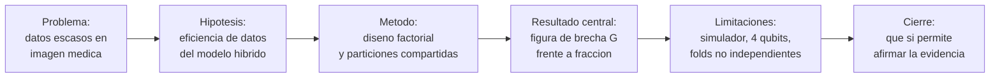

## Description

<!-- SECTION:DESCRIPTION:BEGIN -->
**Resultado esperado del anteproyecto:** R5 — Ponencia de divulgación.

**Qué.** Diapositivas y resumen alineados con el artículo de task-18: misma evidencia, mismas cifras, sin ningún resultado que no esté en el manuscrito.

**Por qué.** La ponencia cierra el ciclo de divulgación y es la primera exposición del trabajo a preguntas hostiles. La audiencia suele ser mixta: especialistas en aprendizaje automático que no dominan computación cuántica y viceversa. El reto es explicar el circuito variacional con intuición suficiente para que la charla se entienda, **sin** simplificar hasta afirmar cosas falsas.

**Entregable.** Presentación, resumen para el programa del evento y guion de respuestas a las preguntas previsibles.

**Estructura narrativa.**

**Diapositiva central.** La figura de `G` frente a la fracción de datos (task-16) es el resultado que responde la pregunta de investigación y debe ser el eje visual de la charla.

**Claves BibTeX.** Las del artículo, sin entradas nuevas.
<!-- SECTION:DESCRIPTION:END -->

## Acceptance Criteria
<!-- AC:BEGIN -->
- [ ] #1 Las diapositivas están alineadas con el artículo: misma evidencia y mismas cifras, sin resultados ausentes del manuscrito
- [ ] #2 Se reutilizan el diagrama del circuito, el esquema de la arquitectura y las figuras ya generadas por script, sin rehacerlos a mano
- [ ] #3 La figura de brecha de generalización frente a la fracción de datos es la diapositiva central de resultados
- [ ] #4 Existe una diapositiva de intuición del circuito variacional accesible para audiencia no especialista y sin afirmaciones incorrectas sobre computación cuántica
- [ ] #5 Existe una diapositiva explícita de limitaciones que incluye la simulación, el número de qubits y la no independencia de los folds
- [ ] #6 Existe resumen para el programa del evento con la extensión que pide la convocatoria
- [ ] #7 Existe guion de respuestas a las preguntas previsibles, incluida la de ventaja cuántica, con respuesta negativa fundamentada
- [ ] #8 Ninguna afirmación de ventaja o supremacía cuántica en la presentación
<!-- AC:END -->

## Definition of Done
<!-- DOD:BEGIN -->
- [ ] #1 Ensayo con control de tiempo, garantizando minutos suficientes para resultados y limitaciones
- [ ] #2 Cada cifra verificada contra el manuscrito, incluido el redondeo
- [ ] #3 Presentación en español latinoamericano
<!-- DOD:END -->

## Implementation Plan

<!-- SECTION:PLAN:BEGIN -->
1. Construir el guion siguiendo la narrativa problema → hipótesis → método → resultado → limitaciones → cierre, con la figura de brecha `G` como diapositiva central.
2. Reutilizar los artefactos ya generados: el diagrama del circuito de task-9, el esquema de la arquitectura de task-10 y las figuras de task-14 y task-16.
3. Preparar una diapositiva de intuición del circuito variacional: qué codifica el `AngleEmbedding`, qué hace el entrelazamiento y qué se mide, con lenguaje accesible y sin afirmaciones incorrectas.
4. Preparar una diapositiva explícita de limitaciones, que incluya la simulación, el número de qubits y la no independencia de los folds.
5. Escribir el resumen para el programa del evento, con la extensión que pida la convocatoria.
6. Anticipar el guion de respuestas a las preguntas previsibles:
   - por qué un simulador y no hardware real;
   - por qué solo 4 qubits;
   - por qué el extractor está congelado;
   - qué significa el término de interacción y qué **no** significa;
   - si esto demuestra ventaja cuántica (no).
7. Ensayar con control de tiempo y verificar que cada cifra dicha coincide exactamente con el manuscrito.
<!-- SECTION:PLAN:END -->

## Implementation Notes

<!-- SECTION:NOTES:BEGIN -->
**Trampas conocidas.**

- Reutilizar las figuras generadas por los scripts, no capturas de pantalla ni gráficos rehechos en otra herramienta: rompe la trazabilidad y suele introducir discrepancias numéricas con el manuscrito.
- La simplificación tentadora "la computación cuántica prueba todas las opciones a la vez" es **incorrecta** y descalifica la charla ante cualquier especialista. Es mejor explicar la codificación en amplitudes de un espacio de estados y la interferencia, aun a costa de un minuto más.
- Ninguna cifra de la charla debe diferir del manuscrito, ni siquiera por redondeo distinto. Una diferencia visible en una diapositiva genera dudas sobre todo lo demás.
- No presentar resultados preliminares o exploratorios que no estén en el artículo: si alguien pregunta por ellos después, no habrá evidencia registrada que los respalde.
- La pregunta "¿esto demuestra ventaja cuántica?" va a llegar. La respuesta debe estar preparada y ser negativa, con la explicación de qué sí permite afirmar el diseño.
- Con audiencia mixta, el tiempo se agota en el marco teórico y el resultado queda apurado al final. Presupuestar el tiempo al revés: primero garantizar los minutos del resultado y de las limitaciones.
<!-- SECTION:NOTES:END -->
