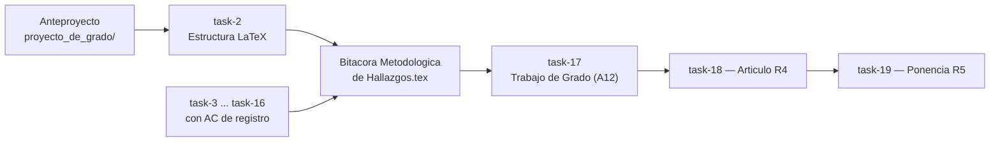

## Description

<!-- SECTION:DESCRIPTION:BEGIN -->
**Qué.** Crear la carpeta `docs/trabajo_de_grado/` con la estructura LaTeX del documento final y, sobre todo, con la **Bitácora Metodológica de Hallazgos**: el documento vivo donde cada tarea del backlog registra su evidencia conforme se ejecuta.

**Por qué.** Sin un registro formal, los hallazgos quedarían dispersos entre CSV, notebooks y conversaciones. El anteproyecto (`docs/proyecto_de_grado/`) es **prospectivo**: plantea problema, marco y diseño. La bitácora es el **registro empírico** de lo ejecutado, con trazabilidad `task-N` ↔ artefacto en `results/`. Al llegar a A12 la redacción se convierte en síntesis de evidencia ya escrita, no en arqueología de resultados.

**Entregable.** Carpeta `docs/trabajo_de_grado/` con:

| Artefacto | Rol |
| :--- | :--- |
| `preambulo_uao.tex` | Preámbulo **copiado** del anteproyecto: mismos paquetes, geometría, `natbib` + `apalike`, `listings`, encabezados. El preámbulo original no se modifica. |
| `Bitacora Metodologica de Hallazgos.tex` | Documento vivo que acumula hallazgos por fase. |
| `Trabajo de Grado - Frank Daza.tex` | Esqueleto del documento final (A12), alimentado por la bitácora. |
| `hallazgos/h0_fundamentos.tex` … `h3_analisis.tex` | Fragmentos `\input{}` por fase; una subsección por tarea con evidencia. |
| `capitulos/` | Esqueleto vacío del documento final (introducción, marco, método, resultados, conclusiones). |
| `Figuras/` | Figuras propias del trabajo de grado, incluido el logo UAO. |
| `../proyecto_de_grado/Referencias.bib` | Bibliografía **compartida**; prohibido duplicar entradas. |

**Estructura de la bitácora (deliberadamente distinta al anteproyecto).**

1. Propósito y convenciones — qué se registra y cómo se trazan `task-N` y artefactos.
2. Fase 0 — Fundamentos y datos (`\input{hallazgos/h0_fundamentos}`).
3. Fase 1 — Arquitectura híbrida (`\input{hallazgos/h1_arquitectura}`).
4. Fases 2-3 — Experimentación y análisis (`h2_experimentacion` + `h3_analisis`).
5. Síntesis de decisiones metodológicas — D1, D2, `L` congelado, go/no-go de cómputo.
6. Referencias — `\bibliography{../proyecto_de_grado/Referencias}`.

**Flujo documental.**



**Claves BibTeX.** Ninguna nueva: se heredan las convenciones bibliográficas del anteproyecto (`natbib` con estilo `apalike` contra `Referencias.bib`).
<!-- SECTION:DESCRIPTION:END -->

## Acceptance Criteria
<!-- AC:BEGIN -->
- [x] #1 Existe docs/trabajo_de_grado/ con preambulo_uao.tex, la bitácora, el esqueleto del trabajo final y las carpetas hallazgos/, capitulos/ y Figuras/
- [x] #2 preambulo_uao.tex reproduce fielmente el preámbulo UAO del anteproyecto (paquetes, geometría, natbib + apalike, listings y encabezados) y el anteproyecto original queda sin modificar
- [x] #3 La bitácora compila sin errores con la cadena pdflatex → bibtex → pdflatex y resuelve las citas contra ../proyecto_de_grado/Referencias.bib
- [x] #4 Los fragmentos hallazgos/h0_fundamentos.tex a h3_analisis.tex existen con comentario guía y se incluyen con \input desde la bitácora
- [x] #5 La plantilla estándar de hallazgo está documentada en la sección de convenciones e impone \label{hallazgo:task-N} para trazabilidad
- [x] #6 Un README.md en la carpeta explica el flujo bitácora → trabajo final y la política de bibliografía compartida
<!-- AC:END -->

## Definition of Done
<!-- DOD:BEGIN -->
- [x] #1 Primera entrada real \label{hallazgo:task-2} que documenta la creación de la estructura
- [x] #2 Sin entradas BibTeX duplicadas: la bibliografía sigue siendo la del anteproyecto
- [x] #3 PDF generado verificado a la vista: índice, encabezados y citas resueltas
<!-- DOD:END -->

## Implementation Plan

<!-- SECTION:PLAN:BEGIN -->
1. Crear el árbol de carpetas:

```bash
mkdir -p "docs/trabajo_de_grado/hallazgos"          "docs/trabajo_de_grado/capitulos"          "docs/trabajo_de_grado/Figuras"
```

2. Extraer el preámbulo del anteproyecto a `preambulo_uao.tex` **copiándolo**, sin tocar el original. Debe conservar la clase, `geometry`, `natbib`, `apalike`, `listings`, `tabularx`, `graphicx` y los encabezados UAO.
3. Escribir `Bitacora Metodologica de Hallazgos.tex` con la estructura de seis secciones y los `\input{}` de los cuatro fragmentos:

```latex
\documentclass[12pt,letterpaper]{article}
\input{preambulo_uao}

\title{Bitácora Metodológica de Hallazgos}
\author{Frank Daza}

\begin{document}
\maketitle
\tableofcontents

\section{Propósito y convenciones}
% Qué se registra, plantilla estándar, trazabilidad task-N <-> results/

\section{Fase 0 — Fundamentos reproducibles y datos}
\input{hallazgos/h0_fundamentos}

\section{Fase 1 — Arquitectura híbrida CNN-VQC}
\input{hallazgos/h1_arquitectura}

\section{Fases 2 y 3 — Experimentación y análisis}
\input{hallazgos/h2_experimentacion}
\input{hallazgos/h3_analisis}

\section{Síntesis de decisiones metodológicas}
% D1, D2, L congelado, go/no-go de cómputo

\bibliographystyle{apalike}
\bibliography{../proyecto_de_grado/Referencias}
\end{document}
```

4. Documentar en la sección de convenciones la **plantilla estándar por hallazgo**, que toda tarea posterior debe replicar:

```latex
\subsubsection{Task-N: Título de la tarea}
\label{hallazgo:task-N}
\begin{tabularx}{\textwidth}{|l|X|}\hline
\textbf{Fecha} & YYYY-MM-DD \\\hline
\textbf{Actividad} & A\# del anteproyecto \\\hline
\textbf{Artefactos} & \texttt{results/...}, \texttt{models/...} \\\hline
\end{tabularx}

\paragraph{Objetivo.} Qué se buscaba verificar.
\paragraph{Procedimiento.} Resumen reproducible (semilla, hiperparámetros, comando \texttt{uv run}).
\paragraph{Resultados.} Tablas y figuras con \texttt{\textbackslash input} desde \texttt{results/figures/}.
\paragraph{Interpretación.} Qué implica para la hipótesis de eficiencia de datos.
\paragraph{Decisiones.} Cambios congelados (p.\,ej.\ $L=4$) o riesgos abiertos.
\paragraph{Limitaciones.} Sesgos, supuestos, deuda técnica.
```

5. Crear los cuatro fragmentos `hallazgos/h*.tex` vacíos, cada uno con un comentario guía que recuerde la plantilla y las tareas que le corresponden.
6. Crear el esqueleto `Trabajo de Grado - Frank Daza.tex` con `\include{}` de `capitulos/` vacíos.
7. Escribir `docs/trabajo_de_grado/README.md` explicando el flujo bitácora → trabajo final y la regla de bibliografía compartida.
8. Compilar la cadena completa y dejar constancia:

```bash
cd docs/trabajo_de_grado
pdflatex "Bitacora Metodologica de Hallazgos.tex"
bibtex "Bitacora Metodologica de Hallazgos"
pdflatex "Bitacora Metodologica de Hallazgos.tex"
```

9. Añadir la primera entrada real, `\label{hallazgo:task-2}`, documentando la creación de la estructura.

10. Registrar hallazgo retroactivo task-1 en h0_fundamentos.tex
<!-- SECTION:PLAN:END -->

## Implementation Notes

<!-- SECTION:NOTES:BEGIN -->
**Trampas conocidas.**

- Los nombres de archivo con espacios rompen `\input` y `bibtex` si no se citan. Compilar siempre con el nombre entre comillas y evitar espacios en los **fragmentos** (`h0_fundamentos.tex`, no `h0 fundamentos.tex`).
- `\bibliography{../proyecto_de_grado/Referencias}` funciona solo si `bibtex` se ejecuta desde `docs/trabajo_de_grado/`. Documentarlo en el README para no perder tiempo depurando "no bibliography".
- Con `natbib` + `apalike` el orden obligatorio es `pdflatex` → `bibtex` → `pdflatex` (→ `pdflatex` si hay referencias cruzadas de tablas). Una sola pasada deja `[?]`.
- No duplicar entradas en un `.bib` local: la bibliografía es **compartida** con el anteproyecto. Las entradas nuevas se agregan con el skill `agregar-cita` sobre `docs/proyecto_de_grado/Referencias.bib`.
- El logo UAO en `Figuras/` puede resolverse con copia o con symlink; si se usa symlink, verificar que el repositorio lo versione correctamente antes de asumir que compila en otra máquina.
- Prohibido modificar `Anteproyecto - Frank Daza.tex`: el documento está entregado y su preámbulo se **copia**, no se refactoriza a un archivo compartido.

**Convención de trazabilidad.** Una tarea sin `\label{hallazgo:task-N}` en el fragmento correspondiente se considera no documentada, aunque haya producido CSV en `results/`.

Validación: pdflatex+bibtex+pdflatex×2 desde docs/trabajo_de_grado/ → PDF 6 páginas sin errores. Cita bergholm2018pennylane resuelta en .bbl. Hallazgos task-1 (retroactivo, mps, pérdida 1.54205954) y task-2 registrados. Anteproyecto sin cambios (git diff vacío).

Revisión Fase 0: rutas de figuras corregidas (../../results/figures); síntesis D1 completada en bitácora.
<!-- SECTION:NOTES:END -->

## Final Summary

<!-- SECTION:FINAL_SUMMARY:BEGIN -->
Creada docs/trabajo_de_grado/ con preámbulo UAO copiado, bitácora compilable, esqueleto de tesis, fragmentos h0–h3, logo UAO y README. Verificado con cadena pdflatex→bibtex→pdflatex×2 (PDF 6 págs, citas y referencias cruzadas resueltas).
<!-- SECTION:FINAL_SUMMARY:END -->
