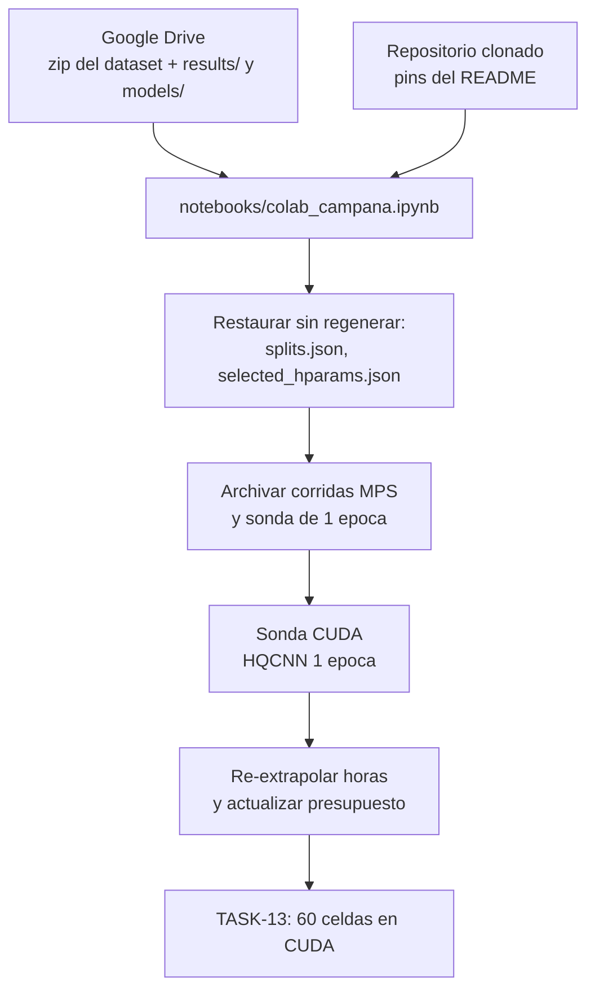

## Description

<!-- SECTION:DESCRIPTION:BEGIN -->
**Recurso declarado del anteproyecto:** Tecnologías Duras — «servicios de cómputo de alto rendimiento en la nube (Google Colab Pro+) para simulación de circuitos cuánticos y entrenamiento de modelos SOTA». Esta tarea implementa un recurso ya comprometido; no amplía el alcance.

**Qué.** Levantar el entorno reproducible de entrenamiento en Colab Pro+ que ejecutará la campaña factorial de TASK-13 (A8): notebook delgado que importa `src.experiments.campana`, contrato de rutas hacia Google Drive fuera de `src/`, restauración de artefactos previos sin regenerarlos, archivado de las corridas heterogéneas, y la sonda de 1 época en CUDA que TASK-11 dejó pendiente como compuerta de viabilidad.

**Por qué.** Tres razones convergen en una sola tarea.

1. **El equipo local no alcanza.** La sonda de TASK-13 midió el HQCNN en CPU a ~389 s por época al 10 %, contra ~33 s de EfficientNet-B0 en MPS. Extrapolado a las 20 celdas del HQCNN, TASK-11 estimó ~130 h solo para el bloque híbrido. La campaña no cabe en el equipo personal.
2. **La compuerta de TASK-11 sigue abierta.** `results/selected_hparams.json` registra `decision: no-go` y `sonda_1_epoca_pendiente: true`. El *go* está condicionado a re-medir 1 época en `colab_cuda`. Entrenar 60 celdas sin cerrar esa compuerta sería ignorar la propia decisión documentada.
3. **Hay hardware mezclado en el registro.** Las 10 celdas al 100 % de TASK-12 están en `results/experiments.csv` con `dispositivo=mps`. Si el resto corre en CUDA, A9 reportaría tiempo de entrenamiento y latencia de inferencia confundidos con el hardware, justo en la fracción donde se compara el HQCNN contra las líneas base. Se decide reejecutar esas 10 celdas en CUDA (~1.5–3 h de GPU frente a las ~130 h del bloque híbrido) y archivar las corridas MPS como evidencia histórica.

**Entregable.** `notebooks/colab_campana.ipynb`, artefactos archivados en `results/historico_mps.csv`, `results/history_mps/` y `results/pruebas_informales.csv`, `results/selected_hparams.json` actualizado con la medición en CUDA, el skill `ejecutar-experimento` con el procedimiento de Colab, y el hallazgo en la bitácora.

**Flujo del entorno.**

**Frontera con TASK-13.** Esta tarea entrega el entorno y la medición de viabilidad. Las 60 celdas del diseño factorial son responsabilidad de TASK-13; aquí no se ejecuta ninguna celda con presupuesto completo de épocas.
<!-- SECTION:DESCRIPTION:END -->

## Acceptance Criteria
<!-- AC:BEGIN -->
- [x] #1 Existe notebooks/colab_campana.ipynb que importa src.experiments.campana y no redefine modelos, bucles de entrenamiento ni particiones
- [x] #2 Ninguna ruta de Google Drive queda incrustada en src/: el contrato de rutas vive en el notebook y src/ deriva todo de ExperimentConfig con pathlib
- [ ] #3 results/ y models/ persisten en Drive, de modo que un corte de sesion no pierde experiments.csv, los historiales ni los pesos
- [ ] #4 El entorno instala los pins del README (PyTorch 2.9.1 cu128, PennyLane 0.45.1) y verifica explicitamente que torch.cuda.is_available() sea verdadero antes de entrenar
- [ ] #5 splits.json se restaura y se valida por hash sin regenerarse, y selected_hparams.json conserva L=6 congelada de TASK-11
- [x] #6 Las 10 corridas MPS al 100 por ciento quedan archivadas en results/historico_mps.csv con sus historiales en results/history_mps/ antes de cualquier reejecucion: ninguna evidencia se pierde ni se sobrescribe en silencio
- [x] #7 Las 3 filas de la sonda local de 1 epoca quedan archivadas en results/pruebas_informales.csv y fuera de experiments.csv
- [x] #8 campana_estado.json vuelve a marcar como pendiente toda celda cuyas filas fueron archivadas, de modo que la campana no las omita por reanudabilidad
- [x] #9 La CLI de campana permite arrancar sin lineas base previas en el CSV sin desactivar la validacion de L congelada ni el hash de splits.json
- [ ] #10 Se ejecuta la sonda de 1 epoca del HQCNN en CUDA y se registra el tiempo por epoca medido, fuera del CSV oficial
- [ ] #11 selected_hparams.json se actualiza con la re-extrapolacion en CUDA: horas estimadas, presupuesto.decision, sonda_1_epoca_pendiente en falso y el dispositivo real de campana
- [ ] #12 wandb opera con WANDB_MODE=offline y queda documentado el procedimiento de sincronizacion posterior
- [x] #13 El skill ejecutar-experimento documenta el procedimiento de Colab Pro plus, que hoy solo cubre ejecucion local con UV
- [ ] #14 Hallazgo registrado en hallazgos/h2_experimentacion.tex con label hallazgo:task-20 siguiendo la plantilla estandar de la bitacora
<!-- AC:END -->

## Definition of Done
<!-- DOD:BEGIN -->
- [ ] #1 Sin pip fuera de la excepcion documentada de Colab: en local sigue rigiendo UV
- [ ] #2 Ninguna corrida experimental se elimina: todo lo retirado de experiments.csv queda archivado y referenciado en la bitacora
- [ ] #3 No se recortan epocas, folds ni celdas del diseno factorial: las mitigaciones rechazadas en TASK-11 siguen rechazadas
<!-- DOD:END -->

## Implementation Plan

<!-- SECTION:PLAN:BEGIN -->
1. Exponer en la CLI de `campana.py` lo necesario para arrancar sin las líneas base archivadas, sin relajar la validación de L ni del hash de splits.json.
2. Implementar `archivar_corridas_no_cuda`: separa pruebas informales (épocas distintas al protocolo) de corridas heterogéneas (dispositivo distinto), mueve historiales y repone celdas a `pendiente`.
3. Resolver `selected_hparams.json` desde `cfg.raiz_resultados` para que el cuaderno no falle en silencio al mover rutas.
4. Pruebas del archivado: separación por categoría, reposición de estado e idempotencia.
5. Ejecutar el archivado sobre `results/` y ajustar `.gitignore` para que la evidencia retirada quede versionada.
6. Cuaderno `notebooks/colab_campana.ipynb` con el contrato de Drive, pines, dataset, wandb offline, sonda y bloques.
7. Skill `ejecutar-experimento` con el procedimiento de Colab Pro+.
8. Hallazgo `hallazgo:task-20` y decisión D3 en la bitácora.
9. **En Colab (requiere GPU):** ejecutar la sonda de 1 época del HQCNN, actualizar `selected_hparams.json` con la re-extrapolación y cerrar el hallazgo con los números medidos.
<!-- SECTION:PLAN:END -->

## Implementation Notes

<!-- SECTION:NOTES:BEGIN -->
**Hecho en local.**

`src/experiments/campana.py`: nuevas banderas `--sin-baselines-previas` (parámetro `exigir_baselines` en `verificar_precondiciones` y `ejecutar_campana`) y `--archivar-no-cuda`. La bandera no relaja la validación de `L` congelada ni el hash de `splits.json`: solo levanta la exigencia de encontrar las 10 celdas de TASK-12 en el CSV, que ahora están archivadas. `selected_hparams.json` se resuelve desde `cfg.raiz_resultados` y no desde el CWD, para que el cuaderno no arranque con la `L` equivocada si mueve rutas.

`archivar_corridas_no_cuda` clasifica por dos criterios independientes: presupuesto de épocas distinto al del protocolo → `results/pruebas_informales.csv`; dispositivo distinto a `cuda` → `results/historico_mps.csv`. Mueve los historiales a `results/history_mps/` y repone las celdas afectadas como `pendiente` en `campana_estado.json`. Es idempotente.

Ejecución sobre `results/`: 10 corridas heterogéneas y 3 pruebas informales archivadas, 13 historiales movidos, `experiments.csv` en cero filas y 60 celdas pendientes. Los historiales de la ablación de `L` (TASK-11) siguen en `results/history/` por no pertenecer al CSV de la campaña.

**Trampa encontrada.** `results/*` está en `.gitignore` con excepciones puntuales, y los 13 historiales movidos sí estaban versionados. Sin tocar `.gitignore`, archivarlos los habría borrado del control de versiones: exactamente el "no se pierde evidencia" que el DoD prohíbe. Se agregaron excepciones para `historico_mps.csv`, `pruebas_informales.csv` y `history_mps/*.json`.

Nota aparte: `results/experiments.csv` **no** está versionado (regla `results/*`). El CSV de la campaña vive en Drive durante la ejecución y hay que traerlo al repositorio al cerrar; conviene decidir si se le agrega una excepción antes de que TASK-14 dependa de él.

Pruebas: 118 passed en la suite completa, con 4 casos nuevos en `tests/test_campana.py`.

**Pendiente, requiere GPU.** Sonda de 1 época del HQCNN en CUDA, actualización de `selected_hparams.json` (horas re-extrapoladas, `presupuesto.decision`, `sonda_1_epoca_pendiente`, `dispositivo_campana_real`) y cierre del hallazgo con los números medidos. Los AC 3, 4, 5, 10, 11, 12 y 14 dependen de esa sesión.

**Trampa de Drive.** La celda que enlaza `results/` y `models/` siembra desde el repositorio **solo** si la carpeta de Drive está vacía. Sin ese guardia, reejecutar el cuaderno en una sesión posterior sobrescribiría con el CSV vacío del repositorio las celdas ya entrenadas.

**Versionado del CSV.** Se agregó `!results/experiments.csv` a las excepciones del `.gitignore`: son 60 filas, es la evidencia de R3 y de ella dependen TASK-14, TASK-15 y TASK-16. Queda por decidir si `results/campana_estado.json` merece el mismo trato, ya que la tabla de estado de ejecución del hallazgo `hallazgo:task-13` se construye a partir de él.
<!-- SECTION:NOTES:END -->
