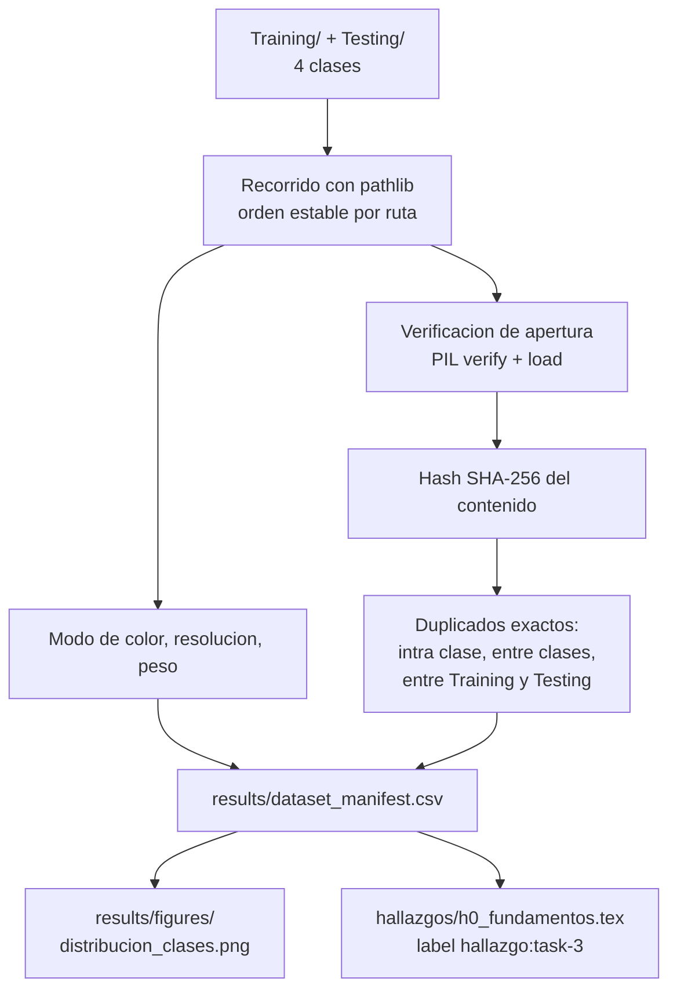

## Description

<!-- SECTION:DESCRIPTION:BEGIN -->
**Actividad del anteproyecto:** A4 — Adquisición y auditoría del conjunto de datos.

**Qué.** Auditar el *Brain Tumor MRI Dataset* de Nickparvar (v3) antes de usarlo: conteo real de imágenes frente a las **7023 declaradas**, las 4 clases (`glioma`, `meningioma`, `pituitary`, `notumor`), el balance por clase y por partición original, imágenes corruptas o truncadas, duplicados exactos por hash y posible solapamiento entre las carpetas `Training/` y `Testing/`.

**Por qué.** Todo el diseño de escasez (10 / 25 / 50 / 100 %) se apoya en el tamaño y el balance **reales**, no en los declarados. Si existen duplicados entre `Training` y `Testing`, o dentro del conjunto que luego se parte en folds, la exactitud reportada quedaría inflada por fuga de datos y el resultado no sería defendible ante un jurado. La preparación de datos de imagen médica es la fuente dominante de errores metodológicos silenciosos (`willemink2020preparing`).

**Consideración clínica.** Las cuatro clases se corresponden con categorías de la clasificación WHO 2021 del sistema nervioso central (`louis20212021`). El dataset es una agregación de fuentes públicas heterogéneas, de modo que la auditoría debe **verificar y documentar** la mezcla de resoluciones, modos de color y procedencias, no asumir homogeneidad.

**Entregable.** `results/dataset_manifest.csv` (una fila por imagen), `results/dataset_audit.md` (informe) y `results/figures/distribucion_clases.png`.

**Flujo de la auditoría.**



**Decisión que esta tarea debe dejar tomada.** Si la carpeta `Testing/` se usa como *holdout* externo o si se une al conjunto completo para la validación cruzada de la decisión **D1**. La decisión se toma **con evidencia de solapamiento**, no por costumbre, y condiciona a task-6.

**Claves BibTeX.** `nickparvar2023dataset`, `louis20212021`, `willemink2020preparing`, `haddou2025hqcm`.
<!-- SECTION:DESCRIPTION:END -->

## Acceptance Criteria
<!-- AC:BEGIN -->
- [x] #1 #1 results/dataset_manifest.csv tiene una fila por imagen con ruta relativa, clase, partición de origen, resolución (ancho/alto), modo de color, hash SHA-256, excluida y motivo_exclusion
- [x] #2 #2 El conteo total y por clase se compara explícitamente con las 7023 imágenes declaradas en el anteproyecto y toda discrepancia queda documentada con su causa
- [x] #3 #3 Se reporta el número de duplicados exactos por hash en tres categorías: intra clase, entre clases (etiqueta contradictoria) y entre Training y Testing (fuga potencial)
- [x] #4 #4 Se listan las imágenes corruptas o truncadas y se justifica si se excluyen mediante una columna auditable en el manifiesto
- [x] #5 #5 Se documenta la heterogeneidad real del dataset (resoluciones y modos de color) y su implicación para el preprocesamiento de task-5
- [x] #6 #6 Queda tomada y justificada con evidencia la decisión sobre el rol de la carpeta Testing: holdout externo o unión al conjunto completo para la validación cruzada
- [x] #7 #7 Hallazgo registrado en hallazgos/h0_fundamentos.tex con \label{hallazgo:task-3}, tabla de conteos y figura de distribución de clases
<!-- AC:END -->

## Definition of Done
<!-- DOD:BEGIN -->
- [x] #1 Código en src/data/audit.py ejecutable con uv run python -m src.data.audit
- [x] #2 Tipado de Python 3.12 y docstrings NumPy en español latinoamericano
- [x] #3 El manifiesto guarda rutas relativas: ningún artefacto en results/ contiene rutas absolutas
- [x] #4 La figura queda en results/figures/ y se referencia desde la bitácora
- [x] #5 Paquete src/data/ con __init__.py para ejecución como módulo
<!-- DOD:END -->

## Implementation Plan

<!-- SECTION:PLAN:BEGIN -->
1. Descargar el dataset y fijar su ubicación bajo la raíz declarada en `ExperimentConfig` (nunca una ruta de Drive incrustada).
2. Implementar `src/data/audit.py` con el hash de contenido y el recorrido estable:

```python
import hashlib
from pathlib import Path

import pandas as pd
from PIL import Image

def sha256_archivo(ruta: Path, bloque: int = 1 << 20) -> str:
    """Calcula el hash SHA-256 del contenido binario de una imagen.

    Parameters
    ----------
    ruta : Path
        Ruta al archivo de imagen.
    bloque : int
        Tamaño del bloque de lectura en bytes.

    Returns
    -------
    str
        Digest hexadecimal del contenido.
    """
    h = hashlib.sha256()
    with ruta.open("rb") as f:
        for trozo in iter(lambda: f.read(bloque), b""):
            h.update(trozo)
    return h.hexdigest()

def construir_manifiesto(raiz: Path) -> pd.DataFrame:
    """Recorre el dataset y devuelve una fila por imagen.

    El recorrido se ordena por ruta relativa para que los índices
    posicionales del manifiesto sean estables entre máquinas.
    """
    filas: list[dict[str, object]] = []
    for ruta in sorted(raiz.rglob("*.jpg")):
        relativa = ruta.relative_to(raiz)
        particion, clase = relativa.parts[0], relativa.parts[1]
        try:
            with Image.open(ruta) as img:
                img.verify()
            with Image.open(ruta) as img:
                img.load()
                modo, ancho, alto = img.mode, img.width, img.height
            corrupta = False
        except Exception:
            modo, ancho, alto, corrupta = "", 0, 0, True
        filas.append(
            {
                "ruta_relativa": str(relativa),
                "particion_origen": particion,
                "clase": clase,
                "modo": modo,
                "ancho": ancho,
                "alto": alto,
                "corrupta": corrupta,
                "sha256": sha256_archivo(ruta),
            }
        )
    return pd.DataFrame(filas)
```

3. Calcular los conteos: total, por clase, por partición de origen y la tabla cruzada clase × partición.
4. Detectar duplicados con `manifiesto.duplicated(subset="sha256", keep=False)` y clasificarlos en tres categorías: mismo hash en la misma clase (duplicado benigno), mismo hash en clases distintas (**etiqueta contradictoria**) y mismo hash entre `Training` y `Testing` (**fuga potencial**).
5. Contrastar el total con las 7023 imágenes declaradas en el anteproyecto y explicar la discrepancia si existe (extensiones distintas de `.jpg`, archivos ocultos, subcarpetas inesperadas).
6. Generar la figura de distribución de clases con `matplotlib` y guardarla en `results/figures/`.
7. Escribir `results/dataset_audit.md` con los hallazgos y la decisión sobre `Testing/`.
8. Registrar el hallazgo en `hallazgos/h0_fundamentos.tex` siguiendo la plantilla de task-2: tabla de conteos, figura y decisión sobre el *holdout*.

Ejecución:

```bash
uv run python -m src.data.audit
```

0. Enlazar notebooks/data/ → data/brain_tumor_mri/ (symlink macOS). Paso 2: descubrir_extensiones() antes del recorrido; no filtrar solo .jpg a ciegas.
<!-- SECTION:PLAN:END -->

## Implementation Notes

<!-- SECTION:NOTES:BEGIN -->
**Trampas conocidas.**

- `Image.verify()` detecta cabeceras corruptas pero **invalida el objeto**: hay que reabrir la imagen para leer sus atributos. Además no detecta truncamiento, para eso hace falta `Image.load()`. Por eso el snippet abre el archivo dos veces.
- El hash de contenido detecta duplicados **byte a byte**, no re-codificaciones del mismo corte guardado con otra calidad JPEG. Declararlo como limitación; si aparecen sospechas visuales, complementar con hash perceptual antes de afirmar que no hay fuga.
- Mismo hash en dos clases distintas **no** es un duplicado benigno: es una etiqueta contradictoria y debe resolverse o excluirse, dejando registro. Este dataset agrega subconjuntos de distinta procedencia y la calidad de etiquetado no es uniforme.
- Hay imágenes en escala de grises (modo `L`) y otras en `RGB`. No convertir aquí: solo **registrar** el modo en el manifiesto; la conversión es responsabilidad de task-5.
- No filtrar por extensión `.jpg` a ciegas: verificar primero con `rglob("*")` qué extensiones existen realmente, o el conteo saldrá corto y se atribuirá erróneamente a "el dataset trae menos imágenes".
- El orden de `Path.rglob` **no** está garantizado entre sistemas de archivos. El `sorted()` no es cosmético: los índices posicionales de task-6 dependen de él.
- No borrar archivos del dataset original. Las exclusiones se expresan como una columna `excluida` con su motivo en el manifiesto, para que la decisión sea auditable y reversible.

Prerequisito local (Mac Studio): dataset en notebooks/data/ enlazado por symlink a data/brain_tumor_mri/. Sin duplicar imágenes.

Auditoría ejecutada: 7023 imágenes (.jpg), 0 corruptas, 6726 utilizables, 297 excluidas (194 duplicado_exacto, 103 fuga_train_test). Duplicados: intra=194, entre_clases=0, train/test=79. Decisión: unir Training+Testing para k-fold D1. Symlink data/brain_tumor_mri -> notebooks/data.
<!-- SECTION:NOTES:END -->

## Final Summary

<!-- SECTION:FINAL_SUMMARY:BEGIN -->
Implementado src/data/audit.py con manifiesto SHA-256, detección de duplicados y exclusiones auditables. Verificado con uv run python -m src.data.audit (7023 filas, sin rutas absolutas en results/). Hallazgo documentado en h0_fundamentos.tex; bitácora compila con figura distribucion_clases.png.
<!-- SECTION:FINAL_SUMMARY:END -->
