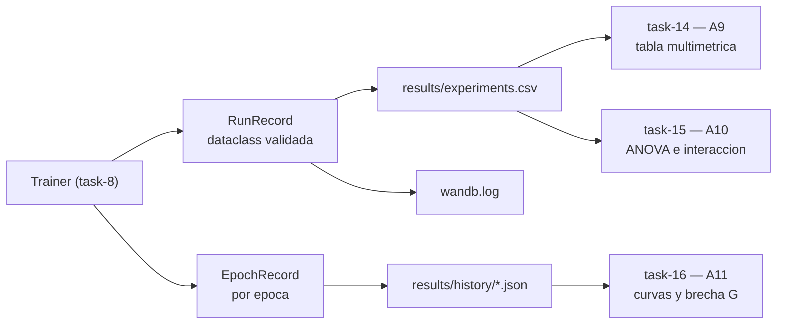

## Description

<!-- SECTION:DESCRIPTION:BEGIN -->
**Qué.** Definir **antes de entrenar** el esquema único de resultados del proyecto: una fila por corrida `(modelo, data_fraction, fold)` con todas las métricas que exigen A9 y A10, más un historial por época en JSON para las curvas de A11.

**Por qué.** Este es el punto de orden más importante de la Fase 0. Si el esquema se define *después* de la campaña experimental y falta un solo campo (por ejemplo la especificidad por clase o el tiempo de inferencia), hay que **repetir 60 corridas** de un modelo cuyo gradiente se calcula por regla de cambio de parámetros. Definir el contrato primero convierte A9, A10 y A11 en consultas sobre datos ya recogidos.

**Entregable.** `src/logging/records.py` con `RunRecord` y `EpochRecord` validados, `src/logging/sinks.py` con la escritura a CSV y a wandb desde el **mismo** objeto, y el esquema documentado en la bitácora.

**Esquema de `results/experiments.csv` (una observación por fila).**

| Grupo | Columnas |
| :--- | :--- |
| Identidad | `modelo`, `data_fraction`, `fold`, `semilla` |
| Contexto | `dispositivo`, `n_train`, `n_val`, `epocas`, `n_params_entrenables`, `n_capas_vqc`, `commit_sha`, `timestamp` |
| Exactitud | `accuracy_train`, `accuracy_val` |
| Pérdida | `loss_train`, `loss_val` |
| F1 (A9) | `f1_val_weighted`, `f1_val_macro` |
| Por clase (A9) | `sens_glioma`, `sens_meningioma`, `sens_pituitary`, `sens_notumor`, `spec_*` equivalentes |
| Costo (A9) | `train_time_s`, `inference_ms_per_batch` |
| Derivada (A11) | `brecha_g` = `abs(accuracy_train - accuracy_val)` |

**Historial por época (A11).** `results/history/{modelo}_{fraccion}_{fold}.json` con `epoca`, `loss_train`, `loss_val`, `accuracy_train`, `accuracy_val`.

**Cómo alimenta el contrato al análisis.**



**Claves BibTeX.** `esteva2019guide`.
<!-- SECTION:DESCRIPTION:END -->

## Acceptance Criteria
<!-- AC:BEGIN -->
- [x] #1 El esquema cubre todas las métricas exigidas por A9 (exactitud, F1 ponderado y macro, sensibilidad y especificidad por clase, tiempo de entrenamiento e inferencia) sin campos faltantes
- [x] #2 El historial por época registra pérdida y exactitud de entrenamiento y validación, suficiente para reconstruir las curvas de A11 sin reentrenar
- [x] #3 Cada fila queda identificada de forma única por la tupla (modelo, data_fraction, fold, semilla)
- [x] #4 Existe validación que rechaza registros incompletos o con métricas fuera de rango antes de escribir en disco, con una prueba que lo demuestra
- [x] #5 El mismo objeto de registro alimenta el CSV y wandb: el esquema está definido una sola vez en el código
- [x] #6 El CSV es tidy (una observación por fila) y statsmodels lo consume sin pivoteo manual
- [x] #7 Se registran metadatos de reproducibilidad: semilla, dispositivo, épocas, parámetros entrenables y SHA del commit
- [x] #8 El contrato especifica el protocolo de medición de tiempos (calentamiento y sincronización de dispositivo), no solo el nombre del campo
- [x] #9 Hallazgo registrado en hallazgos/h0_fundamentos.tex con \label{hallazgo:task-4} y la tabla completa del esquema de columnas
<!-- AC:END -->

## Definition of Done
<!-- DOD:BEGIN -->
- [x] #1 Tipado de Python 3.12 y docstrings NumPy en español latinoamericano
- [x] #2 El Trainer no conoce el formato de salida: depende del registro, no del destino (DIP)
- [x] #3 Prueba automatizada del rechazo de registros inválidos
- [x] #4 Sin secretos de wandb en el código versionado
<!-- DOD:END -->

## Implementation Plan

<!-- SECTION:PLAN:BEGIN -->
1. Definir el registro de corrida como dataclass congelada con validación explícita:

```python
from dataclasses import asdict, dataclass

@dataclass(frozen=True, slots=True)
class RunRecord:
    """Una corrida completa: unidad de observación del análisis estadístico.

    Notes
    -----
    La tupla ``(modelo, data_fraction, fold, semilla)`` identifica la fila de
    forma única. Cualquier campo faltante invalida el registro antes de que
    llegue a disco.
    """

    modelo: str
    data_fraction: float
    fold: int
    semilla: int
    dispositivo: str
    n_train: int
    n_val: int
    epocas: int
    n_params_entrenables: int
    n_capas_vqc: int | None
    commit_sha: str
    accuracy_train: float
    accuracy_val: float
    loss_train: float
    loss_val: float
    f1_val_weighted: float
    f1_val_macro: float
    sensibilidad_por_clase: dict[str, float]
    especificidad_por_clase: dict[str, float]
    train_time_s: float
    inference_ms_per_batch: float

    @property
    def brecha_g(self) -> float:
        """Brecha de generalización |Acc_train - Acc_val| exigida por A11."""
        return abs(self.accuracy_train - self.accuracy_val)

    def validar(self) -> None:
        """Rechaza registros incompletos o con métricas fuera de rango."""
        for nombre in ("accuracy_train", "accuracy_val", "f1_val_weighted", "f1_val_macro"):
            valor = getattr(self, nombre)
            if not 0.0 <= valor <= 1.0:
                raise ValueError(f"{nombre} fuera de [0, 1]: {valor}")
        if len(self.sensibilidad_por_clase) != 4 or len(self.especificidad_por_clase) != 4:
            raise ValueError("Se requieren sensibilidad y especificidad para las 4 clases")
```

2. Implementar la especificidad multiclase, que scikit-learn no entrega como función directa:

```python
def especificidad_por_clase(matriz: np.ndarray, clases: list[str]) -> dict[str, float]:
    """Calcula la especificidad uno-contra-resto desde la matriz de confusión."""
    total = matriz.sum()
    resultado: dict[str, float] = {}
    for i, clase in enumerate(clases):
        vp = matriz[i, i]
        fn = matriz[i, :].sum() - vp
        fp = matriz[:, i].sum() - vp
        vn = total - vp - fn - fp
        resultado[clase] = float(vn / (vn + fp)) if (vn + fp) else 0.0
    return resultado
```

3. Escribir un único *sink* que aplane el registro y lo envíe a CSV y a wandb, sin duplicar la definición del esquema:

```python
def aplanar(registro: RunRecord) -> dict[str, float | int | str]:
    """Convierte el registro en una fila tidy con columnas por clase."""
    fila = asdict(registro)
    for clase, valor in fila.pop("sensibilidad_por_clase").items():
        fila[f"sens_{clase}"] = valor
    for clase, valor in fila.pop("especificidad_por_clase").items():
        fila[f"spec_{clase}"] = valor
    fila["brecha_g"] = registro.brecha_g
    return fila
```

4. Definir el protocolo de medición de tiempos que el contrato **exige** (no solo el campo): calentamiento de al menos 3 lotes descartados, sincronización de dispositivo antes y después, y mediana sobre varios lotes en lugar de promedio.
5. Validar la cabecera del CSV al abrir en modo *append*: si el orden de columnas no coincide con el esquema, abortar en lugar de escribir filas desalineadas.
6. Capturar `commit_sha` con `git rev-parse --short HEAD` y registrar si el árbol de trabajo está sucio.
7. Escribir una prueba que construya un `RunRecord` incompleto y verifique que `validar()` levanta la excepción.
8. Registrar el hallazgo en `hallazgos/h0_fundamentos.tex` con la tabla completa del esquema de columnas.

9. Mejoras al plan original: timestamp en RunRecord; COLUMNAS_CSV como esquema único; historial en results/history/{modelo}_{fraccion}_f{fold}_s{semilla}.json; pytest en dev deps.
<!-- SECTION:PLAN:END -->

## Implementation Notes

<!-- SECTION:NOTES:BEGIN -->
**Trampas conocidas.**

- `f1_score(average="weighted")` y `average="macro"` responden preguntas distintas: con clases desbalanceadas el ponderado puede ocultar el fracaso en la clase minoritaria, que es justamente lo que importa en el escenario de escasez. A9 pide **reportar ambos**, no elegir uno.
- La especificidad multiclase no existe en `sklearn.metrics`. Derivarla de la matriz de confusión uno-contra-resto y **fijar el orden de las clases** explícitamente (`labels=` en `confusion_matrix`), o las columnas `spec_*` quedarán intercambiadas entre corridas.
- Medir `inference_ms_per_batch` sin calentamiento ni `torch.cuda.synchronize()` / `torch.mps.synchronize()` mide el encolado asíncrono del kernel, no el cómputo. En el HQCNN el tiempo real está en la simulación del circuito y el sesgo sería enorme.
- No guardar el módulo completo con `torch.save(model)`: `TorchLayer` no serializa de forma portable entre versiones. Solo `state_dict()`.
- wandb en Colab: usar `WANDB_MODE=offline` y sincronizar después evita perder corridas cuando la sesión se corta a mitad de la campaña.
- El CSV debe abrirse en modo *append* con `newline=""` y una sola escritura de cabecera; si dos procesos escriben en paralelo, se corrompe. Si se paraleliza la campaña, escribir un CSV por corrida y consolidar en task-14.
- No añadir columnas derivadas que se puedan recalcular (más allá de `brecha_g`, que A11 pide explícitamente): duplicar información derivada invita a inconsistencias entre el CSV y el análisis.

**Regla de diseño.** El `Trainer` de task-8 **no** conoce el formato de salida: emite `RunRecord` y el *sink* decide destino. Así se cumple DIP y se puede añadir un destino nuevo sin tocar el bucle de entrenamiento.

Implementado src/logging/{records,timing,sinks}.py con COLUMNAS_CSV, validación, aplanar() y sinks CSV/wandb/JSON. Historial: {modelo}_{fraccion}_f{fold}_s{semilla}.json. pytest: 15 passed.
<!-- SECTION:NOTES:END -->

## Final Summary

<!-- SECTION:FINAL_SUMMARY:BEGIN -->
Contrato de métricas TASK-4: RunRecord/EpochRecord validados, sinks CSV+wandb+JSON, protocolo de tiempos documentado, hallazgo en h0_fundamentos.tex. Verificado con uv run pytest tests/ -q (15 passed).
<!-- SECTION:FINAL_SUMMARY:END -->
