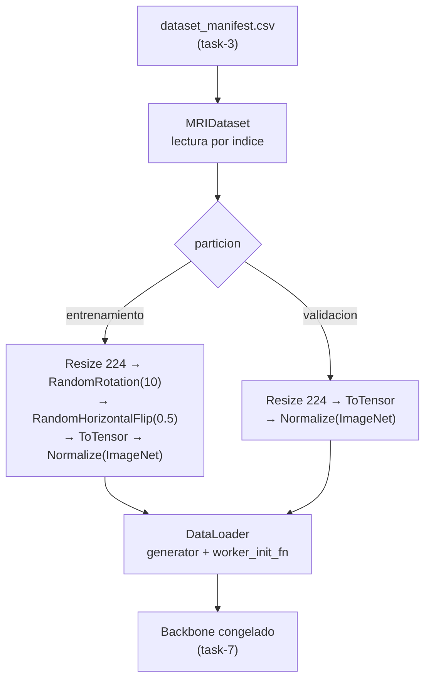

## Description

<!-- SECTION:DESCRIPTION:BEGIN -->
**Actividad del anteproyecto:** A5 — Preprocesamiento y aumento de datos.

**Qué.** Pipeline de datos con redimensionado a 224 × 224, normalización con las estadísticas de ImageNet y aumento (rotaciones leves y volteo horizontal) **aplicado únicamente al entrenamiento**; `Dataset` y `DataLoader` que leen del manifiesto de task-3 con `pathlib` y transformaciones declaradas en configuración.

**Por qué.** Dos razones independientes. Primera: los *backbones* son preentrenados en ImageNet, así que la normalización debe usar **las estadísticas de ImageNet** o las características transferidas pierden calibración. Segunda: aumentar validación contaminaría la medición de la brecha de generalización, que es precisamente la variable de interés de A11.

**Consideración clínica del aumento.** En MRI axial el volteo **vertical** produce anatomías imposibles y el volteo horizontal solo es defendible por la simetría aproximada del cerebro. Las rotaciones deben ser leves. La justificación anatómica es parte del entregable, no un detalle de implementación: un aumento agresivo en imagen médica introduce sesgo en lugar de robustez (`willemink2020preparing`, `litjens2017survey`).

**Entregable.** `src/data/dataset.py` (`MRIDataset`), `src/data/transforms.py` (fábrica de transformaciones declarativa) y `src/data/loaders.py` (constructor determinista de `DataLoader`).

**Pipeline.**



**Claves BibTeX.** `willemink2020preparing`, `litjens2017survey`, `tan2019efficientnet`.
<!-- SECTION:DESCRIPTION:END -->

## Acceptance Criteria
<!-- AC:BEGIN -->
- [x] #1 Las particiones de validación y prueba nunca reciben aumento: una prueba automatizada verifica que dos accesos al mismo índice de validación devuelven tensores idénticos
- [x] #2 Toda imagen sale como tensor float32 de forma (3, 224, 224) normalizado con las estadísticas de ImageNet, incluidas las originalmente en escala de grises
- [x] #3 Las transformaciones se declaran en una fábrica configurable y no están incrustadas dentro del Dataset
- [x] #4 El pipeline es determinista bajo semilla fija, incluido DataLoader con num_workers > 0 mediante generator y worker_init_fn explícitos
- [x] #5 El aumento elegido está justificado anatómicamente: se documenta por qué se usan rotaciones leves y volteo horizontal y por qué se descarta el volteo vertical
- [x] #6 El Dataset lee del manifiesto de task-3 y no vuelve a recorrer el disco, preservando el orden estable de los índices
- [x] #7 Hallazgo registrado en hallazgos/h0_fundamentos.tex con \label{hallazgo:task-5}, listado de transformaciones y figura de ejemplos antes y después
<!-- AC:END -->

## Definition of Done
<!-- DOD:BEGIN -->
- [x] #1 Tipado de Python 3.12 y docstrings NumPy en español latinoamericano
- [x] #2 Pruebas de determinismo y de contrato de forma y rango de los tensores
- [x] #3 Sin rutas absolutas: la raíz de datos proviene de ExperimentConfig
- [x] #4 API vigente de torchvision: transforms.v2 sin mezclar con la API clásica
<!-- DOD:END -->

## Implementation Plan

<!-- SECTION:PLAN:BEGIN -->
1. Declarar las transformaciones en una fábrica, no dentro del `Dataset`, para que el `Dataset` no sepa si está en entrenamiento o en validación más allá del objeto que recibe:

```python
from torchvision.transforms import v2

MEDIA_IMAGENET = (0.485, 0.456, 0.406)
DESV_IMAGENET = (0.229, 0.224, 0.225)

def construir_transformaciones(*, aumentar: bool, tamano: int = 224) -> v2.Compose:
    """Devuelve el pipeline de transformaciones para una partición.

    Parameters
    ----------
    aumentar : bool
        ``True`` solo para la partición de entrenamiento.
    tamano : int
        Lado del cuadrado de entrada esperado por el backbone.

    Notes
    -----
    La normalización usa las estadísticas de ImageNet porque los pesos del
    backbone fueron calibrados con ellas; usar las del propio dataset degrada
    las características transferidas.
    """
    pasos: list[v2.Transform] = [v2.Resize((tamano, tamano))]
    if aumentar:
        pasos += [
            v2.RandomRotation(degrees=10, fill=0),
            v2.RandomHorizontalFlip(p=0.5),
        ]
    pasos += [
        v2.ToImage(),
        v2.ToDtype(torch.float32, scale=True),
        v2.Normalize(mean=MEDIA_IMAGENET, std=DESV_IMAGENET),
    ]
    return v2.Compose(pasos)
```

2. Implementar `MRIDataset` sobre el manifiesto, con conversión explícita a tres canales:

```python
class MRIDataset(Dataset):
    """Dataset de MRI cerebral construido desde el manifiesto auditado."""

    def __init__(self, manifiesto: pd.DataFrame, raiz: Path, transformacion) -> None:
        self._filas = manifiesto.reset_index(drop=True)
        self._raiz = raiz
        self._transformacion = transformacion

    def __len__(self) -> int:
        return len(self._filas)

    def __getitem__(self, indice: int) -> tuple[torch.Tensor, int]:
        fila = self._filas.iloc[indice]
        with Image.open(self._raiz / fila["ruta_relativa"]) as img:
            imagen = img.convert("RGB")
        return self._transformacion(imagen), int(fila["clase_id"])
```

3. Construir los `DataLoader` de forma determinista incluso con varios *workers*:

```python
def sembrar_worker(_: int) -> None:
    """Siembra cada worker a partir de la semilla inicial de PyTorch."""
    semilla = torch.initial_seed() % 2**32
    np.random.seed(semilla)
    random.seed(semilla)

def construir_loader(dataset, *, batch_size: int, mezclar: bool, semilla: int) -> DataLoader:
    generador = torch.Generator().manual_seed(semilla)
    return DataLoader(
        dataset,
        batch_size=batch_size,
        shuffle=mezclar,
        num_workers=2,
        worker_init_fn=sembrar_worker,
        generator=generador,
        pin_memory=torch.cuda.is_available(),
    )
```

4. Escribir la prueba de no-aumento: dos accesos consecutivos al mismo índice de validación deben devolver tensores **idénticos**; en entrenamiento deben diferir.
5. Escribir la prueba de contrato de tensores: forma `(3, 224, 224)`, `dtype` `float32` y valores compatibles con la normalización aplicada.
6. Generar una figura con ejemplos antes y después del aumento y guardarla en `results/figures/`.
7. Registrar el hallazgo en `hallazgos/h0_fundamentos.tex`: listado de transformaciones, justificación anatómica del aumento y figura de ejemplos.

Correcciones al plan original: (1) mapear clase string → int con MAPEO_CLASE derivado de CLASES_ORDEN en src/logging/records.py, no usar clase_id del manifiesto; (2) reutilizar make_worker_init_fn de src/utils/seed.py en lugar de sembrar_worker duplicado; (3) parametrizar num_workers en construir_loader (default 2).
<!-- SECTION:PLAN:END -->

## Implementation Notes

<!-- SECTION:NOTES:BEGIN -->
**Trampas conocidas.**

- Las imágenes en modo `L` deben convertirse con `.convert("RGB")` **antes** de normalizar, o `Normalize` falla por número de canales. Convertir siempre, no solo cuando el modo sea `L`: es más simple y no cambia las imágenes que ya son RGB.
- Usar las estadísticas del propio dataset en lugar de las de ImageNet parece "más correcto" pero degrada las características de un backbone congelado, que es justo el escenario de A1. Si se quisiera comparar ambas normalizaciones, sería un experimento aparte, no un cambio silencioso.
- `RandomRotation` deja bordes rellenos. `fill=0` es coherente con el fondo negro del MRI, pero es una decisión que debe quedar escrita en la bitácora.
- El aumento se aplica **después** de decidir las particiones (task-6), nunca antes. Aumentar y luego partir filtra variantes de la misma imagen entre entrenamiento y validación, y la fuga es invisible en las métricas.
- No mezclar `torchvision.transforms` clásica con `transforms.v2` en el mismo `Compose`. La API vigente es `v2`; en `v2` el reemplazo de `ToTensor` es `ToImage` + `ToDtype(scale=True)`.
- Con `num_workers > 0`, `set_seed` **no** basta: sin `worker_init_fn` y `generator` explícitos el orden de los lotes y el aumento cambian entre corridas y se pierde la comparabilidad entre modelos.
- `pin_memory=True` sin CUDA genera advertencias inútiles en macOS; condicionarlo al dispositivo.
- El `Dataset` debe leer del manifiesto y **no** volver a recorrer el disco: si recorre, el orden puede diferir del que usaron los índices de task-6 y las particiones apuntarían a otras imágenes.

WorkerInitFn en src/utils/seed.py reemplaza cierre local para serialización spawn (macOS). MAPEO_CLASE desde CLASES_ORDEN. Validación: uv run pytest tests/ -q → 25 passed. Figura generada en results/figures/ejemplos_aumento.png.

Revisión Fase 0: WorkerInitFn usa torch.initial_seed(); suite 39 passed.
<!-- SECTION:NOTES:END -->

## Final Summary

<!-- SECTION:FINAL_SUMMARY:BEGIN -->
Pipeline A5: transforms.py (fábrica v2 ImageNet), dataset.py (MRIDataset + manifiesto), loaders.py (DataLoader determinista). 10 pruebas nuevas + hallazgo task-5 en h0_fundamentos.tex. Verificado con pytest (25 passed) y figura de ejemplos con dataset real.
<!-- SECTION:FINAL_SUMMARY:END -->
