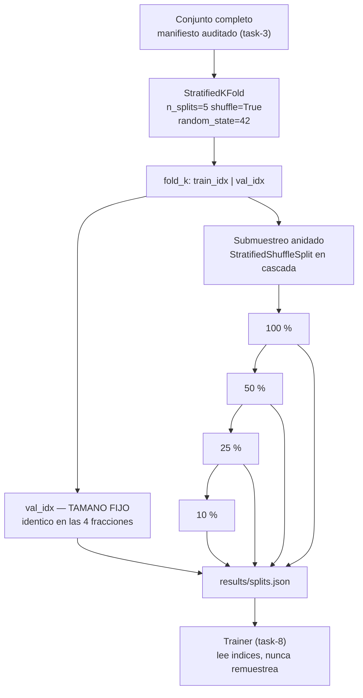

## Description

<!-- SECTION:DESCRIPTION:BEGIN -->
**Actividad del anteproyecto:** A7 (diseño de escenarios de escasez) y base de A8 (validación cruzada estratificada).

**Qué.** Un artefacto único, `results/splits.json`, con los índices de **todas** las particiones del proyecto, construido según la decisión **D1**: `StratifiedKFold(n_splits=5, shuffle=True, random_state=42)` sobre el conjunto completo y, dentro de cada fold, submuestreo estratificado **anidado** del entrenamiento al 10 / 25 / 50 / 100 %.

**Por qué.** Los tres modelos deben verse exactamente los mismos datos en cada celda del diseño factorial; si cada corrida remuestrea, parte de la diferencia observada entre modelos sería ruido de partición y la ANOVA de A10 mediría el muestreo en lugar de la arquitectura. Persistir los índices en disco convierte la comparación en pareada y la campaña en reanudable.

**Decisión D1 — folds fijos, submuestreo solo del entrenamiento.** La fracción de escasez se aplica **únicamente** a la porción de entrenamiento de cada fold; el conjunto de validación conserva su tamaño en los cuatro escenarios. Así, las diferencias entre fracciones reflejan el tamaño del entrenamiento y no el ruido de una validación cada vez más pequeña. Se descarta la lectura literal de A8 (submuestrear primero y partir después), que al 10 % dejaría alrededor de 140 imágenes de validación por fold y una varianza que dominaría el efecto buscado. La intención de A8 —validación cruzada estratificada con k = 5 en cada escenario de escasez— se cumple; cambia el orden de las operaciones, y esa precisión debe quedar justificada en la bitácora y en el documento final.

**Protocolo de particiones.**



**Anidamiento.** El 10 % está contenido en el 25 %, este en el 50 % y este en el 100 %. Sin anidamiento, la curva de escasez sería incomparable entre fracciones: el 10 % podría contener imágenes ausentes del 50 % y una caída de exactitud no distinguiría "menos datos" de "otros datos".

**Claves BibTeX.** `caro2022generalization`, `gupta2025systematic`, `khan2024brain`. Excepción justificada por tema ausente en el `.bib`: `li2021cvstability` (estabilidad de la validación cruzada en imagen médica).
<!-- SECTION:DESCRIPTION:END -->

## Acceptance Criteria
<!-- AC:BEGIN -->
- [ ] #1 results/splits.json contiene los índices de los 5 folds y, dentro de cada uno, los índices de entrenamiento para las fracciones 10, 25, 50 y 100 por ciento
- [ ] #2 Los índices se leen de disco en tiempo de entrenamiento: ningún módulo remuestrea particiones durante una corrida
- [ ] #3 El conjunto de validación de cada fold es idéntico en las cuatro fracciones y una prueba automatizada lo verifica
- [ ] #4 Los subconjuntos de entrenamiento son anidados: el 10 por ciento está contenido en el 25, este en el 50 y este en el 100
- [ ] #5 Cada subconjunto conserva la proporción de clases del conjunto completo dentro de una tolerancia declarada
- [ ] #6 No existe intersección entre entrenamiento y validación en ningún fold ni en ninguna fracción
- [ ] #7 Se documenta el conteo exacto de imágenes por clase para cada combinación de fold y fracción, verificando el piso del escenario del 10 por ciento
- [ ] #8 El JSON guarda el hash del manifiesto usado y la carga falla si el manifiesto cambió
- [ ] #9 Hallazgo registrado en hallazgos/h0_fundamentos.tex con \label{hallazgo:task-6} que justifica la decisión D1 frente a la redacción literal de A8 e incluye el diagrama de particiones
<!-- AC:END -->

## Definition of Done
<!-- DOD:BEGIN -->
- [ ] #1 uv run python -m src.data.splits regenera splits.json idéntico bit a bit desde la semilla 42
- [ ] #2 Tipado de Python 3.12 y docstrings NumPy en español latinoamericano
- [ ] #3 La no independencia de los folds queda declarada como limitación para el análisis estadístico posterior
- [ ] #4 Pruebas automatizadas de anidamiento, estratificación y disyunción entre particiones
<!-- DOD:END -->

## Implementation Plan

<!-- SECTION:PLAN:BEGIN -->
1. Cargar el manifiesto auditado, aplicar las exclusiones decididas en task-3 (corruptas, etiquetas contradictorias, duplicados entre particiones) y **ordenar de forma estable por ruta relativa** antes de asignar índices posicionales.
2. Construir los folds y el submuestreo anidado en un solo módulo:

```python
import json

import numpy as np
from sklearn.model_selection import StratifiedKFold, StratifiedShuffleSplit

FRACCIONES: tuple[float, ...] = (0.10, 0.25, 0.50, 1.00)

def _submuestreo_anidado(
    indices: np.ndarray,
    etiquetas: np.ndarray,
    semilla: int,
) -> dict[str, list[int]]:
    """Submuestrea en cascada descendente para garantizar anidamiento.

    Parameters
    ----------
    indices : np.ndarray
        Índices de entrenamiento del fold.
    etiquetas : np.ndarray
        Etiquetas de todo el conjunto, indexables por ``indices``.
    semilla : int
        Semilla del submuestreo.

    Returns
    -------
    dict[str, list[int]]
        Índices de entrenamiento por fracción, con el 10 % contenido en el
        25 %, este en el 50 % y este en el 100 %.
    """
    n_total = len(indices)
    actual = indices
    resultado: dict[str, list[int]] = {"1.00": actual.tolist()}
    for fraccion in (0.50, 0.25, 0.10):
        objetivo = int(round(fraccion * n_total))
        sss = StratifiedShuffleSplit(n_splits=1, train_size=objetivo, random_state=semilla)
        (seleccion, _), = sss.split(np.zeros(len(actual)), etiquetas[actual])
        actual = actual[seleccion]
        resultado[f"{fraccion:.2f}"] = actual.tolist()
    return resultado

def construir_particiones(
    etiquetas: np.ndarray,
    *,
    n_folds: int = 5,
    semilla: int = 42,
) -> dict[str, object]:
    """Construye todas las particiones del proyecto según la decisión D1."""
    skf = StratifiedKFold(n_splits=n_folds, shuffle=True, random_state=semilla)
    folds: list[dict[str, object]] = []
    for k, (train_idx, val_idx) in enumerate(skf.split(np.zeros(len(etiquetas)), etiquetas)):
        folds.append(
            {
                "fold": k,
                "val": val_idx.tolist(),
                "train": _submuestreo_anidado(train_idx, etiquetas, semilla + k),
            }
        )
    return {"semilla": semilla, "fracciones": list(FRACCIONES), "folds": folds}
```

3. Persistir en `results/splits.json` junto con un resumen legible: conteo por clase para cada combinación de fold y fracción.
4. Escribir las pruebas que sostienen las decisiones metodológicas:
   - la validación de cada fold es idéntica en las cuatro fracciones;
   - los subconjuntos son anidados (`set(10 %) ⊂ set(25 %) ⊂ set(50 %) ⊂ set(100 %)`);
   - la proporción de clases se conserva dentro de la tolerancia declarada;
   - no hay intersección entre entrenamiento y validación en ningún fold.
5. Verificar el piso del escenario más extremo: contar imágenes por clase al 10 % y comprobar que ninguna clase queda por debajo del tamaño de lote.
6. Regenerar el archivo dos veces y comparar los hashes para demostrar determinismo.
7. Registrar el hallazgo en `hallazgos/h0_fundamentos.tex` con el diagrama de particiones, la tabla de conteos por fold y fracción y la **justificación explícita de D1 frente a la redacción literal de A8**.

Ejecución:

```bash
uv run python -m src.data.splits
```
<!-- SECTION:PLAN:END -->

## Implementation Notes

<!-- SECTION:NOTES:BEGIN -->
**Trampas conocidas.**

- `StratifiedShuffleSplit` con `train_size` **entero** garantiza el tamaño exacto; con `float` el redondeo puede variar entre versiones de scikit-learn y las fracciones dejarían de ser comparables entre corridas hechas en momentos distintos.
- Muestrear cada fracción de forma independiente rompe la interpretación de la curva de escasez. La cascada descendente (100 → 50 → 25 → 10) es lo que hace que la curva mida *cantidad* de datos y no *identidad* de los datos.
- Los 5 folds **comparten** datos de entrenamiento entre sí: no son 5 muestras independientes. Esta limitación nace aquí y condiciona la ANOVA de task-15; debe declararse en la bitácora desde esta tarea y no descubrirse al final.
- Los índices son posicionales sobre el manifiesto **ordenado**. Si alguien cambia el criterio de orden o las exclusiones sin regenerar `splits.json`, los índices apuntan a otras imágenes y no hay ningún error visible: las métricas simplemente dejan de significar lo que se cree. Guardar en el JSON el hash del manifiesto usado y validarlo al cargar.
- Si task-3 detectó duplicados entre `Training` y `Testing`, deben excluirse **antes** de construir folds; en caso contrario la fuga está garantizada y ningún resultado posterior es defendible.
- Al 10 % el conteo por clase puede caer a decenas de imágenes. Con lotes de 32 y `BatchNorm` en el backbone, un último lote de tamaño 1 desestabiliza la normalización: prever `drop_last=True` en entrenamiento y documentarlo.
- No usar `train_test_split` con `stratify=` como atajo para los folds: no garantiza cobertura completa del conjunto ni particiones disjuntas entre folds.

**Piso metodológico.** Si al 10 % alguna clase queda por debajo de un mínimo razonable para estimar métricas por clase, la fracción más agresiva debe reconsiderarse y la decisión quedar escrita, en lugar de reportar sensibilidad calculada sobre un puñado de imágenes.
<!-- SECTION:NOTES:END -->
