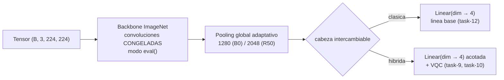

## Description

<!-- SECTION:DESCRIPTION:BEGIN -->
**Actividad del anteproyecto:** A1 — Extractor de características clásico preentrenado y congelado.

**Qué.** Fábrica compartida de *backbones* para EfficientNet-B0 y ResNet-50 usando la Weights API de torchvision, con todas las capas convolucionales congeladas y una cabeza intercambiable, más la reducción del espacio latente (1280 en B0, 2048 en ResNet-50) a la dimensión de 4 que consumirá el VQC.

**Por qué.** Congelar el extractor es lo que hace viable el régimen de escasez: con 10 % de los datos, entrenar 5 millones de parámetros garantiza sobreajuste, mientras que entrenar solo la cabeza mantiene la capacidad del modelo proporcional a la evidencia disponible. Además, una **única** fábrica es lo que hace comparables al HQCNN y a las líneas base: mismo extractor, distinta cabeza. Sin fábrica, el bucle de entrenamiento acabaría con una rama `if modelo == "hqcnn"`, lo que viola OCP y convierte cualquier cambio en una modificación de código ya validado.

**Entregable.** `src/models/backbones.py` con `build_backbone(nombre)` y `contar_parametros(modelo)`, más la tabla de parámetros entrenables frente a congelados por arquitectura.

**Arquitectura del extractor y la cabeza intercambiable.**



**Nota de diseño.** La reducción de 1280 a 4 dimensiones es un cuello de botella severo impuesto por el número de qubits del VQC. Es una **restricción del diseño**, no una optimización, y debe declararse como limitación: el HQCNN y la línea base no compiten en igualdad de ancho de banda de información, sino bajo la misma restricción de datos.

**Claves BibTeX.** `tan2019efficientnet`, `he2016deep`, `mari2020transfer`.
<!-- SECTION:DESCRIPTION:END -->

## Acceptance Criteria
<!-- AC:BEGIN -->
- [x] #1 pretrained=True no aparece en el código: los pesos se cargan con la Weights API y la versión de pesos elegida queda registrada
- [x] #2 build_backbone devuelve el backbone y su dimensión de salida; añadir una arquitectura nueva no exige modificar el Trainer ni el modelo híbrido (OCP)
- [x] #3 Todas las capas del backbone quedan con requires_grad=False y una prueba verifica que su gradiente es None tras un paso de retropropagación
- [x] #4 El backbone permanece en modo eval() mientras está congelado, de modo que BatchNorm no actualiza sus estadísticas móviles con lotes pequeños
- [x] #5 La cabeza es intercambiable: el mismo extractor alimenta la cabeza clásica de la línea base y la reducción que consume el VQC
- [x] #6 El conteo de parámetros entrenables frente a congelados se calcula programáticamente para ambas arquitecturas
- [x] #7 Solo los parámetros con requires_grad=True se entregan al optimizador
- [x] #8 Hallazgo registrado en hallazgos/h1_arquitectura.tex con \label{hallazgo:task-7} y tabla de parámetros por arquitectura
<!-- AC:END -->

## Definition of Done
<!-- DOD:BEGIN -->
- [x] #1 Tipado de Python 3.12 y docstrings NumPy en español latinoamericano
- [x] #2 Pruebas de congelamiento y de dimensión de salida para EfficientNet-B0 y ResNet-50
- [x] #3 El cuello de botella de reducir el espacio latente a 4 dimensiones queda declarado como limitación del diseño
- [x] #4 Sin APIs deprecadas de torchvision
<!-- DOD:END -->

## Implementation Plan

<!-- SECTION:PLAN:BEGIN -->
1. Implementar la fábrica con la API de pesos vigente (nunca `pretrained=True`):

```python
import torch.nn as nn
from torchvision.models import (
    EfficientNet_B0_Weights,
    ResNet50_Weights,
    efficientnet_b0,
    resnet50,
)

def build_backbone(nombre: str) -> tuple[nn.Module, int]:
    """Construye un extractor preentrenado y congelado.

    Parameters
    ----------
    nombre : str
        Identificador de la arquitectura: ``efficientnet_b0`` o ``resnet50``.

    Returns
    -------
    tuple[nn.Module, int]
        El backbone sin cabeza de clasificación y la dimensión de su salida.

    Notes
    -----
    El backbone se devuelve en modo evaluación para que las capas de
    normalización por lotes no actualicen sus estadísticas móviles con los
    lotes pequeños del escenario de escasez.
    """
    if nombre == "efficientnet_b0":
        modelo = efficientnet_b0(weights=EfficientNet_B0_Weights.IMAGENET1K_V1)
        dimension = modelo.classifier[1].in_features
        modelo.classifier = nn.Identity()
    elif nombre == "resnet50":
        modelo = resnet50(weights=ResNet50_Weights.IMAGENET1K_V2)
        dimension = modelo.fc.in_features
        modelo.fc = nn.Identity()
    else:
        raise ValueError(f"Backbone no soportado: {nombre}")

    for parametro in modelo.parameters():
        parametro.requires_grad = False
    modelo.eval()
    return modelo, dimension
```

2. Implementar el conteo de parámetros, que alimenta la tabla de la bitácora:

```python
def contar_parametros(modelo: nn.Module) -> dict[str, int]:
    """Cuenta parámetros entrenables y congelados de un módulo."""
    entrenables = sum(p.numel() for p in modelo.parameters() if p.requires_grad)
    congelados = sum(p.numel() for p in modelo.parameters() if not p.requires_grad)
    return {"entrenables": entrenables, "congelados": congelados}
```

3. Definir la cabeza clásica como módulo independiente, para que la línea base y el HQCNN compartan el extractor sin duplicarlo.
4. Escribir la prueba de congelamiento: un paso de retropropagación sobre una entrada aleatoria y verificación de que todos los parámetros del backbone tienen gradiente `None`.
5. Escribir la prueba de forma: la salida del backbone tiene la dimensión declarada para cada arquitectura.
6. Verificar que solo los parámetros con `requires_grad=True` llegan al optimizador (se consume en task-8).
7. Registrar en `hallazgos/h1_arquitectura.tex` la tabla de parámetros entrenables frente a congelados por arquitectura, con la versión de pesos utilizada.

8. Entregables ampliados: src/models/heads.py (CabeceraReduccion), VERSIONES_PESOS, obtener_version_pesos(), parametros_entrenables().
<!-- SECTION:PLAN:END -->

## Implementation Notes

<!-- SECTION:NOTES:BEGIN -->
**Trampas conocidas.**

- **La más costosa:** poner `requires_grad=False` **no** impide que `BatchNorm` actualice `running_mean` y `running_var`. Si el módulo está en modo `train()`, las estadísticas móviles del backbone siguen desplazándose con cada lote, así que el "extractor congelado" cambia de comportamiento entre épocas. Hay que mantener el backbone en `eval()`; y como el `Trainer` llama `model.train()` en cada época, el módulo contenedor debe reimponer `eval()` en el backbone (se resuelve en task-10 sobrescribiendo `train()`).
- `pretrained=True` está deprecado. Usar `weights=EfficientNet_B0_Weights.IMAGENET1K_V1`. Además, la versión de pesos **debe** quedar registrada: `ResNet50_Weights.IMAGENET1K_V2` tiene mejor exactitud que V1 pero proviene de otra receta de entrenamiento, y eso afecta la comparación con la literatura.
- Sustituir la cabeza por `nn.Identity()` es preferible a recortar `modelo.features` a mano: conserva el pooling adaptativo del modelo y evita errores de forma difíciles de detectar.
- No pasar los parámetros congelados al optimizador. `torch.optim.Adam(modelo.parameters())` mantiene estado (momentos) para tensores que nunca cambian: gasta memoria y, si alguien reactiva `requires_grad`, arranca con estado espurio. Filtrar siempre por `requires_grad`.
- La normalización de entrada debe ser la de ImageNet (task-5). Un backbone congelado con normalización distinta a la de su preentrenamiento produce características desplazadas y el efecto se confunde con el de la arquitectura.
- EfficientNet-B0 y ResNet-50 tienen dimensiones latentes distintas (1280 y 2048). La fábrica **devuelve** la dimensión precisamente para que ningún módulo la escriba a mano.

Alcance AC #4: build_backbone() devuelve eval(); mantener eval() bajo model.train() es responsabilidad del contenedor híbrido (TASK-10).

Validación: uv run pytest tests/test_backbones.py -q → 10 passed. Conteos: EfficientNet-B0 4_007_548 congelados / 5_124 entrenables con cabeza (dim 1280); ResNet-50 23_508_032 congelados / 8_196 entrenables con cabeza (dim 2048).
<!-- SECTION:NOTES:END -->

## Final Summary

<!-- SECTION:FINAL_SUMMARY:BEGIN -->
Fábrica build_backbone() con Weights API, VERSIONES_PESOS, contar_parametros(), parametros_entrenables() y CabeceraReduccion en src/models/. Hallazgo en h1_arquitectura.tex. Verificado con pytest tests/test_backbones.py (10 passed).
<!-- SECTION:FINAL_SUMMARY:END -->
