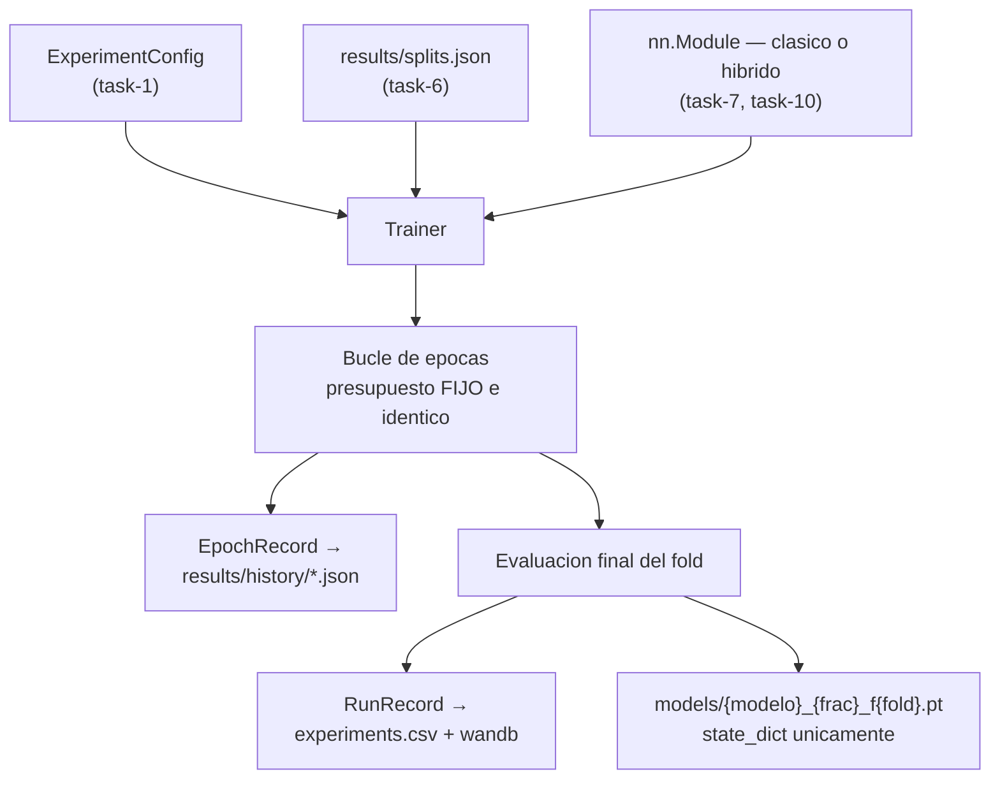

## Description

<!-- SECTION:DESCRIPTION:BEGIN -->
**Qué.** Un **único** bucle de entrenamiento y evaluación que sirve a las líneas base, a la ablación de profundidad y a la campaña experimental completa. Recibe un `nn.Module` ya construido y un `ExperimentConfig`, lee los índices de `results/splits.json`, emite el contrato de task-4 e instrumenta los tiempos con calentamiento y sincronización de dispositivo.

**Por qué.** Es la pieza que evita el fracaso más común de un benchmark: tres bucles distintos (uno por familia de experimento) producen resultados no comparables sin que nadie lo note. Basta que uno use `Adam` y otro `AdamW`, o que midan el tiempo de forma distinta, para que la diferencia entre HQCNN y línea base deje de ser atribuible a la arquitectura. Con un solo bucle, la comparación es una sustitución de modelo y nada más: es exactamente el principio de sustitución de Liskov aplicado al diseño experimental.

**Entregable.** `src/train/trainer.py` con la clase `Trainer`, reanudabilidad frente al CSV existente y persistencia de pesos con `state_dict()`.

**Flujo del entrenamiento.**



**Principios SOLID que esta tarea materializa.**

- **SRP:** el `Trainer` entrena y evalúa; no construye modelos, no arma particiones, no formatea resultados.
- **OCP:** un modelo nuevo entra por la fábrica; el bucle no se toca.
- **LSP:** el HQCNN es sustituible por una línea base clásica sin ninguna rama condicional.
- **DIP:** el `Trainer` depende de `nn.Module` y `ExperimentConfig`; **no importa** `pennylane` ni `torchvision`.
- **DRY:** un solo bucle de épocas, un solo criterio de selección de época, un solo protocolo de medición de tiempos.

**Riesgo metodológico que esta tarea cierra.** Elegir la época a reportar mirando el fold de validación y luego reportar ese mismo fold produce una estimación optimista (fuga por selección de época). El criterio debe ser un presupuesto de épocas fijo o una partición interna extraída del entrenamiento, aplicado **igual** a todos los modelos.

**Claves BibTeX.** `esteva2019guide`, `litjens2017survey`.
<!-- SECTION:DESCRIPTION:END -->

## Acceptance Criteria
<!-- AC:BEGIN -->
- [ ] #1 El mismo Trainer entrena el modelo clásico y el híbrido sin ninguna rama condicional por tipo de modelo
- [ ] #2 El presupuesto de épocas, el optimizador, la función de pérdida y la tasa de aprendizaje son idénticos para todos los modelos y provienen de la configuración
- [ ] #3 No se selecciona la época a reportar mirando el fold de validación que luego se reporta: el criterio elegido está documentado y se aplica igual a todos los modelos
- [ ] #4 El Trainer no importa pennylane ni torchvision: depende solo de nn.Module y ExperimentConfig (DIP)
- [ ] #5 Los índices de entrenamiento y validación se leen de results/splits.json y no se remuestrean
- [ ] #6 Los tiempos de entrenamiento e inferencia se miden con calentamiento y sincronización de dispositivo según el protocolo de task-4
- [ ] #7 Emite exactamente el contrato de task-4 (RunRecord y EpochRecord) sin campos ad hoc
- [ ] #8 Los pesos se persisten con state_dict() exclusivamente y la recarga reproduce las métricas reportadas
- [ ] #9 Las corridas son reanudables: una celda del diseño factorial ya presente en el CSV se omite en lugar de duplicarse
- [ ] #10 Hallazgo breve en hallazgos/h1_arquitectura.tex con \label{hallazgo:task-8} que documenta el criterio de épocas y los hiperparámetros comunes
<!-- AC:END -->

## Definition of Done
<!-- DOD:BEGIN -->
- [ ] #1 Tipado de Python 3.12 y docstrings NumPy en español latinoamericano
- [ ] #2 Prueba de sustituibilidad: un modelo clásico y uno con capa cuántica entrenan con el mismo Trainer
- [ ] #3 Sin torch.save del módulo completo en ninguna ruta del código
- [ ] #4 Presupuesto de épocas y optimizador congelados y documentados antes de iniciar cualquier campaña
<!-- DOD:END -->

## Implementation Plan

<!-- SECTION:PLAN:BEGIN -->
1. Definir la clase con dependencias abstractas, sin conocer la naturaleza cuántica o clásica del modelo:

```python
class Trainer:
    """Bucle único de entrenamiento y evaluación para modelos clásicos e híbridos.

    Parameters
    ----------
    modelo : nn.Module
        Modelo ya construido por la fábrica.
    cfg : ExperimentConfig
        Configuración del experimento.
    dispositivo : torch.device
        Dispositivo de cómputo seleccionado.

    Notes
    -----
    No importa ``pennylane`` ni ``torchvision``: recibe un ``nn.Module`` y una
    configuración, de modo que añadir un modelo nuevo no exige modificar esta
    clase (OCP) y el modelo híbrido es sustituible por uno clásico (LSP).
    """

    def __init__(
        self,
        modelo: nn.Module,
        cfg: ExperimentConfig,
        dispositivo: torch.device,
    ) -> None:
        self._modelo = modelo.to(dispositivo)
        self._cfg = cfg
        self._dispositivo = dispositivo
        self._criterio = nn.CrossEntropyLoss()
        self._optimizador = torch.optim.Adam(
            (p for p in modelo.parameters() if p.requires_grad),
            lr=cfg.lr,
        )
```

2. Implementar el bucle de épocas con presupuesto **fijo** y emisión del historial por época:

```python
    def ajustar(
        self,
        cargador_train: DataLoader,
        cargador_val: DataLoader,
    ) -> tuple[RunRecord, list[EpochRecord]]:
        """Entrena por un presupuesto fijo de épocas y evalúa al final.

        Returns
        -------
        tuple[RunRecord, list[EpochRecord]]
            El registro de la corrida y su historial por época.

        Notes
        -----
        No se selecciona la mejor época mirando el conjunto de validación que
        luego se reporta: eso produciría una estimación optimista. Se usa el
        presupuesto completo de épocas, idéntico para todos los modelos.
        """
        historial: list[EpochRecord] = []
        inicio = time.perf_counter()
        for epoca in range(self._cfg.epocas):
            metricas_train = self._epoca_entrenamiento(cargador_train)
            metricas_val = self._evaluar(cargador_val)
            historial.append(EpochRecord(epoca=epoca, **metricas_train, **metricas_val))
        self._sincronizar()
        tiempo = time.perf_counter() - inicio
        return self._construir_registro(historial, tiempo, cargador_val), historial
```

3. Implementar la medición de tiempos según el protocolo de task-4: descartar los primeros lotes como calentamiento, sincronizar el dispositivo antes de detener el reloj y reportar la mediana por lote para la inferencia.
4. Implementar la reanudabilidad: antes de entrenar, consultar `results/experiments.csv` y omitir la celda `(modelo, fracción, fold)` si ya existe. La campaña de task-13 tiene 60 celdas y Colab corta sesiones.
5. Persistir los pesos con `state_dict()` exclusivamente, con un nombre de archivo que codifique la celda del diseño factorial.
6. Escribir la prueba de sustituibilidad: el mismo `Trainer` entrena un modelo clásico trivial y un modelo con capa cuántica simulada, sin ninguna rama condicional por tipo de modelo.
7. Documentar en la bitácora (`h1_arquitectura.tex`) el criterio de selección de época elegido y por qué evita la fuga, junto con el presupuesto de épocas y el optimizador comunes.
<!-- SECTION:PLAN:END -->

## Implementation Notes

<!-- SECTION:NOTES:BEGIN -->
**Trampas conocidas.**

- `self._modelo.train()` reactiva las capas de normalización por lotes del backbone congelado. El `Trainer` **no** debe conocer esa particularidad: la solución limpia es que el módulo híbrido sobrescriba `train()` para reimponer `eval()` en su backbone (task-10). Si se parchea desde el `Trainer`, se rompe DIP y aparece la rama condicional que se quería evitar.
- Solo los parámetros con `requires_grad=True` deben entrar al optimizador; con un backbone congelado, pasarle `modelo.parameters()` completo desperdicia memoria en momentos de Adam que nunca se usan.
- `CrossEntropyLoss` espera **logits**, no probabilidades. El VQC devuelve valores esperados en el intervalo [-1, 1]: son logits válidos pero de escala pequeña, lo que achata el softmax y limita la confianza alcanzable. El efecto es real y debe documentarse (se retoma en task-10); lo que **no** se debe hacer es aplicar softmax antes de la pérdida.
- Medir el tiempo sin `torch.cuda.synchronize()` o `torch.mps.synchronize()` mide el encolado asíncrono de kernels. En el HQCNN el costo dominante está en la simulación del circuito y el sesgo sería grande.
- No usar detención temprana sobre el fold de validación que después se reporta: es precisamente la fuga que la AC prohíbe. Si se quiere detención temprana, la señal debe venir de una partición interna extraída del entrenamiento.
- Guardar el módulo completo con `torch.save(modelo)` falla o no es portable con `TorchLayer`. Solo `state_dict()`; y verificar que la recarga reproduce las métricas antes de confiar en los artefactos.
- La reanudabilidad debe comparar la **celda completa** `(modelo, fracción, fold, semilla)`. Comparar solo por modelo omitiría folds pendientes y dejaría el diseño factorial incompleto sin aviso.
- Si se paraleliza la campaña, dos procesos escribiendo el mismo CSV lo corrompen: escribir un archivo por corrida y consolidar en task-14.

**Decisión a congelar aquí.** Presupuesto de épocas, optimizador, tasa de aprendizaje y criterio de época reportada. Cualquier cambio posterior invalida las comparaciones ya ejecutadas y obliga a repetir la campaña completa, no solo la celda afectada.
<!-- SECTION:NOTES:END -->
