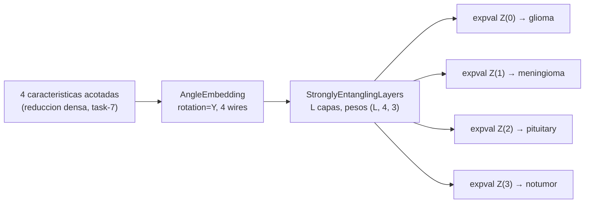

## Description

<!-- SECTION:DESCRIPTION:BEGIN -->
**Actividad del anteproyecto:** A2 — Diseño del clasificador cuántico variacional.

**Qué.** Circuito de 4 qubits con `AngleEmbedding` para la codificación, `StronglyEntanglingLayers` con profundidad `L` parametrizable, mediciones **locales** `qml.expval(qml.Z(i))` (una por qubit) e inicialización cercana a la identidad con varianza controlada.

**Por qué cada decisión, con respaldo en la literatura (prohibición de cajas negras).**

- **`AngleEmbedding`:** la codificación define el mapa de características cuántico y por tanto la clase de funciones que el circuito puede representar (`schuld2019feature`). Con 4 características y 4 qubits, la codificación por ángulos mantiene el circuito superficial, lo que es un requisito práctico en la era NISQ (`Preskill2018`).
- **`StronglyEntanglingLayers`:** ansatz de clasificación centrado en circuitos, con `O(L · n)` parámetros y entrelazamiento entre todos los qubits (`schuld2020circuit`). Ofrece expresividad sin crecer cuadráticamente en parámetros.
- **Mediciones locales, no un costo global:** los costos globales inducen mesetas áridas incluso a profundidad reducida, mientras que los observables locales preservan gradientes medibles (`Cerezo2021bp`). Un observable por qubit da además un mapeo natural de 4 qubits a 4 clases.
- **Inicialización cercana a la identidad:** mitiga la meseta árida que aparece con inicialización aleatoria en circuitos profundos (`McClean2018B`, `grant2019initialization`).
- **`L` parametrizable:** la expresividad y la magnitud del gradiente están en tensión directa (`holmes2022connecting`); por eso `L` no se fija por intuición, sino con la ablación medida de task-11.

**Entregable.** `src/models/vqc.py` con el QNode, la inicialización de pesos, el diagnóstico de norma de gradiente y el diagrama del circuito generado programáticamente.

**Circuito.**



**Aritmética del costo que hereda task-11.** Con `parameter-shift` cada parámetro exige 2 evaluaciones de circuito. Con `L = 6` hay `6 × 4 × 3 = 72` parámetros, es decir **144 evaluaciones por muestra y por paso de optimización**. Esta cuenta es la razón de existir de la compuerta de presupuesto.

**Claves BibTeX.** `schuld2019feature`, `McClean2018B`, `grant2019initialization`, `Cerezo2021bp`, `holmes2022connecting`, `Preskill2018`. Excepción justificada por tema ausente en el `.bib`: `schuld2020circuit` (define el ansatz de entrelazamiento fuerte). **No usar** `anzatz_vqc_2024`: es una tesis sobre calibración de sensores y no respalda esta arquitectura.
<!-- SECTION:DESCRIPTION:END -->

## Acceptance Criteria
<!-- AC:BEGIN -->
- [ ] #1 El circuito usa 4 qubits, AngleEmbedding, StronglyEntanglingLayers con L tomado de la configuración y mediciones locales expval Z, una por qubit
- [ ] #2 El QNode declara interface=torch y diff_method=parameter-shift sobre default.qubit, y usa qml.Z en lugar de la API deprecada qml.PauliZ
- [ ] #3 El mapeo qubit a clase está fijado en una constante única y documentado, y coincide con el orden de clases del Dataset
- [ ] #4 La forma de los pesos se obtiene de StronglyEntanglingLayers.shape y no está escrita a mano
- [ ] #5 La inicialización es cercana a la identidad con varianza controlada y su elección está justificada con la literatura de mesetas áridas
- [ ] #6 La norma del gradiente inicial es medible y se reporta para L en 2, 4 y 6 como diagnóstico previo a la ablación
- [ ] #7 La elección de mediciones locales frente a un observable global está argumentada con cita explícita
- [ ] #8 El diagrama del circuito se genera programáticamente, se guarda en docs/trabajo_de_grado/Figuras/ y se incluye en la bitácora
- [ ] #9 Hallazgo registrado en hallazgos/h1_arquitectura.tex con \label{hallazgo:task-9}
<!-- AC:END -->

## Definition of Done
<!-- DOD:BEGIN -->
- [ ] #1 Tipado de Python 3.12 y docstrings NumPy en español latinoamericano
- [ ] #2 Cada decisión de diseño del circuito tiene su justificación citada: sin cajas negras
- [ ] #3 Sin APIs deprecadas de PennyLane
- [ ] #4 No se cita anzatz_vqc_2024 como respaldo del ansatz
<!-- DOD:END -->

## Implementation Plan

<!-- SECTION:PLAN:BEGIN -->
1. Declarar el dispositivo y el QNode con la API vigente de PennyLane 0.45:

```python
import pennylane as qml
import torch

N_QUBITS = 4
dispositivo_cuantico = qml.device("default.qubit", wires=N_QUBITS)

@qml.qnode(dispositivo_cuantico, interface="torch", diff_method="parameter-shift")
def circuito_vqc(entradas: torch.Tensor, pesos: torch.Tensor) -> list:
    """Clasificador cuántico variacional de 4 qubits.

    Parameters
    ----------
    entradas : torch.Tensor
        Vector de 4 características acotadas provenientes de la capa densa.
    pesos : torch.Tensor
        Pesos variacionales de forma ``(L, 4, 3)``.

    Returns
    -------
    list
        Valor esperado del observable Z en cada qubit, uno por clase.

    Notes
    -----
    Se emplean mediciones locales, un observable por qubit, en lugar de un
    observable global: los costos globales inducen mesetas áridas incluso a
    profundidad baja, mientras que los locales preservan gradientes medibles.
    """
    qml.AngleEmbedding(entradas, wires=range(N_QUBITS), rotation="Y")
    qml.StronglyEntanglingLayers(pesos, wires=range(N_QUBITS))
    return [qml.expval(qml.Z(i)) for i in range(N_QUBITS)]
```

2. Fijar y documentar el mapeo qubit a clase en una constante única, para que sea idéntico en todas las corridas y en todas las matrices de confusión:

```python
MAPEO_QUBIT_CLASE: dict[int, str] = {
    0: "glioma",
    1: "meningioma",
    2: "pituitary",
    3: "notumor",
}
```

3. Inicializar los pesos con la forma canónica del ansatz y una escala pequeña:

```python
def inicializar_pesos(n_capas: int, n_qubits: int = N_QUBITS, escala: float = 0.01) -> torch.Tensor:
    """Inicializa los pesos cerca de la identidad para mitigar mesetas áridas.

    Notes
    -----
    La forma se obtiene de ``StronglyEntanglingLayers.shape`` y no se escribe a
    mano, de modo que cambiar el número de qubits no rompa el código.
    """
    forma = qml.StronglyEntanglingLayers.shape(n_layers=n_capas, n_wires=n_qubits)
    return torch.randn(forma) * escala
```

4. Implementar el diagnóstico de entrenabilidad: norma del gradiente en la inicialización, promediada sobre varias muestras aleatorias, para `L` en {2, 4, 6}:

```python
def norma_gradiente_inicial(n_capas: int, n_muestras: int = 20) -> float:
    """Mide la norma media del gradiente en la inicialización.

    Un valor que decae con la profundidad es evidencia de meseta árida.
    """
    normas: list[float] = []
    for _ in range(n_muestras):
        entradas = torch.rand(N_QUBITS) * torch.pi
        pesos = inicializar_pesos(n_capas).requires_grad_(True)
        salida = torch.stack(circuito_vqc(entradas, pesos)).sum()
        salida.backward()
        normas.append(float(pesos.grad.norm()))
    return sum(normas) / len(normas)
```

5. Generar el diagrama del circuito programáticamente y guardarlo como figura del trabajo de grado:

```python
figura, _ = qml.draw_mpl(circuito_vqc)(torch.zeros(N_QUBITS), inicializar_pesos(4))
figura.savefig("docs/trabajo_de_grado/Figuras/circuito_vqc.png", dpi=200, bbox_inches="tight")
```

6. Verificar que el circuito acepta el rango de entradas que producirá la capa densa acotada de task-10 y que la salida está en [-1, 1] por construcción.
7. Registrar el hallazgo en `hallazgos/h1_arquitectura.tex`: diagrama del circuito, mapeo qubit-clase, tabla de norma de gradiente por `L` y la argumentación de las mediciones locales con su cita.
<!-- SECTION:PLAN:END -->

## Implementation Notes

<!-- SECTION:NOTES:BEGIN -->
**Trampas conocidas.**

- `qml.expval(qml.PauliZ(i))` está deprecado en PennyLane 0.45. Usar `qml.Z(i)`.
- **La trampa silenciosa de `AngleEmbedding`:** los ángulos son periódicos. Si la capa densa produce valores grandes, dos características muy distintas se envuelven al mismo ángulo y la información se destruye sin ningún error visible. Las entradas **deben** acotarse antes de embeber (se resuelve en task-10 con `tanh` escalado).
- No escribir la forma de los pesos como `(L, 4, 3)` a mano: usar `StronglyEntanglingLayers.shape(...)`. Si cambia el número de qubits, el código escrito a mano falla de formas confusas.
- Una escala de inicialización demasiado pequeña acerca el circuito a la identidad y da gradientes medibles, pero arranca en una región casi lineal donde el circuito aporta poco. El punto no es asumir un valor bueno, es **medir** la norma del gradiente y reportarla.
- El QNode debe declarar `interface="torch"` explícitamente. Sin la interfaz, el gradiente no se propaga a PyTorch y el entrenamiento "funciona" mientras los pesos cuánticos no se mueven.
- `default.qubit` con `parameter-shift` es el default del proyecto. `lightning.qubit` solo como acelerador de prototipo: con `parameter-shift` y lotes en `TorchLayer` no es el default validado.
- `qml.draw_mpl` devuelve una figura de matplotlib que hay que cerrar; en un bucle de ablación deja figuras abiertas y agota memoria.
- El mapeo qubit a clase debe estar en **una sola** constante. Si el orden de clases del `Dataset` (alfabético por carpeta) difiere del mapeo asumido aquí, las métricas por clase quedan permutadas y la matriz de confusión miente sin dar error.

**Prohibición explícita del proyecto.** No citar `anzatz_vqc_2024` como respaldo del ansatz: es una tesis de maestría sobre calibración de sensores y no sostiene la afirmación sobre *Strongly Entangling Layers*.
<!-- SECTION:NOTES:END -->
